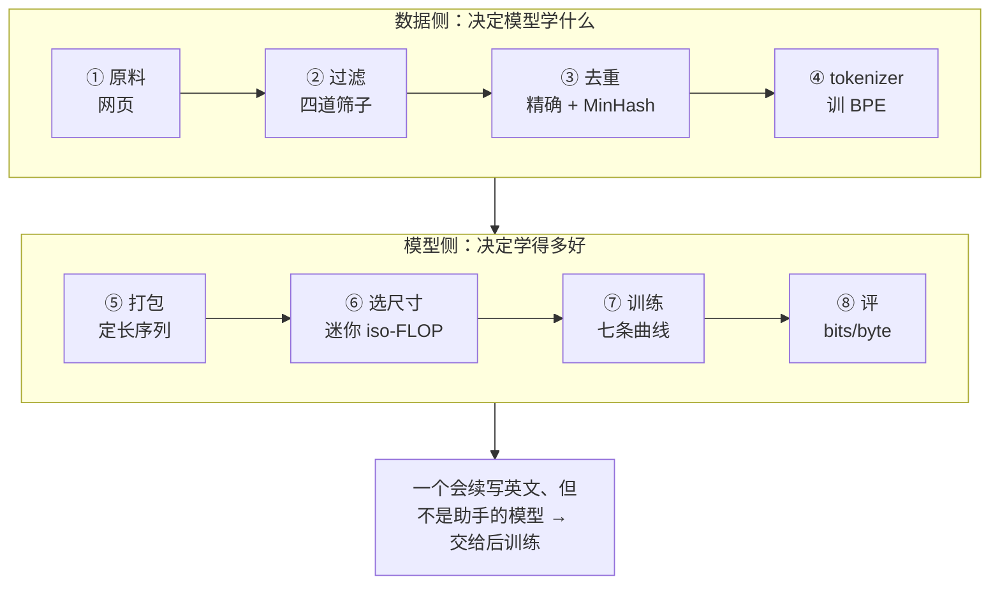

## 这个系列的一句话主张

> **预训练的每个决定都能算账，算不出来的部分靠小模型消融外推。**

| 决定 | 换的是什么 | 篇 |
|---|---|---|
| 词表多大 | 每 token 的成本 ↔ 每段文字的 token 数 | 02 |
| 参数 vs 数据 | 训练算力 ↔ 推理算力 | 03 |
| 过滤多严 | token 量 ↔ 质量；配比 = epoch 数 | 04 |
| 学习率与 batch | 收敛速度 ↔ 稳定性 | 05 |

同一套方法：推导 → 代入 Llama 3 与 DeepSeek-V3 → 解释数字；**第一篇先把整条流水线实跑一遍**。

<aside class="notes" markdown="1">
总纲：/pretraining-from-tokenizer-to-training-recipe.html。第一篇是端到端实跑（MacBook，两个 Common Crawl WET 文件），后四篇每篇先有一章「先讲明白」入门层，再算账。
</aside>

---

## 一次预训练的八步

- 02 展开 ④，03 展开 ⑥，04 展开 ①②③，05 展开 ⑦

---

## 01 · 一次预训练是怎么跑起来的（实跑）

**结论**：原料是网页，大部分不是「文章」——四道过滤留下 **16%**，C4 行级一道就删掉一半字符（全是导航栏和页脚）；Llama 3 的 240T → 15T 也是约 6%。

{: style="max-height: 400px"}

<aside class="notes" markdown="1">
原文 /pretraining-end-to-end-from-web-pages-to-a-model.html。两个 Common Crawl WET 文件，486 MB，英文 46%。过滤主要不是为了省算力，是决定模型学什么：数据里垃圾的比例就是输出里垃圾的比例。
</aside>

<!-- v -->

### 去重：只比 2,515 对，不比 6,189 万对

{: style="max-height: 380px"}

- 精确去重删 169 篇、MinHash（128 个哈希、16 段 × 8）/ LSH 再删 311 篇，剩 **38 MB**（原始的 8%）
- tokenizer 是训练语料的化石：英文网页上训的 BPE 4096，英文 3.46 字符/token，**中文每字 3 个 token**

<!-- v -->

### 选尺寸：固定算力下模型大小有最优点，且随预算右移

{: style="max-height: 380px"}

- 迷你实验的 D/N 是 72–155 而不是 20——小数据上的实验偏向小模型，**不能直接外推**
- 数据只有 10.9M token 时硬约束是数据：定 3 epoch 再选模型（2×128 vs 4×192：4.79 vs 4.63）

<!-- v -->

### 训练：盯七条曲线，不只看 loss

{: style="max-height: 400px"}

- 4 层 × 192 宽，12 分钟：loss 从 ln 4096 = 8.32 → 4.6；attention logit 最大值从 0.4 涨到 78
- 评：**bits/byte 1.88** 对 GPT-2 small 的 1.06——差在参数（48 倍）与数据（1,000 倍）；生成「像英文不像话」，当助手用完全不行

---

## 02 · 分词与词表：成本按字符算，不按 token

**结论**：词表 32K → 128K 每 token 贵 5.6%，但同一段英文的 token 少 24%——**每字符便宜 15%、KV 少 20%**；前提是词表针对目标语言训练。

{: style="max-height: 330px"}

<aside class="notes" markdown="1">
原文 /tokenizer-vocabulary-and-token-efficiency.html。字符级序列长；词级词表大且遇生词丢信息；子词在中间。byte-level 初始词表保证任何字节串可切分；预分词正则决定数字与空格怎么切。
</aside>

<!-- v -->

### BPE：合并顺序就是词表

{: style="max-height: 400px"}

- 词表翻倍压缩率只涨 0.4–0.5 字符/token（对数增长），与 lm_head 的线性成本相交于「最优词表」；128K–256K 是这条曲线上的一段

<!-- v -->

### 同一段话，四个 tokenizer

{: style="max-height: 440px"}

- 中文：cl100k 每字 1.46 token，DeepSeek-V3 0.69——差 **2.1 倍**，差在训练语料不在 V

<!-- v -->

### 词表进成本表的四个位置

| 位置 | 公式 | Llama-3-8B |
|---|---|---|
| 参数 | 2Vd（tied 为 Vd） | 1.05B，13.1%；训练状态 16.8 GB |
| lm_head FLOPs | 每 token 2Vd | 7.0%；Qwen2.5-0.5B 占 **28%** |
| decode 字节 | 每步读一遍 lm_head | 1 GB / 步 |
| 训练显存 | logits = tokens × V × 4 B | 8K 序列 **3.9 GiB**，softmax 前后两份 |

- 跨 tokenizer 比 loss 要换算 $$\text{bits/byte} = \frac{L}{\ln 2}\cdot\frac{T}{B}$$；同等 bits/byte 下 Llama 3 的 per-token loss 应比 Llama 2 高 24%
- 「1 token ≈ 0.75 个英文词」只对英文成立；中文 0.4–1.5 字符/token 视词表而定

---

## 03 · Scaling law：从 Chinchilla 到「过训练」

**结论**：$$L = E + A/N^\alpha + B/D^\beta$$，在 C = 6ND 下最优 D/N ≈ 20；但 Chinchilla 只最小化**训练算力**——把推理 $$2ND_{inf}$$ 算进去，最优点移向**小模型、多数据**。

{: style="max-height: 330px"}

<aside class="notes" markdown="1">
原文 /scaling-laws-and-compute-optimal-training.html。E = 1.82、α = 0.35、β = 0.37（Besiroglu 等 2024 重拟合）。Kaplan 的 N ∝ C^0.73 与 Chinchilla 的差异：不数输出层算力、固定 warmup、超参不随规模调。
</aside>

<!-- v -->

### 幂律是什么样：7 个小模型手算

{: style="max-height: 340px"}

- 双对数坐标下是直线；最优 loss 随算力 $$L_{opt} - E \propto C^{-0.178}$$：算力 ×10 可约 loss ×0.66，**减半要 ×49**
- 拟合最常见的失败：cosine 中途的 loss 不可比、tokenizer 不一致、超参没随尺寸调、外推太远

<!-- v -->

### 为什么 Llama-3 8B 训 15T 是对的

| 固定 C，把 N 缩小 k = 10 倍 | |
|---|---|
| 训练 loss | 只 **+0.053** nats（$$\Delta L \propto (\ln k)^2$$） |
| 推理成本 | **1/10** |
| 服务 100T token 的最优点 | 81B / 1.5T → **24B / 13.8T** |
| 2024 年后的 D/N | 200–2000（「过训练」） |

- 数据不够就重复：$$D' = U + UR^*(1 - e^{-R/R^*})$$，4 epoch 值 93%、16 epoch 值 66%，上限约 16 倍
- 超参也要 scaling：$$\eta_{opt} \propto C^{-0.125}$$、$$B_{opt} \propto C^{0.33}$$——算力 ×10，lr −25%、batch ×2.1
- Llama-3 405B：$$3.8 \times 10^{25}$$ FLOPs = 2670 万 H100 小时 @ 40% MFU（实际 3084 万）

---

## 04 · 数据工程：一条漏斗，每级刻度都被消融过

**结论**：240T → 15T（6%）→ 模型打分后 1.3–5.4T；启发式规则零成本只清明显垃圾，**模型打分要两级**（大模型标几十万篇、小分类器跑全量）；**跨快照全局去重反而更差**——重复是控制分布，不是消灭。

{: style="max-height: 330px"}

<aside class="notes" markdown="1">
原文 /pretraining-data-pipeline-dedup-filtering-and-mixture.html。管线成本按文档数增长，贵在最上游的抽取（约 70 万核·小时）≫ 去重 ≈ tokenize；训练读带宽只要 9–46 MB/s。
</aside>

<!-- v -->

### 四道筛子，每道配一个被删的真实页面

| 筛子 | 规则 | 被删的样子 |
|---|---|---|
| 语言 | 英文功能词（the / of / and …）≥ 12%；生产上用 fastText | 非英文页（英文只占 46%） |
| Gopher 文档级 | 词数 50–100K、平均词长 3–10、含字母的词 ≥ 80%、≥ 2 个停用词 | 博客侧边栏（一半是日期和符号）、22 个词的 Redirecting 页 |
| C4 行级 | 只留以句末标点结尾、≥ 3 词、不含 `{` / javascript 的行 | **导航、按钮、页脚、版权行**——删掉一半字符 |
| Gopher 重复度 | 重复行 ≤ 30%、高频 n-gram 占比上限 | 关键词堆砌、模板文字 |

- MinHash 112 个哈希估 Jaccard 到 ±0.04；LSH 14 × 8 阈值 0.72：J = 0.6 时 21% 成候选、0.8 时 92%
- 模型打分的账：用 8B 给 15T 打分 $$2.4 \times 10^{23}$$ FLOPs 是训练的 1/3——所以标注只花约 $$7 \times 10^{19}$$

<!-- v -->

### 配比：百分比本质是 epoch 数

{: style="max-height: 340px"}

- 配比换算 $$w_i D / U_i$$：25% × 15T ÷ 约 0.5T 的独立数学数据 ≈ **7.5 epoch**——「15T」不是 15T 条不同的文本
- 一次配比消融 1.8B × 350B token ≈ **2700 H100 小时**，差距常达 3–5 分；预算预留 1–3% 算力做消融
- 领域数据靠分类器迭代召回：DeepSeekMath 四轮 14.7B → 120B

---

## 05 · 训练配方与稳定性：每个数字都有来历

**结论**：峰值 lr 随宽度降（μP ∝ 1/d、经验律 $$0.31\,C^{-0.125}$$）：7B 3e-4 → 70B 1.5e-4 → 405B 8e-5，GPT-3 的 6e-5 在同一条线上；batch 由梯度噪声尺度定、随训练 ramp。

{: style="max-height: 340px"}

<aside class="notes" markdown="1">
原文 /pretraining-recipe-and-training-stability.html。V3 的 2.2e-4 高是因为 MoE 激活参数只有 37B 且 batch 更大。fp32 小模型上 lr 大 50 倍只是终点差 0.08 不会崩——太大的代价在大模型 / 低精度上才变成 spike。
</aside>

<!-- v -->

### 配方表：MacBook 与 405B 是同一张表

| | 第一篇（MacBook，12 分钟） | Llama 3 405B（16K 张 H100，54 天） | DeepSeek-V3 |
|---|---|---|---|
| 模型 · 数据 | 4 层 × 192，2.61M；10.9M × 3 epoch | 126 层 × 16384，405B；15.6T × 1 | 37B 激活；14.8T |
| 峰值 lr | 1.15e-3 | 8e-5 | 2.2e-4 |
| batch（token） | 16K | 4M → 8M → **16M** ramp | 12.6M → **63M** ramp |
| warmup | 59 步（3%） | 8,000 步（约 1%） | 2,000 步 |
| 调度 | cosine → 10% | cosine → 10% | 常数 10T → cosine → 两段常数 |
| AdamW | β = (0.9, 0.95)、wd 0.1、clip 1.0 | 同 | 同 |
| 精度 | FP32 | BF16 + FP32 主权重 | FP8 分块 + FP32 累加 |

- weight decay 时间尺度 $$\tau = 1/(\eta\lambda)$$：7B 33K 步（7%）、405B 125K 步（13%）
- 调度实验：WSD 1.464 < 常数 1.536 < cosine 1.578

<!-- v -->

### loss spike 拆成三个机制，各有开关

{: style="max-height: 320px"}

| 机制 | 监控曲线 | 开关 |
|---|---|---|
| attention logit 增长 | attention logit 最大值 | **QK-norm**：12,592 → 22 |
| 输出 logit 漂移 | $$\lvert\log Z\rvert$$ | **z-loss** 1e-4 |
| 单步过大 | 梯度范数 | 裁剪 1.0、warmup、β₂ = 0.95 |

<!-- v -->

### 实训里真实发生的一次 spike

{: style="max-height: 300px"}

- 大模型的处理：回退 100 步、跳 200–500 个 batch；405B 一次 8 千–1.6 万 GPU 小时
- 硬件故障每 3 小时一次：checkpoint 5.7 TB，间隔 $$T_{opt} = \sqrt{2\delta\cdot\text{MTBF}}$$，异步保存让间隔短到 4–5 分钟、有效时间 > 90%
- 「spike 是脏数据」——三个机制里两个是模型内部的数值问题

---

## 四条贯穿线

| 线 | 落点 |
|---|---|
| **按字符算账** | 每个「token 数」背后隐含一个词表；15T token 在 Llama 3 里多读 24% 字符；跨 tokenizer 比 bits/byte |
| **算力怎么分** | 6ND 的三个变量分别被三篇约束：N 里有 2Vd，D 的上限是漏斗，定下后算步数与 checkpoint；推理 $$2ND_{inf}$$ 把最优点推向小模型 |
| **重复、epoch 与有效数据** | 同一个 D′ 公式：总量不够（4 epoch 值 93%）与某一类不够（25% ≈ 7.5 epoch）；去重要控制分布不是消灭 |
| **消融外推** | 词表、常数、阈值、配比、超参——公式推不出的都靠小模型：03 给方法、04 给价格（2700 H100 小时）、05 给 μP 迁移 |

---

## 常见误区

- 「词表越大每 token 越贵，小词表省钱」——按每字符算，128K 比 32K 便宜 15%
- 「两个模型的 per-token loss 可以直接比」——tokenizer 不同要换 bits/byte
- 「Chinchilla 说 D/N = 20，过训练是浪费」——它只最小化训练算力，不算推理
- 「算力翻 10 倍 loss 明显下降」——可约 loss 只 ×0.66，减半要 ×49
- 「数据不够就重复，效果一样」——4 epoch 93%、16 epoch 66%
- 「去重越彻底越好」——跨快照全局去重把被多次转载的好内容删成长尾
- 「数据管线瓶颈是训练读吞吐」——只要 9–46 MB/s；贵在最上游的抽取
- 「lr 是调出来的经验值」——公开配方全落在随宽度下降的同一条线上
- 「loss spike 是脏数据」——attention logit、log Z 漂移是模型内部的数值问题
{: .fragments}

---

## 五个出口

| 篇 | 一个数 / 一个公式 |
|---|---|
| 01 | 68,834 网页 → 16% → 38 MB；bits/byte 1.88 vs GPT-2 的 1.06 |
| 02 | $$\text{FLOPs/字符} = \text{FLOPs/token} \div \text{字符/token}$$；128K 词表每字符 −15% |
| 03 | $$L = E + A/N^\alpha + B/D^\beta$$、C = 6ND；k = 10 时 +0.053 nats、推理 1/10 |
| 04 | 240T → 15T → 1.3–5.4T；LSH 14 × 8 阈值 0.72；25% ≈ 7.5 epoch |
| 05 | lr ∝ 1/d；$$\tau = 1/(\eta\lambda)$$；QK-norm 12,592 → 22；$$T_{opt} = \sqrt{2\delta\cdot\text{MTBF}}$$ |

---

## 下一步

- **往前**：《Transformer 与 LLM》——这里训的模型的结构、参数量与算量
- **往后**：《后训练》——预训练结束的模型是续写器不是助手；SFT / RLHF / DPO 把它变成助手
- **Infra 侧**：《分布式训练》——16M token 的 batch 怎么切到 16K 张卡；《成本表》——6ND 变成 GPU 小时与美元
- 原文总纲：`/pretraining-from-tokenizer-to-training-recipe.html`；通关自测 22 题在系列总结；代码在 labs `transformer-and-llm/pretrain_e2e/`

<aside class="notes" markdown="1">
系列总结 /pretraining-series-recap-and-self-test.html：A 判断与计算 10 题、B 跨篇综合 5 题、C 面试题 7 题。
</aside>
