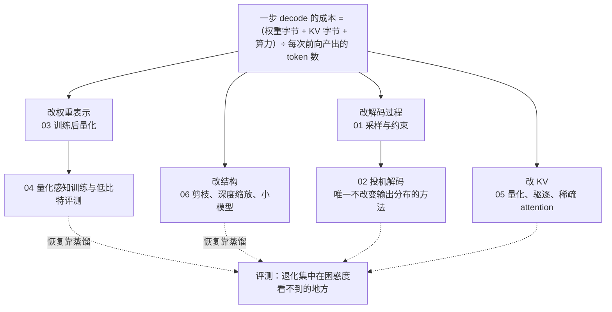
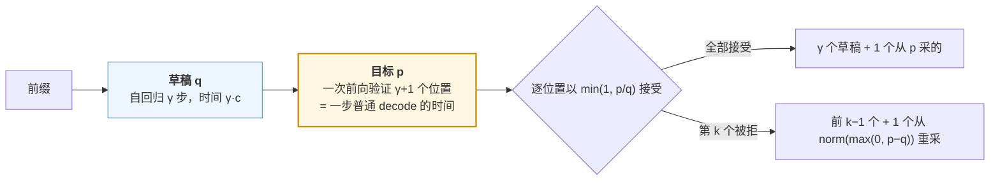

## 这个系列的一句话主张

> 每种推理优化都改了**成本公式的一项**；除投机解码之外每一种都**改变了输出分布**；而退化是**不均匀**的——集中在困惑度看不到的地方。

$$
\text{一步 decode 的成本} = \frac{\text{权重字节} + \text{KV 字节}}{\text{带宽}} \div \text{每次前向产出的 token 数} + \text{算力项}
$$

| 改哪一项 | 篇 |
|---|---|
| 改解码过程（分母） | 01 采样与约束 · 02 投机解码 |
| 改权重字节 | 03 训练后量化 · 04 QAT 与评测 |
| 改 KV 字节 | 05 量化、驱逐、稀疏 attention |
| 改参数数量 | 06 剪枝、深度缩放、小模型 |

<aside class="notes" markdown="1">
总纲：/efficient-inference-and-compression-for-llms.html。六篇用同一把尺子：分布是否改变、收益的区间在哪、代价是什么、退化集中在哪类任务上。
</aside>

---

## 六篇的全景

---

## 01 · 解码策略：采样参数本身就在改分布

**结论**：pass@1 奖励稳定走最可能的路（最优低温），pass@k 奖励至少一次走到（最优中高温）——**两者不能用同一组参数报告**；温度只改比值不置零，**截断才把尾部置零**；推理模型不用 greedy。

{: style="max-height: 300px"}

<aside class="notes" markdown="1">
原文 /decoding-strategies-sampling-and-constrained-generation.html。R1 / Qwen3 模型卡：T = 0.6、top-p 0.95、无重复惩罚。greedy 路径未被训练，长输出下重复退化被放大。
</aside>

<!-- v -->

### 数字

| 量 | 数 |
|---|---|
| 熵对温度的导数 | $$dH/dT = \text{Var}(z)/T^3$$ |
| 128K 词表尾部总质量 | 可达 **10%**；T = 0.7 也许只降到 0.02——低温没有去掉尾部 |
| pass@1 最优温度 | ≈ 0.2；pass@100 最优 ≈ 0.8 |
| pass@k 无偏估计 | $$1 - \binom{n-c}{k}/\binom{n}{k}$$ |
| 高温下 | min-p 比 top-p 稳 |

- 选择题用约束解码还是自由回答再抽取，可以差好几个点——采样参数是评测协议里最大的一项
- 不先固定采样，后面任何「量化前后差多少」都混进了采样噪声

---

## 02 · 投机解码：接受率 = 1 − TV，训草稿就是蒸馏

**结论**：唯一**不改变输出分布**的方法（拒绝采样保证严格等于目标分布）；EAGLE 赢在条件依赖与特征输入；树用宽度换深度但受 ridge 约束；**投机是延迟工具不是吞吐工具**。

<aside class="notes" markdown="1">
原文 /speculative-decoding-drafters-acceptance-and-trees.html。Pinsker：TV ≤ √(KL/2)——训草稿用前向 KL 蒸馏的依据；DistillSpec 把加速比再提高 10–45%。
</aside>

<!-- v -->

### 数字

| 量 | 数 |
|---|---|
| 期望产出 | $$\mathbb E[\text{tokens}] = \frac{1 - \alpha^{\gamma+1}}{1 - \alpha}$$，speedup $$= \mathbb E/(\gamma c + 1)$$，c ≈ 0.02–0.05 |
| 平均接受长度 | Medusa 2.5–3 → EAGLE 3.8–4.5 → EAGLE-3 5–6.5 |
| MTP 头（与主模型联合训练） | 接受率 85–90%、约 1.8× |
| 树的约束 | $$B \cdot N_{tree} \lesssim \text{ridge}$$：batch 8 × 64 节点 = 512 已过 H100 的 295 |

- 「草稿的 argmax 一致率就是接受率」——接受率是两个分布的重叠，argmax 相同形状不同 TV 可以很大
- typical acceptance 放松验证后，它就掉进后面几篇「改变分布」的范畴

---

## 03 · 训练后量化：崩掉几乎总是分布形状

**结论**：4-bit **快在 memory-bound 的 decode、慢在 prefill 与大 batch**；崩掉来自权重重尾与激活的固定通道离群——GPTQ 补偿、AWQ 保护、SmoothQuant 迁移、旋转摊平。

{: style="max-height: 340px"}

<aside class="notes" markdown="1">
原文 /post-training-quantization-gptq-awq-and-rotation.html。70B 权重 141 → 39.8 GB。高吞吐用 W8A8 / FP8（字节 ÷ 2、算力 × 2、近无损）或 W4A4（需旋转）。
</aside>

<!-- v -->

### 误差模型与四种方法

| 量 | 数 |
|---|---|
| 舍入误差方差 | $$\Delta^2/12$$：每少 1 bit ×4，INT8 → INT4 ×256 |
| 一个 15σ 权重 | 让 INT4 的 Δ = 2σ——group 内一个离群值毁掉一组 |
| g128 | 有效 4.156 bit，元数据 4% |
| 输出误差 | $$\text{tr}(EHE^\top)$$，$$H = \mathbb E[XX^\top]$$：误差落在激活大的通道被放大 |

| 方法 | 做什么 |
|---|---|
| GPTQ | 用 $$H^{-1}$$ 把误差补偿到未量化的列 |
| AWQ | 保护激活幅度最大的约 1% 通道 |
| SmoothQuant | $$\text{diag}(s)$$ 把激活的离群迁到权重 |
| 旋转（QuaRot） | Hadamard 把 1000 摊成约 17；70B W4A4KV4 困惑度 3.32 → 3.73 |

---

## 04 · QAT 与评测：困惑度是平均，任务看关键 token

**结论**：困惑度 +0.36 的 W4 模型 GSM8K 掉 3–6、needle 掉 10 以上——**先掉的是多步推理、长上下文、多语言与指令细节**；逐 token KL 是直接度量；末段 QAT 以全精度的自己为教师把退化压回一半。

{: style="max-height: 320px"}

<aside class="notes" markdown="1">
原文 /quantization-aware-training-low-bit-and-evaluating-quantized-models.html。ŵ = w + sg(Q(w) − w)。Gemma 3 QAT 5000 步；NF4 双重量化 4.127 bit。
</aside>

<!-- v -->

### 部署前怎么发现

| Llama-3-8B W4 | 变化 |
|---|---|
| 困惑度 | +0.36 |
| MMLU | −1–2 |
| GSM8K | **−3–6** |
| needle | **−10 以上** |
| 逐 token KL 均值 | 0.01–0.05 nat；超 0.1 明显——看 **P99** 不看均值 |

- 机制：容易的 token 0.9 → 0.88 贡献 0.02，关键的 token 0.4 → 0.3 或被翻转
- 敏感层：首尾层、out_proj / down_proj、lm_head、MoE 路由；校准集分布（英文网页上校准在中文与代码上损失更大）
- 「QAT 要从头训」——末段 QAT 用最后 5–10% token 或 SFT 阶段

---

## 05 · KV cache 压缩：key 与 value 不一样

**结论**：**key 有固定通道离群、value 没有**——key per-channel、value per-token，2 bit 下选错崩掉；FP8 KV 永远是第一步；驱逐假设「过去不重要 = 将来不重要」，在问题未知、信息密度高的任务上不成立。

{: style="max-height: 320px"}

<aside class="notes" markdown="1">
原文 /kv-cache-compression-quantization-eviction-and-sparse-attention.html。attention sink：massive activation 落在第一个 token 上，它的 key 与所有 query 点积都大，吃 30–50% 注意力，驱逐它就崩。
</aside>

<!-- v -->

### 70B、128K 的一条账

| 步 | KV 大小 |
|---|---|
| BF16，每 token 320 KB | **40 GB** |
| FP8（KL 0.001 nat） | 20 GB |
| INT4（元数据 25%，实际 3.2×） | 12.5 GB |
| + SnapKV 保留 25% | **3.1 GB** |

- KIVI 2 bit：key per-token 崩掉、per-channel +0.1
- 约 40K 上下文时 KV 读取超过权重读取——此后 KV 量化的边际收益大于权重量化
- 驱逐只在问题已知（SnapKV）、只依赖近期（StreamingLLM）或输入冗余大时安全；needle 是试金石
- 训练时稀疏（NSA / MoBA）回到「不变」：模型从来就只看那些块；NSA 64K 下 KV 读取 ÷ 11

---

## 06 · 剪枝与深度缩放：赢的是 token 效率不是精度上限

**结论**：中后层是残差流上的小修正——删掉对平均预测影响小、对**关键位置的多步组合与后训练能力**破坏大（删 25% 层 PPL +0.3、GSM8K 50 → 10 以下）；**剪枝必须蒸馏恢复**。

{: style="max-height: 280px"}

<aside class="notes" markdown="1">
原文 /pruning-depth-scaling-and-small-model-recipes.html。中后层余弦相似度 0.85–0.95；悬崖 70B 约 40%、13B 约 30%。
</aside>

<!-- v -->

### 重要性、硬件兑现与小模型配方

| 量 | 数 |
|---|---|
| OBS / SparseGPT 重要性 | $$w_q^2 / [H^{-1}]_{qq}$$——与 GPTQ 同一个拉格朗日推导 |
| Wanda | $$\lvert w_{ij}\rvert \cdot \lVert X_j\rVert$$——与 AWQ 同一个一阶观察 |
| 非结构化 50% | Tensor Core 不识别零，**不变快** |
| 2:4 | GEMM 1.3–1.8×，只在 compute-bound 有效；decode 字节只到 5/8 |
| Minitron 15B → 8B | 94B token 蒸馏 vs 从头 8T，省 **40×**；比继续预训练高 3–4 MMLU 点 |

- 承担 sink 功能的 head 与 retrieval head：校准集激活范数看不出、却不能剪
- 剪枝后再量化：两种误差相乘不相加——剪后模型对同样 W4 的困惑度增量大 1.5–2 倍
- Llama 3.2：剪枝做初始化，再用 9T token 蒸馏——压缩成了模型发布的一部分

---

## 五条贯穿线

| 线 | 落点 |
|---|---|
| **分布变了多少** | 有意改（采样）→ 不变（投机）→ 可控噪声（量化，Δ²/12、逐 token KL）→ 任务依赖（驱逐）→ 改变最大（剪枝）；度量从 TV 到 KL 到任务曲线 |
| **成本公式的哪一项** | 投机改分母（≲ ridge）；W4A16 改权重字节（止于 memory-bound）；KV 量化在 40K 后边际更大；2:4 只在 compute-bound；叠加时消耗同一段余量 |
| **离群值与同一套二阶数学** | $$\text{tr}(EHE^\top)$$：GPTQ = SparseGPT、AWQ = Wanda；通道级离群（LayerNorm γ，6.7B 起相变）与 massive activations（sink） |
| **困惑度 vs 关键 token** | 每个「无损」都要问在哪个指标、哪类任务、什么协议下 |
| **蒸馏，教师 = 自己** | 训草稿、QAT、剪枝恢复；部署需求提前到训练：MTP 头、厂商 QAT 版、NSA / MLA、剪枝做初始化 |

---

## 常见误区

- 「评测用 greedy 最公平」——推理模型在 T = 1 下训练，greedy 路径未被训练
- 「低温已经把尾部去掉了」——温度只改比值不置零；128K 词表尾部 10%
- 「树越大加速越多」——$$B \cdot N_{tree} \lesssim$$ ridge，batch 8 × 64 已过
- 「INT4 的误差只是 INT8 的两倍」——方差 ×256；一个 15σ 权重让 Δ = 2σ
- 「W4A16 让高吞吐服务也快 4 倍」——GEMM 仍是 BF16，dequant 是额外算力
- 「困惑度 +0.1 就是无损」——GSM8K −3–6、needle −10 以上；看 KL 的 P99
- 「key 与 value 用同一种粒度」——key per-channel、value per-token
- 「注意力低的 KV 可以安全驱逐」——needle 在被读到时就是「不重要」的
- 「50% 非结构化稀疏快一倍」——只有 2:4 被硬件兑现
- 「删层后 MMLU 不掉就是无损」——GSM8K 50 → 10；多选只要「大致对」
{: .fragments}

---

## 六个出口

| 篇 | 一个公式 / 一个数 |
|---|---|
| 01 | pass@1 最优 T ≈ 0.2、pass@100 ≈ 0.8；模型卡 T = 0.6 / top-p 0.95 |
| 02 | $$\alpha = 1 - \text{TV}$$；$$\mathbb E = (1-\alpha^{\gamma+1})/(1-\alpha)$$；$$B \cdot N_{tree} \lesssim$$ ridge |
| 03 | $$\Delta^2/12$$；$$\text{tr}(EHE^\top)$$；Hadamard 1000 → 17 |
| 04 | STE $$\hat w = w + \text{sg}(Q(w) - w)$$；PPL +0.36 ↔ needle −10 |
| 05 | 70B 128K：40 → 20 → 12.5 → 3.1 GB；sink 吃 30–50% |
| 06 | $$w_q^2/[H^{-1}]_{qq}$$；2:4 1.3–1.8×；Minitron 省 40× |

---

## 下一步

- **往前**：《Transformer 与 LLM》第 10、12 篇——Roofline 与量化 / 投机的第一次出现
- **往后（Infra）**：《vLLM 源码》——这些方法在引擎里的落点：采样器、投机 worker、量化 kernel、分页 KV
- **往后（算法）**：《后训练》第 7 篇——蒸馏的方法本身
- 原文总纲：`/efficient-inference-and-compression-for-llms.html`；通关自测 22 题在系列总结
