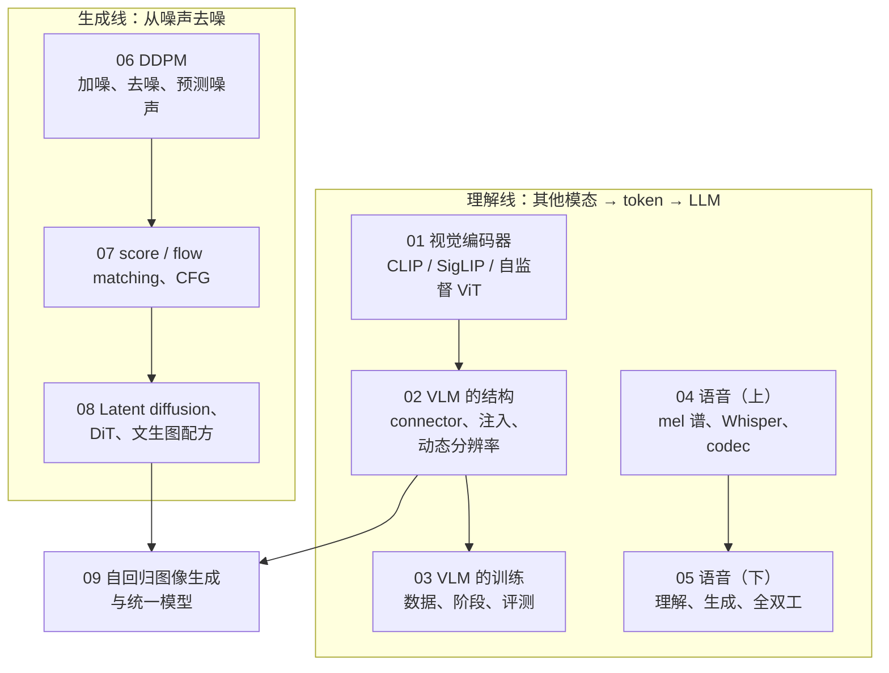

## 这个系列的一句话主张

> 多模态模型的每个部件都在做一次**「信息 vs token」的交换**，而交换的两端都能算账。

| 部件 | 决定什么 | 篇 |
|---|---|---|
| 编码器的目标函数 | 保留什么信息 | 01、04 |
| connector 与分辨率策略 | 一张图值多少 token | 02 |
| codec | 一秒语音值多少 token | 04、05 |
| VAE 与 VQ tokenizer | 生成侧在哪个空间、多长的序列上工作 | 08、09 |
| 生成范式（AR vs 扩散） | 串行 decode 还是多步并行 → memory-bound 还是 compute-bound | 06–09 |

<aside class="notes" markdown="1">
总纲：/multimodal-from-vision-encoders-to-diffusion.html。对照同一批模型：LLaVA → Qwen2.5-VL → InternVL、Whisper → Moshi、SD 1.5 → FLUX、VQGAN → BAGEL。每篇有一个 8×8 手写数字 / 双月牙上的玩具实验。
</aside>

---

## 理解线与生成线在第九篇交汇

---

## 01 · 视觉编码器：为什么是 CLIP 而不是 ImageNet ViT

**结论**：对比学习把图像投到**已与文本对齐的语义空间**，connector 只需小映射；但它只保留「文本能描述且需要区分图文对」的信息——**计数、空间、绑定、小字是结构性盲点**。

{: style="max-height: 300px"}

<aside class="notes" markdown="1">
原文 /vision-encoders-clip-siglip-and-self-supervised-vit.html。I ≥ log B − L，CLIP 32K batch；温度学到 0.01（×100）；CLIP 训练 6.4e21 FLOPs ≈ 7B LLM 150B token。
</aside>

<!-- v -->

### 图变成 token：patchify

{: style="max-height: 300px"}

| 编码器 | 输入 | token 数 |
|---|---|---|
| CLIP ViT-L/14-336 | 336² | 576 |
| SigLIP-SO400M-384 | 384² | 729 |

- MM1 消融：**分辨率 > 编码器参数量 > 训练数据**——ViT-H 比 ViT-L 不到 1 点，336² 比 224² 约 3 点
- DINOv2 特征更好但没有语言对齐；Cambrian-1 与 CLIP 类拼接，SigLIP 2 把自监督目标加进对比编码器

---

## 02 · VLM 的结构：一张图值多少 token

**结论**：LLaVA 的 MLP **无损保空间**、Q-Former 32 个内容无关的 query 装不下细节；2×2 merge 4× 几乎无损，28 × 28 像素/token 是文字甜点；**原生分辨率让 token ∝ 像素**，解决 tile 的边界、失真、效率三问题。

{: style="max-height: 290px"}

<aside class="notes" markdown="1">
原文 /vlm-architecture-connectors-injection-and-dynamic-resolution.html。576 token 在 7B 里 prefill 8 TFLOPs、KV 72 MB。MM1：connector 类型的影响远小于分辨率与 token 数。
</aside>

<!-- v -->

### 四种 connector 与两种注入

{: style="max-height: 240px"}

| 模型 | 策略 | 一张大图的 token |
|---|---|---|
| LLaVA-1.5 | 固定 336² | 576 |
| LLaVA-NeXT | AnyRes tile | 2880 |
| InternVL | ≤ 40 tile | ≈ 10K |
| Qwen2-VL | 原生分辨率，HW / 28² | 1024² → 1369 |
| Llama 3.2 Vision | cross-attention 注入 | 不占上下文，但 **+20B 参数**、单独训练 |

---

## 03 · VLM 的训练：为什么先冻结 LLM

**结论**：随机初始化的 connector 送进噪声梯度，**LLM 会学会忽略视觉 token**——所以先冻结 LLM 只训 connector；幻觉来自数据共现、编码器缺失、解码惯性三处，各有对应手段。

{: style="max-height: 320px"}

<aside class="notes" markdown="1">
原文 /vlm-training-recipe-data-stages-and-evaluation.html。LLaVA-1.5 558K + 665K；MM1 配比 45 / 45 / 10（交错 / 图文对 / 纯文本）。
</aside>

<!-- v -->

### 数字

| 量 | 数 |
|---|---|
| 文本混入 | 10–50%，退化 1–3 点；退化 > 2–3 点要查 |
| 阶段 2 的规模 | Qwen2-VL 1.4T token ≈ 一次 8B 预训练 |
| 幻觉（POPE） | 共现型 85 → 90；顽固的约 10% 来自编码器缺失与解码惯性 |

- 「多模态微调不影响文本能力」——只用多模态数据训会让 MMLU 掉几个点，代码与数学掉更多；回归 MMLU / GSM8K
- 三源三治：数据（去共现偏置）/ 编码器（分辨率、拼接）/ 解码（对比解码、视觉锚定）

---

## 04 · 语音（上）：一秒声音在模型眼里是什么

**结论**：波形 → log-mel（100 帧/秒 × 80）→ 编码器特征；语音**要生成**，所以主流让 LLM 生成短的离散序列再由 codec 还原波形；**RVQ 用几个小码本得到巨大的等效码本**。

{: style="max-height: 280px"}

<aside class="notes" markdown="1">
原文 /speech-and-omni-models-audio-encoders-codecs-and-duplex.html。log-mel 25 ms 窗 / 10 ms 步。Whisper 30 s → 1500 位置。
</aside>

<!-- v -->

### RVQ：残差量化，8 级码本 = 2⁸⁰ 个等效码字

{: style="max-height: 300px"}

| 一分钟语音 | token 数 |
|---|---|
| 声学 token（EnCodec 8 × 75 Hz，6 kbps） | 36,000 |
| 语义 token | 3,000 |
| 文本 | 200 |

---

## 05 · 语音（下）：说与想分开，全双工的时延

**结论**：直接生成语音 token 伤文本能力（**模态竞争**）→ 内心独白 / Thinker-Talker 把说与想分开；时延 = 分帧 + 首 token + 解码 + 语义决策，**全双工把串联四段压成一个模型的一步**。

{: style="max-height: 340px"}

<aside class="notes" markdown="1">
原文 /speech-understanding-generation-and-full-duplex.html。Moshi 80 ms 帧、160 / 200 ms；半双工 1–3 s；每路半张 H100——代价是持续运行。
</aside>

<!-- v -->

### 数字

| 量 | 数 |
|---|---|
| 一分钟三层 token | 声学 3.6 万 / 语义 3000 / 文本 200 |
| RVQ | 8 × 1024 = 2⁸⁰，6 kbps |
| 半双工时延 | 1–3 s，主要在 VAD 与三个模型的首 token 叠加 |
| 全双工（Moshi） | 80 ms 帧，160–200 ms |
| 成本 | 每路半张 H100，持续运行 |

- 「低时延靠更快的硬件」——四段里帧长与语义决策不是算力问题

---

## 06 · 扩散模型（上）：去噪为什么等于学会生成

**结论**：猜噪声的网络知道每个带噪点「**数据在哪个方向**」；ELBO 的高斯 KL 只剩均值差，用噪声表示后就是**一行 MSE**。

{: style="max-height: 170px"}

{: style="max-height: 150px"}

<aside class="notes" markdown="1">
原文 /diffusion-models-ddpm-score-matching-and-flow-matching.html。闭式 x_t = √ᾱ_t x_0 + √(1−ᾱ_t) ε；β 1e-4 → 0.02，1000 步。
</aside>

<!-- v -->

### DDIM：20 步 ≈ 1000 步

{: style="max-height: 200px"}

$$
x_t = \sqrt{\bar\alpha_t}\,x_0 + \sqrt{1 - \bar\alpha_t}\,\epsilon,\qquad
\mathcal L_{simple} = \mathbb E\big\lVert \epsilon - \epsilon_\theta(x_t, t)\big\rVert^2
$$

- 训练：随机取 t、加噪、预测噪声——loss 从约 1 几百步降到 0.21
- 采样：每步用预测的噪声估 $$x_0$$ 的方向走一小步；DDPM 每步加随机噪声（SDE），DDIM 不加（ODE）所以能跳步

---

## 07 · 扩散模型（下）：DDPM、score、flow matching 是同一件事

**结论**：在高斯路径 $$x_t = a_t x_0 + b_t\epsilon$$ 下三者是**同一个分数 $$\nabla_x \log p_t$$ 的线性参数化**，损失差一个 t 权重，采样解同一个概率流 ODE；reflow 拉直轨迹一步采样；**CFG 逐噪声层把 $$p_t(c\mid x)$$ 升到 w 次幂**。

{: style="max-height: 260px"}

<aside class="notes" markdown="1">
原文 /score-matching-flow-matching-and-classifier-free-guidance.html。ε = −σ s；v = ε − x_0；2^7.5 ≈ 180。
</aside>

<!-- v -->

### 轨迹的直线度决定步数

{: style="max-height: 260px"}

- toy reflow：直线度 0.49 → **1.00**，一步采样可用
- 「flow matching 是新方法」——全部是加权 ELBO；直线路径让步数少、调度直观

<!-- v -->

### CFG：w 越大越「像那个类」，也越过饱和

{: style="max-height: 200px"}

$$
\tilde\epsilon = \epsilon_\theta(x_t, \varnothing) + w\,\big(\epsilon_\theta(x_t, c) - \epsilon_\theta(x_t, \varnothing)\big)
$$

- w = 7.5 ⇒ $$2^{7.5} \approx 180$$：终点**不是**干净分布的幂，是逐层锐化的结果
- 不可跨模型比较：SD 1.x 7.5、SD3 3.5–7、FLUX.1-dev 3.5；配动态阈值 / rescale / 区间 guidance

---

## 08 · Latent diffusion 与 DiT：一张图与一次 LLM 推理怎么比

**结论**：VAE 接管感知压缩（f8 4ch 48×），扩散只做语义（1/10 算力）；DiT 的 FID 随 GFLOPs 平滑下降、与分配无关；**扩散 compute-bound 多步并行，LLM memory-bound 串行**——加速手段是步数蒸馏。

{: style="max-height: 260px"}

<aside class="notes" markdown="1">
原文 /latent-diffusion-dit-and-text-to-image-recipes.html。DiT-XL/2 FID 2.27；LCM 4 步、Turbo 1–4 步。
</aside>

<!-- v -->

### 在 16 维 latent 上做扩散

{: style="max-height: 300px"}

- 扩散只在 16 维上工作，算力约为像素空间的 1/10；DiT-XL/2 FID 2.27，FID 随 GFLOPs 平滑下降、与深度 / 宽度分配无关

<!-- v -->

### 账：FLUX 一张图 vs 7B LLM 一千 token

| | FLUX.1 12B，28 步 | 7B LLM，1000 token |
|---|---|---|
| FLOPs | **2.8 PFLOPs** | 14 TFLOPs |
| 比值 | 200× | 1 |
| 墙钟 | 相近——compute-bound 多步并行 | memory-bound 串行 decode |
| 5 s 720p 视频 | ≈ 115K token、600 PFLOPs | |

- 扩散无自回归 KV cache、每步形状相同（文本 cross-attn 的 K/V 可缓存）；服务按步数 / 分辨率组 batch
- 「扩散的推理优化照搬 LLM」——加速靠步数蒸馏（LCM 4 步、Turbo 1–4 步）与求解器

---

## 09 · 自回归图像生成与统一模型

**结论**：AR 赢在**与 LLM 共享一切**和「一切皆 token」的统一，扩散赢在质量、效率、编辑生态；表示目前部分共享（共享 attention、分开 FFN），方向是收敛。

{: style="max-height: 320px"}

<aside class="notes" markdown="1">
原文 /autoregressive-image-generation-and-unified-models.html。VQ commitment β = 0.25；LlamaGen 16384 码本利用率 97%。AR 生成的 60 张数字约一半可辨认——同预算下比 latent 扩散差。
</aside>

<!-- v -->

### 数字

| 量 | 数 |
|---|---|
| 栅格 AR，1024² | 4096 步、100 s |
| VAR（next-scale） | 10 尺度 680 token；FID **1.73** vs DiT-XL/2 2.27 |
| Janus-Pro | GenEval 0.80，理解 / 生成分开编码器 |
| BAGEL | 14B MoT：共享 attention、分开 FFN |

- 「AR 图像生成已被扩散淘汰」——ImageNet 上平手或领先，文生图上仍落后一档；最优形式可能是混合

---

## 五条贯穿线

| 线 | 落点 |
|---|---|
| **目标函数决定保留什么** | 对比学习 → 语义、丢计数与小字；重建（VAE / VQ / codec）→ 感知细节；自监督 → 空间结构 |
| **一段信号值多少 token** | 图 576 / 1369 / 10K；一秒语音 75 声学 / 50 语义 / 3 文本；一张 FLUX 图 = 200× 一次 LLM 推理的 FLOPs |
| **离散与连续两种生成形态** | AR 串行 decode（memory-bound）vs 扩散多步并行（compute-bound）；语音走离散 codec，图像两条路并行 |
| **新旧参数与模态竞争** | 冻结 LLM 训 connector；文本混入 10–50%；说与想分开；MoT 分开 FFN |
| **数据质量与 scaling** | 分辨率 > 参数量 > 数据；阶段 2 ≈ 一次预训练；DiT FID 随 GFLOPs 平滑下降 |

---

## 常见误区（一）

- 「编码器越大 VLM 越好」——ViT-H 比 ViT-L 不到 1 点，分辨率影响 3 点
- 「Q-Former 把 576 压到 32 是免费的」——32 个内容无关的 query 装不下细节
- 「cross-attention 注入不占上下文所以更优」——+20B 参数、单独训练、引擎特殊支持
- 「幻觉是数据问题」——顽固的 10% 来自编码器缺失与解码惯性
- 「多模态微调不影响文本能力」——MMLU 掉几个点，代码数学掉更多
{: .fragments}

---

## 常见误区（二）

- 「全双工低时延靠更快的硬件」——帧长与语义决策不是算力
- 「flow matching 是不同于扩散的新方法」——同一个分数的线性参数化
- 「guidance scale 越大越好、可跨模型比较」——过饱和、多样性坍缩；与模型和调度耦合
- 「扩散的推理优化照搬 LLM」——没有 KV cache、compute-bound
- 「AR 图像生成已被淘汰」——VAR 1.73 优于 DiT 2.27
{: .fragments}

---

## 九个出口

| 篇 | 一个公式 / 一个数 |
|---|---|
| 01 | $$I \ge \log B - \mathcal L$$；温度 0.01；576 / 729 token |
| 02 | token = HW / 28²；2×2 merge 4× 无损 |
| 03 | 先冻结 LLM；文本混入 10–50%；1.4T ≈ 一次预训练 |
| 04 · 05 | 25 ms / 10 ms；RVQ $$1024^8 = 2^{80}$$；一分钟 3.6 万 / 3000 / 200；Moshi 160–200 ms |
| 06 | $$x_t = \sqrt{\bar\alpha_t}x_0 + \sqrt{1-\bar\alpha_t}\epsilon$$；DDIM 20 步 ≈ 1000 |
| 07 | $$\epsilon = -\sigma s$$、$$v = \epsilon - x_0$$；$$2^{7.5} \approx 180$$ |
| 08 | f8 4ch 48×；FLUX 2.8 PFLOPs vs LLM 14 TFLOPs |
| 09 | VAR FID 1.73；BAGEL MoT |

---

## 下一步

- **往前**：《Transformer 与 LLM》第 13 篇——image token 的 KV 代价；《数学》04 / 05——KL、ELBO、高斯
- **往后（Infra）**：《扩散模型推理 Infra》——步数、分辨率、batch 与服务；《vLLM 源码》——多模态输入怎么进引擎
- **往后（应用）**：《模型作为组件》——多模态 API 的调用形态
- 原文总纲：`/multimodal-from-vision-encoders-to-diffusion.html`；通关自测 22 题在系列总结
