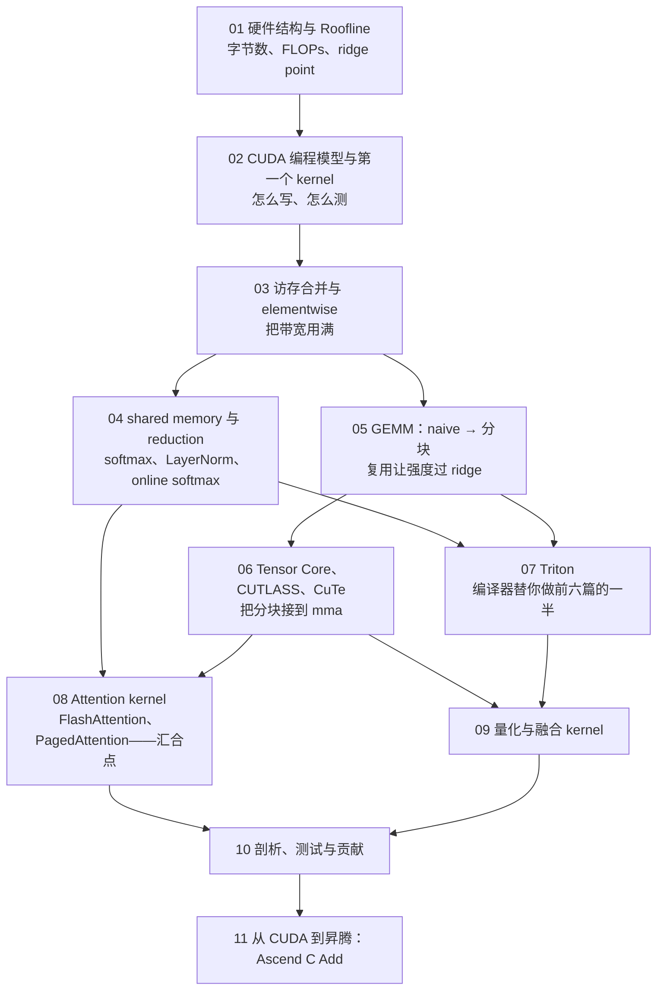
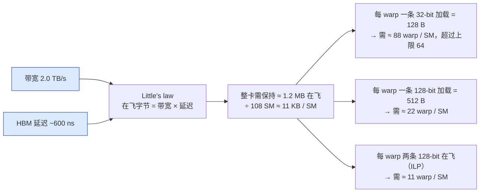
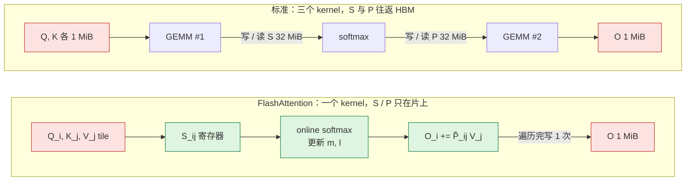

## 这个系列的一句话主张

> 每个 kernel **先算它理论上应该多快，再测它实际多快，再用 profiler 解释差距，再动手缩小差距**。

$$
T \ge \max\!\left(\frac{\text{FLOPs}}{P_{peak}},\ \frac{\text{Bytes}}{BW}\right),\qquad
I = \frac{\text{FLOPs}}{\text{Bytes}}\ \ \text{vs}\ \ \text{ridge} = \frac{P_{peak}}{BW}
$$

| 硬件基线 | 带宽 | BF16 | FP32 | SM | ridge（BF16） |
|---|---|---|---|---|---|
| A100 | 2.0 TB/s | 312 TFLOPS | 19.5 TFLOPS | 108 | 156 |
| H100 | 3.35 TB/s | 989 TFLOPS | 67 TFLOPS | 132 | 295 |

<aside class="notes" markdown="1">
总纲：/gpu-kernel-engineering.html。理论下界来自 kernel 的两个数（字节、FLOPs）和硬件的两个数（峰值带宽、峰值算力）。
</aside>

---

## 十一篇怎么连起来



---

## 01 · GPU 为什么这样设计：硬件结构与 Roofline

**结论**：GPU 用**零开销 warp 切换**而非乱序执行隐藏延迟——芯片面积给了 ALU 而不是缓存与预测器；一段计算理论上最快多快由 $$T = \max(F/P_{peak},\ B/BW)$$ 决定。

{: style="max-height: 340px"}

<aside class="notes" markdown="1">
原文 /gpu-architecture-and-roofline.html。延迟：寄存器 0 / shared 20–30 / L2 200 / HBM 400–800 周期。
</aside>

<!-- v -->

### 常见算子的算术强度

| 算子 | I（FLOP / Byte） | vs ridge 156（A100 BF16） |
|---|---|---|
| elementwise（add） | 1/6 | memory-bound，差三个数量级 |
| RMSNorm | ≈ 1 | memory-bound |
| decode attention（GQA g = 4） | ≈ 4 | memory-bound |
| GEMM 4096³ BF16 | ≈ 1365 | compute-bound |

- 「GPU 利用率 90% 说明 kernel 跑得好」——利用率只说明有 kernel 在跑；访存糟糕的 kernel 可以占满 SM 只用 10% 带宽

---

## 02 · 第一个 kernel：五行 vector add 跑出多少带宽

**结论**：**80–92%**；DRAM 可达带宽只有标称的 85–92%，其余在每线程工作量太小、launch 与尾部、SM 填充。

```cuda
__global__ void add(const float* a, const float* b, float* c, int n) {
    int i = blockIdx.x * blockDim.x + threadIdx.x;   // 全局线程编号
    if (i < n) c[i] = a[i] + b[i];
}
// add<<<(n + 255) / 256, 256>>>(a, b, c, n);
```

| 量 | 数 |
|---|---|
| 3 × 1 GiB 读写 | 下界 3 GiB / 2.0 TB/s = **1.6 ms**；实测 1.7–2.0 ms |
| block 大小 | 32 的倍数，常用 128–256 |
| 计时 | `cudaEventRecord` 前后各一个 event——launch 立即返回，CPU 时钟量到的是提交时间 |
| L2 flush | 128 MB ≥ 2 × 40 MB，否则测的是 L2 |

<aside class="notes" markdown="1">
原文 /cuda-programming-model-and-first-kernel.html。
</aside>

---

## 03 · 访存合并：跑到 90% 之后只能减字节

**结论**：一个 warp 32 线程的访问按 **32 B sector** 合并——连续 100%、跨步 2 50%、跨步 ≥ 32 B 12.5%；90% 贴着物理上限，**之后唯一的优化是融合减少总字节数**。



<aside class="notes" markdown="1">
原文 /memory-coalescing-and-elementwise-kernels.html。
</aside>

<!-- v -->

### 要点

- 16 B / 线程的向量化加载；「memory-bound 不需要高占用率」——1.2 MB 必须在飞
- 三个 elementwise kernel 各读写 16 B → 融合成一个 8 B

---

## 04 · shared memory 与 reduction：慢在形态不在字节

**结论**：4096 维 RMSNorm 是 memory-bound 的，naive 慢 10 倍是**归约的形态**；shared 汇总跨 warp 的部分和，**warp shuffle 在寄存器里 5 步完成 warp 内归约**，sync 10 次 → 1 次；online softmax 让一次遍历就够。

| 量 | 数 |
|---|---|
| 128 MiB 的 RMSNorm | 67 µs（接近带宽） |
| bank conflict | bank = (addr / 4) mod 32；stride s → gcd(s, 32)-way |
| d ≤ 1024 | 一行一个 warp |
| $$e^x$$ 溢出 | FP16 于 x > 11.09，BF16 / FP32 于 88.7——softmax 必须减最大值 |

$$
m = \max(m_a, m_b),\qquad l = l_a e^{m_a - m} + l_b e^{m_b - m}
$$

- 「用 `atomicAdd` 做行归约最简单」——同地址串行化；float 加法不满足结合律、不可复现；树形归约 + shuffle，跨 block 只用原子计数

<aside class="notes" markdown="1">
原文 /shared-memory-reduction-and-softmax.html。online softmax 的合并公式是 FlashAttention 的核心（第八篇）。
</aside>

---

## 05 · GEMM 从 naive 到分块：让算术强度成为可设计的参数

**结论**：4096³ FP32 的理论 I = 683、下界 7.0 ms；naive 实际读 512 GiB、I = 0.25、只到峰值 1–3%；**分块 $$MNK(1/BM + 1/BN)$$**：128 × 128 → 4 GiB、I = 32；瓶颈从 L1/L2 请求迁到 shared 带宽再迁到 LDS 指令，寄存器分块靠 ILP。

{: style="max-height: 340px"}

<aside class="notes" markdown="1">
原文 /gemm-from-naive-to-tiled.html。137.4 GFLOP、192 MiB。「25% 占用率一定没压满硬件」——寄存器分块用 128 个寄存器换 ILP，compute-bound GEMM 的常态是低占用率 + 高 ILP。
</aside>

---

## 06 · Tensor Core、CUTLASS 与 CuTe

**结论**：Tensor Core **不是更快的 FMA**——累加器从属于线程变成属于 warp、布局由指令规定；`mma` 只允许约 8 条伴随指令，装载必须用 `ldmatrix` 且 shared 必须 **swizzle**；Hopper 交给 TMA + `wgmma`。

| 量 | 数 |
|---|---|
| 312 TFLOPS | FP32 的 16 倍 |
| `mma.sync.m16n8k16` | 4096 FLOP，占 8 周期 |
| BF16 4096³ | 100.7 MB、I = 1365、下界 0.44 ms |
| 未 swizzle 的 64 B 行 | 4 路 bank conflict |
| 手写到 cuBLAS | 80–90% |

- CuTe 的 Layout = Shape + Stride：把 fragment 布局、swizzle、分块写成可组合的代数
- CUTLASS 三层：collective（mma + 装载）→ kernel（分块调度）→ device（launch）

<aside class="notes" markdown="1">
原文 /tensor-cores-cutlass-and-cute.html。
</aside>

---

## 07 · Triton：块级编程与编译器的边界

**结论**：编译器替你做了合并、流水、`ldmatrix`、swizzle、mma 选择——matmul **少 80% 代码、到 cuBLAS 80–95%**；差的 10% 在 warp specialization、epilogue 布局转换、小 shape tile、指令调度。

| kernel | Triton | CUDA |
|---|---|---|
| vector add | 12 行 | 50–80 行 |
| softmax | 25 行 | 100–150 行 |
| matmul | 60 行 | 200–300 行 |

- 两个旋钮：`num_warps`、`num_stages`；`tl.arange` 要 2 的幂——都是执行模型的影子
- 何时手写：热点 GEMM / attention、特殊指令、Hopper 特性、跨 block 协作
- 「用 Triton 就不必理解执行模型」——性能直觉全来自 CUDA；出问题读 TTGIR 与 PTX

<aside class="notes" markdown="1">
原文 /triton-block-level-programming.html。
</aside>

---

## 08 · FlashAttention：省的是 IO 不是 FLOPs

**结论**：不物化 S、P，靠 online softmax 逐块累加，**HBM 132 MiB → 66 MiB（实际近 4 MiB）**，从 memory-bound 变 compute-bound；FLOPs 略多于标准实现；decode 每步读全部 KV，**分页只改地址不改字节**。



<aside class="notes" markdown="1">
原文 /attention-kernels-flashattention-and-pagedattention.html。N = 4096、d = 128：4N²d = 8.6 GFLOP；标准 I ≈ 62；HBM 流量 Θ(N²d²/M)。
</aside>

<!-- v -->

### decode：每 token 读多少 KV，决定了什么

| 量 | 数 |
|---|---|
| Llama-3-8B 每 token KV | 128 KiB |
| B × s > 约 131k token 时 | KV 读取超过权重读取 |
| PagedAttention | block 表把逻辑块映射到物理块：**只改地址不改字节**，解决碎片与共享前缀 |
| FlashDecoding | 沿序列维切 split-K，让小 batch 也填满 SM |

- 「FlashAttention 快是因为算得少」——FLOPs 略多，快在不物化 N² 矩阵

---

## 09 · 量化与融合 kernel：用指令换字节

**结论**：INT4 weight-only GEMM **字节 ÷ 4、FLOPs 不变、多一条反量化指令**——decode 在斜线上受益（8 → 约 2 ms），prefill 在屋顶上不动甚至下沉；FP8 字节与 FLOPs **同时**减半。

{: style="max-height: 340px"}

<aside class="notes" markdown="1">
原文 /quantization-and-fused-kernels.html。BF16 I ≈ M、W4A16 I ≈ 4M；E4M3 max 448 无 inf。
</aside>

<!-- v -->

### decoder layer 的其余融合

| 融合 | 每元素字节 |
|---|---|
| residual + RMSNorm | 10 → 8 B |
| RMSNorm + FP8 量化 | 7 → 3 B |
| SiLU × up（SwiGLU 激活） | 三读一写 → 两读一写 |
| RoPE + KV 写入 | 省一次往返 |

- 「INT4 量化全面提速」——只在 decode（M 小于约 40）赢；prefill 要 FP8

---

## 10 · 剖析、测试与贡献：先看 SOL

**结论**：ncu 先看 **Speed-of-Light**：访存或算力任一接近 90% 就什么都不用改；**两者都低才是 latency-bound**，再看占用率的限制因素、加 ILP、改完重测。

| ncu 读法 | 判断 |
|---|---|
| SOL > 80% | 到顶，换算法或减字节 |
| 两者 < 40–50% | latency-bound：看 stall 原因与占用率 |
| 寄存器 > 32 | 压占用率；128+ 是 GEMM 常态 |
| stall long scoreboard 60% + 占用 25% | 等 HBM 且 warp 不够——加 ILP 或提占用 |

- 测试：BF16 rtol 1.6e-2；边界 shape 0、1、769、5125（非 2 的幂、非 tile 倍数）
- 接入：`TORCH_LIBRARY` + `register_fake` + `opcheck`——才能进 compile 与 vLLM
- 「stall 原因是 profiler 最有用的信息」——SOL 已满时等访存是正常的

<aside class="notes" markdown="1">
原文 /kernel-profiling-testing-and-contribution.html。
</aside>

---

## 11 · 从 CUDA 到昇腾：同一个 Add 换执行模型

**不变**：每元素两读一写、一次加法；先正确性、后性能。

**改变**：线程索引 → 每核一段再分 tile；直接全局 load/store → 显式 `CopyIn → Compute → CopyOut`。

| CUDA 概念 | Ascend C 的对应与边界 |
|---|---|
| grid / blockIdx | launch 的 blockDim / GetBlockIdx；不要混淆 block 内线程数 |
| 显式暂存与生产者/消费者同步 | TPipe / TQue / LocalTensor；队列不是 warp |
| cp.async 与流水 | 两块 buffer 提供重叠机会，不承诺加速 |
| Tensor Core / CUTLASS | Cube / Matmul；只是功能角色与分层分块的类比 |

Table: CUDA 与 Ascend C 的核心映射

<aside class="notes" markdown="1">
原文 /ascend-cann-from-cuda-to-ascend-c.html。版本钉 CANN 8.0.0 文档链接的 samples tag v0.2-8.0.0.beta1；本文环境没有 CANN / NPU。
</aside>

<!-- v -->

### 账本不是性能报告

- 固定 FP16 `[8,2048]`：8 个逻辑块，每块 16 轮 × 128 元素。
- 三队列各两块 buffer：payload **1536 B**；逻辑全局流量 **98304 B**；I = **1/6**。
- NumPy 账本只验证覆盖与参考值；CANN CPU 调试、仿真、真机不能互相冒充。
- 本篇未编译或运行 Ascend C；**没有真实 NPU 性能数据**。

---

## 贯穿线：同一张 Roofline

| 篇 | 在 Roofline 上做了什么 |
|---|---|
| 01 | 画出这张图：ridge 156 / 295 |
| 02 · 03 | 斜线上的 kernel 贴到 90% 带宽；之后只能减字节（融合） |
| 04 | 归约形态让 memory-bound kernel 离斜线 10 倍；shuffle 贴回去 |
| 05 · 06 | 分块把 I 从 0.25 抬到 32 再到 1365，从斜线爬上屋顶；Tensor Core 把屋顶抬高 16 倍 |
| 07 | 编译器替你走前六篇的路，差 10% |
| 08 | FlashAttention 把 attention 从斜线搬到屋顶（减 IO） |
| 09 | INT4 沿斜线右移（减字节）；FP8 同时右移和抬顶 |
| 10 | SOL 告诉你现在在图的哪里 |
| 11 | 账本可迁移，执行模型与 profiler 要换；小 Add 不代表 HBM 带宽 |

---

## 常见误区

- 「GPU 利用率 90% 说明 kernel 跑得好」——看字节、FLOPs 与 Roofline
- 「launch 后用 CPU 时钟计时」——量到的是提交时间
- 「跑到 90% 带宽还能在 kernel 内部再挤」——可达带宽只有标称 85–92%
- 「memory-bound 不需要高占用率」——1.2 MB 必须在飞
- 「GEMM 算术强度 683 所以怎么写都 compute-bound」——naive 实际 0.25
- 「Tensor Core 只是更快的 FMA」——累加器归属、布局、装载、指令预算全变
- 「FlashAttention 快是因为算得少」——FLOPs 略多，省的是 HBM 往返
- 「INT4 量化全面提速」——只在 decode M < 40 赢
- 「stall 原因是 profiler 最有用的信息」——先看 SOL
{: .fragments}

---

## 十一个出口

| 篇 | 一个公式 / 一个数 |
|---|---|
| 01 | $$T = \max(F/P,\ B/BW)$$；ridge 156 / 295 |
| 02 | 3 GiB → 1.6 ms；80–92% |
| 03 | 32 B sector；1.2 MB 在飞；≥ 22 warp / SM |
| 04 | bank = (addr/4) mod 32；$$l = l_a e^{m_a - m} + l_b e^{m_b - m}$$ |
| 05 | $$MNK(1/BM + 1/BN)$$；128×128 → I = 32 |
| 06 | mma m16n8k16 = 4096 FLOP；swizzle |
| 07 | 60 行 vs 200–300 行；80–95% |
| 08 | 132 → 66 MiB（实际 4）；$$\Theta(N^2d^2/M)$$ |
| 09 | W4A16 I ≈ 4M，交叉 M ≈ 40 |
| 10 | SOL > 80% 到顶；rtol 1.6e-2 |
| 11 | 8 × 2048；16 × 128；1536 B 队列 payload；性能留待 NPU 实测 |

---

## 下一步

- **往上**：《PyTorch 深度实践》第 6、8 篇——自定义算子怎么接入、profiler 怎么读；《vLLM 源码》——FlashAttention / PagedAttention 在引擎里的位置
- **往旁**：《ML 编译器》——Triton 之后编译器还做了什么；《通信与互连》——kernel 之外的另一半时间
- **算法侧**：《现代 LLM 结构》第 02 篇的 Roofline 是同一张图
- 原文总纲：`/gpu-kernel-engineering.html`；通关自测在系列总结
