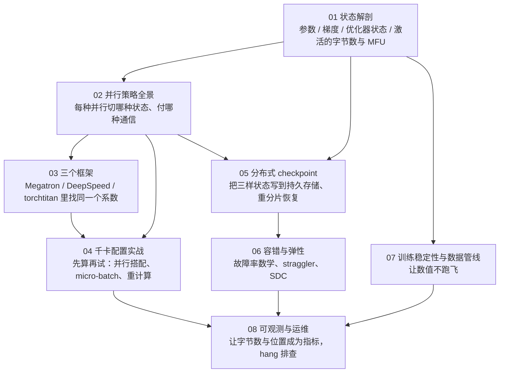

## 这个系列的一句话主张

> **训练引擎围绕状态组织，先算再试。**

一个训练任务的全部状态只有**四样**——参数、梯度、优化器状态、激活：

| 事 | 对状态做什么 | 篇 |
|---|---|---|
| 算账 | 它们各多少字节、多少 FLOP | 01 |
| 并行 | 决定它们放在哪张卡上 | 02、03、04 |
| checkpoint | 把其中三样写到持久存储 | 05 |
| 容错 | 一部分卡消失后重建它们 | 06 |
| 稳定性 | 保证它们的数值不跑飞 | 07 |
| 可观测 | 让它们的字节数与位置成为指标 | 08 |

代入 Llama 3 的 8B / 70B / 405B 与 1024 或 16K 张 H100；到 Megatron Core、DeepSpeed、torchtitan 源码里找同一个系数。

<aside class="notes" markdown="1">
总纲：/large-scale-training-from-parallelism-to-fault-tolerance.html。配置不是试出来的，是算出来再校准的；checkpoint 间隔是一个平方根；有效训练时间是一个五项公式。
</aside>

---

## 八篇怎么连起来

---

## 01 · 状态解剖：三种是 N 的线性函数，一种是 token 数的

**结论**：每参数 **16 字节**（Megatron fp32 累加梯度 18）——70B 常驻 **1.13 TB**、405B 6.49 TB，是一张 80 GB 卡的 14 倍；激活每层 $$sbh(34 + 5as/h)$$，FlashAttention 后 $$34sbh$$；每 token $$6N + 6Lsh$$ FLOP。

{: style="max-height: 340px"}

<aside class="notes" markdown="1">
原文 /training-state-anatomy-memory-and-mfu.html。70B 每层激活 2.28 GB；每 token 449 GFLOP。
</aside>

<!-- v -->

### 三个数的包含关系，与 MFU / HFU

{: style="max-height: 330px"}

- **MFU 不含重计算、HFU 含**；全量重计算 HFU = 4/3 MFU——「开重计算后 MFU 上去了」是误区
- 千卡 dense ≥ 40% MFU 是好成绩

---

## 02 · 并行策略全景：每一个「切」对应一种通信

**结论**：并行是**状态的放置方案**；不可重叠且量大的放最近（TP 锁在 NVLink 内，$$N_t \le 8$$），可重叠的放远（PP 量最小放最远）；组合顺序 **TP → CP → PP → DP**。

{: style="max-height: 360px"}

<aside class="notes" markdown="1">
原文 /parallelism-strategies-which-state-to-shard.html。Llama 3 405B TP 8 / PP 16 / DP 128 每 step：TP 220 GB NVLink、DP 12.6 GB IB、PP 1 GB IB。
</aside>

<!-- v -->

### TP：列切不通信、行切要 all-reduce

{: style="max-height: 300px"}

| 并行 | 切什么 | 每 step 通信 | 链路 |
|---|---|---|---|
| DP / ZeRO-1 / ZeRO-2 | 复制 / O / O + G | 2N | 可重叠，放最远 |
| ZeRO-3 / FSDP | P + G + O | **3N** | 可重叠 |
| TP | 每层的矩阵 | 每层 2 + 2 次 all-reduce | **不可重叠**，NVLink 内 |
| PP | 层 | 层间激活，最小 | 可重叠；气泡 (p−1)/m，交错后 (p−1)/(vm) |

<!-- v -->

### PP：GPipe 与 1F1B；CP：ring attention

{: style="max-height: 280px"}

{: style="max-height: 200px"}

---

## 03 · 三个框架：同一个 bf16 参数存在哪

**结论**：Megatron **常驻完整 bf16**（buffer 视图）、DeepSpeed Stage 3 常驻 **1/N_d 碎片**、torchtitan **不常驻 bf16**（fp32 分片 unshard 出来）；通信量相同，**表示与可组合性不同**。

| 框架 | 每参数常驻 | 每 step 通信 | 进程组 |
|---|---|---|---|
| Megatron Core 0.18 | 2 + 4 + 12/N_d | RS + AG = 2N | `RankGenerator(order="tp-cp-ep-dp-pp")` |
| DeepSpeed 0.19 Stage 3 | (16 或 18)/N_d + 临时层 | AG + AG + RS = 3N | mpu 委托 |
| torchtitan v0.3（FSDP2） | 16/N_d + 临时层 | 3N | `DeviceMesh` + DTensor |

- 「FSDP2 比 FSDP1 通信少所以快」——次数与量相同；差别是每参数 DTensor 能与 TP、DCP、compile 组合
- 「torchtitan 常驻一份 bf16 参数」——bf16 只在一层前向、反向的几十毫秒里存在

<aside class="notes" markdown="1">
原文 /megatron-deepspeed-torchtitan-architecture-and-source-guide.html。
</aside>

---

## 04 · 千卡配置实战：70B、1024 张 H100，先算

**结论**：推导顺序 **TP → PP → DP → CP**；每卡 token 少时选 **PP + ZeRO-1 不选 FSDP**（FSDP128 每卡每 step 175 GB 节点间通信、3.5 s 盖不住）；MFU 损失拆成七项各自标价，先修配置错误。

| 候选 A | 值 |
|---|---|
| 并行 | TP8 / PP4（v = 4 交错）/ DP32 |
| micro-batch | b = 1、m = 16；气泡 4.7% |
| 每卡显存 | 约 49 GB，不重计算 |
| 理论 step | 2.0 s；目标 42% MFU ≈ 4.75 s ≈ **88 万 token/s** |
| 只有 32% 时缺的 10 个点 | 配置约 6、硬件约 2、结构约 0.5、管线约 0.5 |

- 全量重计算 +33% FLOP 省 94% 激活；FP8 step 时间降 20–25%
- 「PP 加深激活就少」——1F1B 第一个 stage 同时持有 p 个 micro-batch 的激活；减激活靠 micro-batch、SP、CP、重计算

<aside class="notes" markdown="1">
原文 /thousand-gpu-configuration-and-mfu-tuning.html。s = 8192、global batch 4M。
</aside>

---

## 05 · 分布式 checkpoint：磁盘上是「全局张量的一组分片」

**结论**：不是某个 rank 的内存映像，所以能**零通信重分片**；落盘每参数 14 或 12 字节、**与并行配置无关**；异步保存把 δ 从写入时间变成 staging 时间——**不是优化是必需**。

$$
\tau_{opt} = \sqrt{2\,\delta\,M},\qquad \text{最小浪费} = \sqrt{2\delta / M}
$$

| M ≈ 3.1 h（16K 卡的 MTBF） | δ | 最小浪费 |
|---|---|---|
| 同步写单文件 | 10 min | **33%** |
| 分片异步写 | 2 s | **1.9%** |

- 405B 5.7 TB：单文件 19–95 分钟，分片写每卡 350 MB 秒级；staging 内存 = 每卡唯一字节 × (1–2)
- 「checkpoint 大小随 TP / PP / DP 变」——去掉 DP 复制后的唯一字节不变，这正是能重分片的前提

<aside class="notes" markdown="1">
原文 /distributed-checkpoint-format-async-save-and-resharding.html。Young 公式。
</aside>

---

## 06 · 容错与弹性：故障是常态，有效时间是五项公式

**结论**：$$M = M_{gpu}/N$$——16K 卡 54 天 **419 次意外中断**、M ≈ 3.1 h；缩短顺序：**先 δ（异步保存），再 $$T_d$$（hang 检测），再 $$T_r$$（重启），$$T_l$$ 最后**。

$$
G = \frac{1 - (T_d + T_r + T_l + \tau/2)/M}{1 + \delta/\tau}
$$

| Llama 3 405B | 数 |
|---|---|
| 中断成因 | 78% 硬件、58.7% GPU、1.4% SDC；3 次人工 |
| 有效训练时间 | > 90% |
| 16K 卡：同步 → 异步 → 压检测与重启 | 71% → 87% → 94% |
| NCCL watchdog / 进程重启 | 10 min / 2–5 min |

- 「有效时间低先缩短 checkpoint 间隔」——间隔由 $$\sqrt{2\delta M}$$ 决定，δ 不变缩间隔只是多付保存代价
- 「straggler = 坏卡」——多数是序列长度 / stage 不均衡，**每步换 rank**；先看是否换 rank

<aside class="notes" markdown="1">
原文 /fault-tolerance-and-elastic-training.html。
</aside>

---

## 07 · 稳定性与数据管线：五种成因各有信号指纹

**结论**：第 137,000 步 loss 2.1 → 4.8——三种形态（瞬时 / 可恢复 / 发散）× 五种成因（LR / bf16 / logit / 坏数据 / 优化器状态），靠**事前记录的原始值**归因；处理是**回退 + 跳过**，前提是 checkpoint 密度与数据管线确定性。

| 成因 | 指纹 |
|---|---|
| 学习率 | 与调度拐点对齐；param norm 加速 |
| bf16 精度 | grad norm 平台后跳变 |
| attention logit | max logit 单调升过约 100 |
| 坏数据 | 换 seed / 跳 batch 后不复现 |
| 优化器状态 | 恢复 checkpoint 后仍在同一步附近 |

- PaLM：回退约 100 步 + 跳过 200–500 batch，代价约 250–300 步 / 次
- 数据位置：Megatron = `consumed_train_samples` 可换 DP；torchtitan `StatefulDataLoader` 不可换
- 「loss spike 就是脏数据」——五种里两种是模型内部数值问题

<aside class="notes" markdown="1">
原文 /training-stability-and-data-pipeline.html。裁剪阈值 1.0。
</aside>

---

## 08 · 可观测与运维：「step 是否前进」是 hang 唯一可靠的信号

**结论**：三层指标（任务 / 进程 / 硬件）、**按 rank 看、以 step 为时钟**；GPU 利用率 100% 时照样可能在 hang（NCCL kernel 自旋）；Flight Recorder 指出哪个 rank 缺席哪次集合通信。

| 凌晨三点 step 12 s → 40 s，四个嫌疑 | 决定性指标 |
|---|---|
| straggler | Timers minmax（哪个 rank 最慢、是否每步换） |
| 数据 | `data_loading(%)` |
| 通信 | 通信等待 + IB 端口计数器 |
| 降频 | `SM_CLOCK` |

- Flight Recorder 2.13.0 默认开（buffer 2000）；把 dump 路径接好、缓冲加到 2 万
- 2.5 美元 / 卡时下 1 个 MFU 点 ≈ 30 天任务的 0.71 天 ≈ **4.4 万美元**

<aside class="notes" markdown="1">
原文 /long-running-training-observability-and-operations.html。
</aside>

---

## 四种状态在八篇里

| 状态 | 01 多少 | 02–04 放哪 | 05 落盘 | 06 重建 | 07 数值 | 08 指标 |
|---|---|---|---|---|---|---|
| 参数 | 2N bf16 + 4N fp32 | TP / ZeRO-3 切 | 4 B（fp32 主）| 重分片加载 | param norm | 每 rank 显存 |
| 梯度 | 2N | DP 归约 | 不落 | — | grad norm、裁剪 | 通信等待 |
| 优化器状态 | 8N | ZeRO-1 切 | 8 B | 重分片 | 恢复后仍 spike → 是它 | — |
| 激活 | sbh(34 + 5as/h) | PP / CP / 重计算 | 不落 | — | max logit | 峰值显存 |

---

## 常见误区（一）

- 「bf16 训练每参数 2 字节」——16 字节，70B 1.13 TB
- 「开重计算后 MFU 上去了」——只计入 HFU
- 「TP 通信量最大所以最贵」——贵在不可重叠
- 「ZeRO-2 比 ZeRO-1 多通信」——都是 2N
- 「FSDP2 比 FSDP1 通信少」——差别是表示
- 「千卡上用 FSDP 代替 PP 更快」——每卡 4096 token 摊不薄参数通信
{: .fragments}

---

## 常见误区（二）

- 「PP 加深激活就少」——1F1B 持有 p 份
- 「checkpoint 大小随并行配置变」——唯一字节不变
- 「异步 checkpoint 是锦上添花」——同步最小浪费 ≥ 10%
- 「有效时间低先缩间隔」——先 δ、再 T_d、再 T_r
- 「straggler = 坏卡」——多数每步换 rank
- 「GPU 利用率 100% 说明训练正常」——hang 时也 100%
{: .fragments}

---

## 八个出口

| 篇 | 一个公式 / 一个数 |
|---|---|
| 01 | 16 B / 参数；$$sbh(34 + 5as/h)$$；$$6N + 6Lsh$$；HFU = 4/3 MFU |
| 02 | DP 2N / ZeRO-3 3N；TP ≤ 8；气泡 (p−1)/(vm)；TP → CP → PP → DP |
| 03 | 常驻 2 + 4 + 12/N_d vs 16/N_d；RS + AG = 2N |
| 04 | TP8 / PP4 / DP32，b = 1、m = 16；42% ≈ 88 万 token/s |
| 05 | $$\tau_{opt} = \sqrt{2\delta M}$$；33% → 1.9% |
| 06 | $$G = \frac{1 - (T_d + T_r + T_l + \tau/2)/M}{1 + \delta/\tau}$$；419 次 / 54 天 |
| 07 | 3 形态 × 5 成因；max logit > 100；回退 100 + 跳 200–500 |
| 08 | step 是否前进；FR buffer 2 万；1 MFU 点 ≈ 4.4 万美元 |

---

## 下一步

- **往下**：《通信与互联》——2N / 3N 的每一次通信走哪条链路；《PyTorch 深度实践》第 9 篇——DDP / FSDP 的源码
- **往旁**：《AI 平台工程》——千卡怎么调度、故障怎么隔离；《RL 后训练 Infra》——训练引擎里再塞一个推理引擎
- **算法侧**：《预训练》第 5 篇——配方与稳定性的算法视角
- 原文总纲：`/large-scale-training-from-parallelism-to-fault-tolerance.html`；通关自测在系列总结
