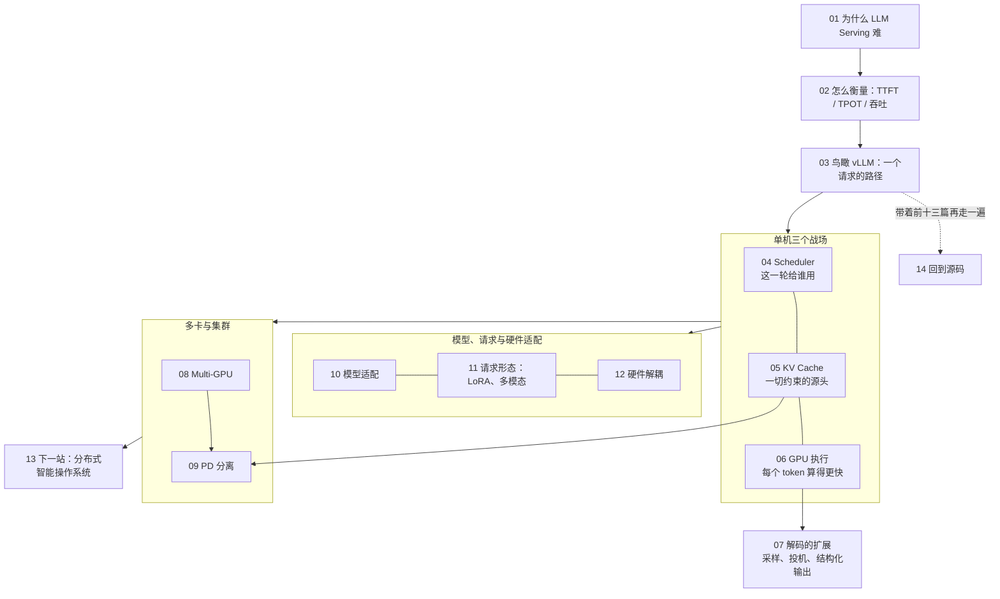
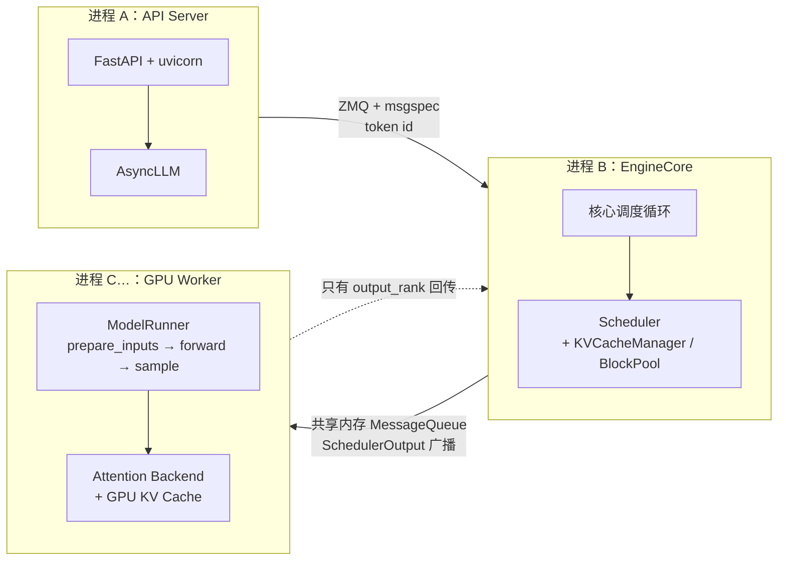
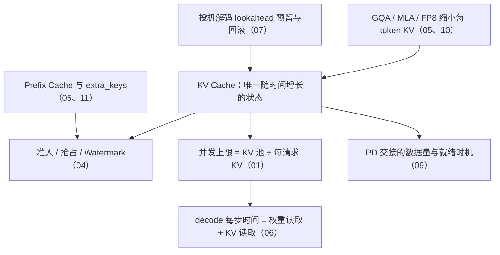
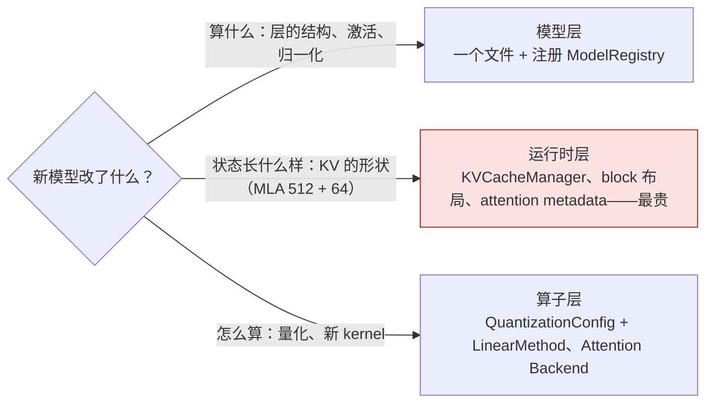

## 这个系列的一句话主张

> LLM Serving 的本质，是围绕**生成过程**对请求、Token、计算资源和中间状态进行**持续协调**；vLLM 不是一堆优化技术的集合，而是一套围绕「**动态请求 + KV 状态 + GPU 资源**」构建起来的**推理操作系统**。

两条贯穿全系列的判断：

1. **KV Cache 是一切约束的源头**——它是唯一随时间增长的状态
2. **调度的单位是 token，不是 request**

<aside class="notes" markdown="1">
总纲：/deep-dive-into-vllm.html。主线：问题定义 → 指标体系 → 系统全景 → 单机三个战场（调度 / 内存 / 执行）→ 多卡与集群扩展 → 模型、请求与硬件适配 → 未来演进 → 源码落地。
</aside>

---

## 十四篇怎么连起来

---

## 01 · 为什么 LLM Serving 比传统 DL 推理难

**结论**：服务对象从「一次前向、一次返回」变成**持续生成过程**——动态执行、带状态、Prefill / Decode 混合 workload；目标是 **SLO 约束下的执行规模**而非最大 batch。

| Llama-3-70B、TP8、H100 | 数 |
|---|---|
| 每 token KV | 320 KB（每层 4 KB）；一条 2300 token 的请求 734 MB |
| 权重 | 每卡 17.6 GB |
| Prefill 2050 token | 算力下界 37 ms |
| Decode 一步 | 带宽下界 5.3 ms；batch 1 → 64 只从 5.3 → 7.0 ms |
| ridge | 295 FLOP/B |

- 「LLM 推理难是因为模型大」——参数多只让每步更慢；难在三个根本变化

<aside class="notes" markdown="1">
原文 /why-llm-serving-is-hard.html。
</aside>

---

## 02 · 如何衡量：吞吐量系统做了多少，延迟量用户等了多久

**结论**：四个维度（延迟 / 吞吐 / 效率 / 质量）；**Goodput 量 SLO 内的有效工作**——按请求计、ttft / tpot / e2el 三项「与」；一条 300 token 的回答 E2E ≈ 0.3 + 299 × 0.03 ≈ 9.3 s，**decode 占 97%**。

| 指标 | 定义 | 陷阱 |
|---|---|---|
| TTFT | 从 t0 起算，**含排队** | 「TTFT = Prefill 时间」——高了先看 waiting 队列、`max_num_seqs`、抢占 |
| TPOT | (E2E − TTFT) / (N − 1)，不含首 token | |
| 吞吐 | token/s 或 req/s | 超 SLO 的吞吐不算 Goodput |
| GPU 利用率 | SM 上有 kernel | decode memory-bound 时 MFU 只有几个百分点；看带宽利用率 |

<aside class="notes" markdown="1">
原文 /how-to-measure-llm-serving.html。
</aside>

---

## 03 · 鸟瞰 vLLM：一个请求穿过整个系统

**结论**：**控制面 / 数据面分离**——EngineCore 驱动循环，Scheduler 决策，Executor 分发，ModelRunner 执行；Scheduler 与 ModelRunner 之间**传元数据不传 tensor**。

<aside class="notes" markdown="1">
原文 /vllm-request-lifecycle-overview.html。Scheduler 约 3000 行。
</aside>

---

## 04 · Scheduler：GPU 这一轮到底给谁用

**结论**：**调度单位是 token**——每步先服务 running（至少 1 token），再按 FCFS 准入 waiting，直到 token budget、`max_num_seqs` 或 KV 块用尽；KV 不够按 **LIFO 抢占、重算**。Scheduler 没有「阶段」：Continuous Batching、Chunked Prefill、混合批次、投机解码是同一模型的四种取值。

| 例子 | 数 |
|---|---|
| 2050 token 的 prompt，chunk 512 | 4 × 512 + 2，共 5 段 |
| budget 2048 | 200 decode + 1800 prefill 用掉 2000 |
| decode 为主 | `max_num_seqs` 先于 budget 卡住（256 请求只用 12.5% 预算） |
| 抢占 | `running.pop()` + `num_computed_tokens = 0` + `prepend_request` |

- 「抢占重算一定很贵，应该 swap」——Prefix Cache 让前缀块大多还在，重算远低于理论最坏

<aside class="notes" markdown="1">
原文 /scheduler-batch-and-fairness.html。
</aside>

---

## 05 · KV Cache：LLM Serving 的第一号内存问题

**结论**：显存是被「不确定性」浪费的（旧系统有效 KV 只占 20–38%）——**按块分页**，块满才进 Prefix Cache；让 KV 更小有**系统 / 架构 / 数值**三个正交层面。

<aside class="notes" markdown="1">
原文 /kv-cache-memory-core.html。
</aside>

<!-- v -->

### 数字

| 量 | 数 |
|---|---|
| `block_size` | 16 token；每卡一块 640 KB |
| 2050 token | 129 块；2000 token 前缀 125 块全部命中——**复用粒度是块**，2005 token 最后 5 个要重算 |
| 每 token KV | MHA 64 头 2.56 MB → GQA-8 320 KB → FP8 160 KB（**16 倍**） |
| MLA | 每 token 每层 (512 + 64) × 2 B ≈ 1.1 KB vs 4 KB |

- 三个层面：系统（分页、前缀共享、抢占）/ 架构（GQA、MLA）/ 数值（FP8 KV）

---

## 06 · GPU 执行：浪费只有四种

**结论**：**等 CPU 发指令**（CUDA Graph）、**等 HBM**（FlashAttention、融合）、**每个数太胖**（量化）、**轮次太多**（投机解码）；一步约 10 ms，权重读取下界 5.3 ms。

| 量 | 数 |
|---|---|
| Prefill 92 ms（40% MFU） | 占 3% |
| 300 步 decode 3000 ms | 占 **97%** |
| CUDA Graph capture sizes | [1, 2, 4] + 8 步进到 256 + 16 步进到 512；默认 `FULL_AND_PIECEWISE`，80 层切成约 81 段图 |
| FP8 vs BF16 | 1979 vs 989 TFLOPS |

- 「CUDA Graph 把 forward 融成一个超级 kernel」——图只记录 kernel 序列一次重放，减少的是 launch 开销与间隙；每个 kernel 内部时间不变；与 `torch.compile` 正交

<aside class="notes" markdown="1">
原文 /gpu-execution-kernels-and-graphs.html。
</aside>

---

## 07 · 解码的扩展：为什么不只改 Sampler

**结论**：采样改**分布本身**、投机改**每步决定的位置数**（1 → 1 + K）、结构化输出改**分布的支撑集**；都要改调度、KV、runner——因为 batch 是持久的、token 数是调度出来的、KV 是预分配的、图是捕获好的。

| 量 | 数 |
|---|---|
| 一行 fp32 logits | 513 KB；penalties 每步两张 [B, V+1] int64 直方图 |
| 投机的临界点 | 约 300 token / 步 / 卡：batch × (1 + K) 超过它验证不再免费 |
| batch 1、接受长度 2.5 | 约 2.1× |
| batch 128 | 每步慢 1.9 倍、吞吐反降 |
| 结构化输出 bitmask | 每行 16 KB（4008 个 int32） |

- 「投机解码打破了 token 依赖」——依赖在 draft 内部照样串行

<aside class="notes" markdown="1">
原文 /decoding-extensions-sampling-speculative-and-structured-output.html。
</aside>

---

## 08 · Multi-GPU：一张卡不够时怎么切

**结论**：单层放不下 **TP**、整个模型太大 **PP**、专家太多 **EP**、上下文太长 **CP**、装得下要更多吞吐 **DP**——前四个解决「装不下」，DP 解决「想要更多」且**永远最外层**。

| 并行 | 通信 | 放哪 |
|---|---|---|
| TP | 每层 2 次 all-reduce（Attention 后 + MLP 后），80 层每步 160 次，**关键路径不可重叠** | 只放 NVLink 内 |
| PP8 | 每 stage 10 层、每步 7 次 P2P | 可跨机 |
| EP | all-to-all；TP × EP = 总 GPU 数 | |
| CP | 适合 64K–1M token | |
| rank 排布 | DP × PP × PCP × TP（TP 最内层） | |

- 「TP 卡数翻倍单请求延迟减半」——all-reduce 在关键路径上

<aside class="notes" markdown="1">
原文 /multi-gpu-scaling-strategies.html。
</aside>

---

## 09 · PD 分离：从资源混部走向计算解耦

**结论**：三个设计问题——**计算如何拆、状态如何交接、系统如何协同**；「匹配不等于就绪」、「计算结束不等于块可回收」；共置 / 分离描述资源域不描述物理位置；PD 不会自动产生全局调度器或分布式缓存管理器。

| 70B、TP8 | 数 |
|---|---|
| 每 token KV | 320 KiB |
| 2048 token | 640 MiB，每 rank 80 MiB；400 Gb/s 共享一条链路 13.42 ms、八路并行 1.68 ms |
| 4096 token | 1.25 GiB，每 rank 160 MiB，**3.4 ms ≈ 一步 decode 量级** |
| D 侧状态 | `WAITING_FOR_REMOTE_KVS` |
| P 待交接 KV | 20000 tok/s × 0.2 s ≈ 1.22 GiB——P 侧的块不能在计算结束时回收 |

<aside class="notes" markdown="1">
原文 /prefill-decode-disaggregation.html。
</aside>

---

## 10 · 模型适配：模型剧变时引擎在哪一层吸收

**结论**：三层适配——**模型层**吸收「算什么」、**运行时层**吸收「状态长什么样」（最贵）、**算子层**吸收「怎么算」；通用抽象扩大范围，特化 kernel 守住性能。

<aside class="notes" markdown="1">
原文 /model-adaptation-architecture.html。
</aside>

---

## 11 · 请求形态的扩展：multi-LoRA 与多模态

**结论**：三个假设被破——**同一份权重、embedding 是查表、相同前缀相同 KV**；LoRA 靠一个 kernel 处理全部 adapter + 槽位静态预分配 + 两层 LRU；多模态靠 encoder 独立预算 + 占位符 + 布尔掩码散射；两者都往块哈希加 `extra_keys`。

{: style="max-height: 320px"}

<aside class="notes" markdown="1">
原文 /request-shapes-multi-lora-and-multimodal.html。
</aside>

<!-- v -->

### 数字

| 量 | 数 |
|---|---|
| 8 个 rank-16 LoRA 槽位 | ≈ 1.44 GB / 卡 = 15 个请求的 KV，**与实际加载几个无关** |
| LoRA 的代价 | 每步多 1120 次 launch、FLOPs 只多 0.2% |
| 一张图 | 576 / 1369 个 token；encoder 输出 9–22 MB 但 **KV 184–438 MB（约 20 倍）** |
| `encoder_compute_budget` | = `max_num_batched_tokens` |

{: style="max-height: 260px"}

---

## 12 · 硬件解耦：不让芯片差异污染 Serving 核心

**结论**：Serving 核心**依赖抽象能力不依赖具体芯片**；Platform 是能力中心但**不是所有底层组件的唯一父类**；Out-of-Tree 独立演进的前提是主仓库提供稳定契约。

| 五层边界 | 内容 |
|---|---|
| Serving Core | Scheduler、KV Cache、请求生命周期——不知道芯片 |
| 抽象契约 | `get_attn_backend_cls`、`get_device_communicator_cls`、`get_worker_cls`、`check_and_update_config` |
| 平台实现 | CUDA / ROCm / TPU / XPU 的 Platform 类 |
| 硬件运行时 | 驱动、通信库 |
| Kernel | attention、GEMM、量化 |

- 插件经 `vllm.platform_plugins` entry point 注册
- 「Attention Backend 应该继承 Platform」——一个平台多个 backend，继承会组合爆炸；Platform 按条件派发一个类

<aside class="notes" markdown="1">
原文 /hardware-abstraction-and-portability.html。
</aside>

---

## 13 · 下一站：从模型执行器到分布式智能操作系统

**结论**：四个转变——手工配置 → **自动执行计划**、本地缓存 → **分布式状态平面**、单体推理 → **多阶段分布式执行**、GPU 利用率 → **Goodput / SLO / 成本**；vLLM 是执行引擎层。

| OS 类比 | Serving |
|---|---|
| 进程 | 请求 |
| 页 | KV 块 |
| 内核里的调度器 + 内存管理器 | vLLM |
| 集群资源管理器 | llm-d / Dynamo / Mooncake 一类 |
| 系统调用契约 | KV 传输、能力发现、指标 |

- 三个平面：计算 / 状态 / 调度

<aside class="notes" markdown="1">
原文 /future-of-serving-infra.html。
</aside>

---

## 14 · 回到源码：一次请求的真实旅程

**结论**：Python 控制面 / C++·CUDA 数据面分离；四个域（请求 / 调度 / 显存 / 模型）；`RequestStatus` 状态机；翻译层 `prepare_inputs()` 把 `SchedulerOutput` 变成 `slot_mapping` / `block_table`；**Python 开销 0.15 ms / 15 ms ≈ 1%**，且被 batch queue 流水线化。

| 五笔账（7B / A100 与 70B / H100） | 数 |
|---|---|
| 显存 | 147 块 / 734 MB |
| 调度 | 5 段 chunk |
| 时间 | 92 + 3000 ms |
| 每步同步 | 2.5 MB |
| 跨节点搬 KV | 641 MB ≈ 13 ms |

- 7B / A100：权重读取 13.5 GB ÷ 2.0 TB/s ≈ 6.6 ms；decode 一步 batch 1 8–12 ms、batch 32 10–18 ms，吞吐 100 → 2000 tok/s

<aside class="notes" markdown="1">
原文 /source-code-request-walkthrough.html。
</aside>

---

## 两条判断在十四篇里

| 判断 | 落点 |
|---|---|
| **KV 是一切约束的源头** | 01 并发上限 = KV 池 ÷ 每请求 KV → 04 准入 / 抢占 → 05 分页与前缀 → 06 每步时间 = 权重 + KV 读取 → 07 lookahead 预留 → 09 PD 交接的就是 KV → 10 MLA 是运行时层的变化 → 11 图片 KV 20 倍、extra_keys |
| **调度单位是 token** | 04 budget 与 chunk → 06 capture sizes 按 token 数 → 07 投机 1 + K、临界 300 token → 09 P 侧按 token 交接 → 11 encoder 预算 → 14 `SchedulerOutput` 里只有 token 数与块表 |

---

## 常见误区（一）

- 「LLM 推理难是因为模型大」——难在动态、带状态、混合 workload
- 「最大 batch 就是目标」——SLO 下的执行规模
- 「TTFT 等于 Prefill 时间」——含排队
- 「GPU 利用率高 = 系统高效」——decode 时 MFU 只有几个点
- 「Scheduler 先跑 prefill 再跑 decode」——没有阶段，只有 token 推进
- 「抢占重算一定很贵」——前缀块还在
- 「Prefix Cache 按 token 复用」——按块
{: .fragments}

---

## 常见误区（二）

- 「CUDA Graph 融成一个超级 kernel」——只省 launch
- 「投机解码总能加速」——batch × (1 + K) > 300 后不再免费
- 「TP 卡数翻倍延迟减半」——all-reduce 在关键路径
- 「只加载一个 LoRA 就只占一个槽」——静态买断
- 「多模态贵在 encoder」——贵在图片 token 的 KV
- 「PD 分离 = 两台机器；分离后干扰消失」——资源域不是位置；D 内干扰仍在
{: .fragments}

---

## 十四个出口

| 篇 | 一个公式 / 一个数 |
|---|---|
| 01 · 02 | KV 320 KB / token；decode 下界 5.3 ms；TPOT = (E2E − TTFT)/(N − 1)；decode 占 97% |
| 03 · 04 | 三类进程两道 IPC；2050 → 5 段；`max_num_seqs` 先卡；LIFO 抢占重算 |
| 05 · 06 | block 16、640 KB；2.56 MB → 320 → 160 KB；四种浪费；81 段图 |
| 07 · 08 | 临界 300 token / 步；2.1× vs 慢 1.9 倍；TP 每步 160 次 all-reduce |
| 09 · 10 · 11 | 4096 token 3.4 ms；匹配 ≠ 就绪；三层适配；LoRA 1.44 GB 买断；图片 KV 20 倍 |
| 12 · 13 · 14 | 五层边界；三个平面；Python 1% |

---

## 下一步

- **往下**：《GPU Kernel 工程》第 8 篇——FlashAttention / PagedAttention 本身；《通信与互联》第 7 篇——custom all-reduce 与 KV 传输
- **往旁**：《扩散模型推理 Infra》——没有 KV cache 的另一种 Serving；《RL 后训练 Infra》——推理引擎进训练循环
- **算法侧**：《高效推理与压缩》——量化、投机、KV 压缩的算法侧；《Transformer 与 LLM》第 10 篇的 Roofline
- 原文总纲：`/deep-dive-into-vllm.html`；通关自测在系列总结
