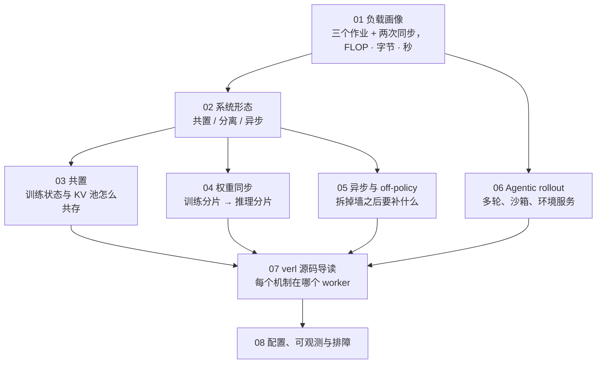
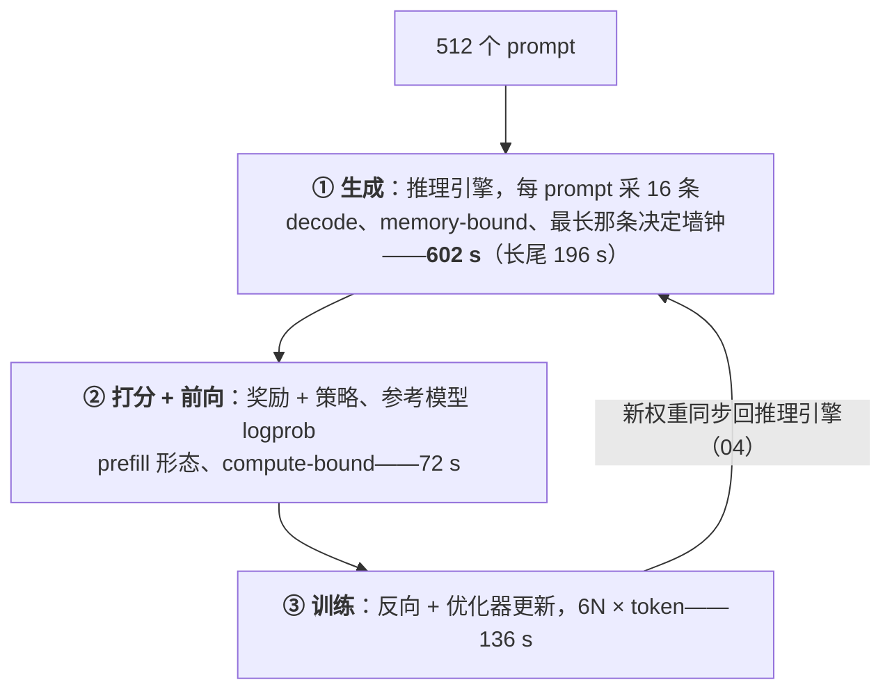
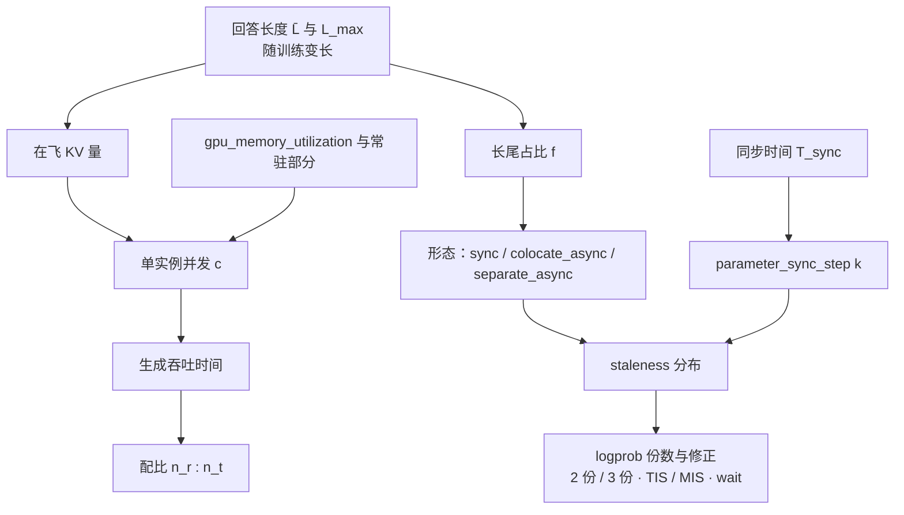

## 这个系列的一句话主张

> RL 训练的一步是**三个形态不同的作业加两次同步**；把它们的算力、显存、时间与两次同步的字节数追踪清楚，系统形态、权重同步、异步、环境调度都是在**这张账上做交换**。

| 作业 | 形态 | 对 GPU 的用法 |
|---|---|---|
| 生成（rollout） | decode，**memory-bound** | 权重 + 大 KV 池 |
| 打分 + 前向 | prefill，compute-bound | 三个模型的 logprob |
| 训练 | GEMM，**compute-bound** | 16 B / 参数的训练状态 |

两者对显存的要求互斥、中间隔两道同步的墙——公开报告里 rollout 占墙钟 60–80%、GPU 利用率常在 30% 以下，全部来自这个结构。

<aside class="notes" markdown="1">
总纲：/rl-post-training-infrastructure.html。三条线索：账本线（FLOP · 字节 · 秒）、形态线（共置 / 分离 / 异步）、框架线（verl，末尾对照 slime 与 AReaL）。
</aside>

---

## 八篇怎么连起来

---

## 01 · 负载画像：一步 RL 里发生什么

**结论**：8B、64 张 H100 做 GRPO——**FLOP 上训练占一半、生成六分之一；时间上生成占四分之三**；全步 MFU 13%。

<aside class="notes" markdown="1">
原文 /rl-step-anatomy-rollout-reward-train.html。每 token 约 12N_a；一步 6.8 EFLOP；KV 9.3 TB、分 1.4 波；decode 步 ≈ 36 ms。
</aside>

<!-- v -->

### 三个误区

- 「训练 FLOP 占一半，所以瓶颈在训练」——decode 是 memory-bound、MFU 个位数，时间不按 FLOP 分
- 「加卡就能按比例缩短 rollout」——长尾取决于最长那条序列：64 → 128 卡墙钟只降 35%，长尾 196 s 一秒不少
- 「全步 MFU 越高越好」——PPO 多出的价值模型 FLOP 是「好算的活」，MFU 13.3% → 18.1% 而墙钟 +22%；看墙钟

---

## 02 · 系统形态：同一张账上的三种交换

**结论**：**同步分离比共置更差**（两池轮流、任一时刻只有一个池在干活）；**异步 ≈ 共置 − 长尾**；共置对长尾线性敏感、异步不敏感；rollout : train **按时间配**不按 FLOP，异步 2 : 1。

| 64 卡 | 墙钟 | 利用率 |
|---|---|---|
| 共置 | 810 s | 13% |
| 同步分离 | **1501 s** | 7% |
| 一步流水 | 764 s | 14% |
| 异步 | **619 s** | 17% |

- 长尾占比 f 从 10% 到 70%：异步 / 共置 1.07× → 2.55×；verl 实验 2.35–2.67×
- 配比 $$n_r / n_t = T_{gen}^{(n)} / T_{train}^{(n)}$$；FLOP 上训练是生成的 3 倍、时间上生成是训练的 2 倍——且随回答变长而漂

<aside class="notes" markdown="1">
原文 /rl-system-topologies-colocate-disaggregate-async.html。
</aside>

---

## 03 · 共置：两次显存换手搬多少字节

**结论**：让渡有**搬 / 丢 / 不动**三种；`CuMemAllocator` 摘物理页保虚拟地址——CUDA graph、模型对象、块表都幸存；**切换 < 2%，真实代价是常驻部分挤掉的 KV 池**。

| 32B、8 卡 | 数 |
|---|---|
| 每步换手 | 约 130 GB、6.5 s（4 s 是优化器状态往返） |
| pinned 内存 | 520 GB |
| `gpu_memory_utilization` 0.85 → 0.5 | 8B 生成 610 → **745 s**——KV 池只有半张卡 |
| 边界 | $$16N / n \le 70$$ GB 才能共置 |

- 「sleep 之后 CUDA graph 要重捕获、块表要重建」——只摘物理页；要补的是 `named_buffers`、fp8 KV scale、prefix cache

<aside class="notes" markdown="1">
原文 /colocated-trainer-and-rollout-engine-memory-handoff.html。
</aside>

---

## 04 · 权重同步：从训练分片到推理分片

**结论**：同步 = **布局 + 传输**两半，中间是 HF 名字的 `(name, tensor)` 流；「**谁持有完整模型**」比链路快慢重要；**增量同步让没有人持有完整模型**。

| Megatron TP4 / PP2 / EP8 → vLLM TP8 / EP4，671B FP8 | 时间 |
|---|---|
| 朴素：全模型经 rank 0 一张网卡并在它上面物化 | 60–80 s（理论下界 13 s） |
| 多源 | 12–20 s |
| 235B 全量 vs delta | 246–266 s vs **11–15 s（21×）** |
| 每步变化的参数 | dense 1–3%、MoE 0.02–0.05% |

- bucket 512 MB、峰值 2 bucket；bubble = $$T_{sync} / (kT_{mb} + T_{sync})$$
- 「权重同步慢是网络带宽不够」——大部分与网络无关；「增量省的是传输字节」——0.5B 上也快 1.3 倍，省的是全量 all-gather 与 rank 0 物化

<aside class="notes" markdown="1">
原文 /weight-sync-from-training-shards-to-inference-shards.html。
</aside>

---

## 05 · 异步与 off-policy：「样本过期」是三个东西

**结论**：**staleness、训推不一致、缓冲淘汰**三者机制不同、信号不同——在 reward 曲线上不可分，要**事前记录**三组信号；修正的系统要求是 **logprob 的份数**。

| 量 | 数 |
|---|---|
| staleness $$s \approx \lfloor(\text{生成用时} + \text{等待}) / T_{sync}\rfloor$$ | 长回答 s 更大；阈值默认 8；s ≤ 2–4 配修正无损 |
| 训推不一致（logprob 差） | dense $$10^{-3}$$、FP8 $$10^{-2}$$、MoE 路由翻转单 token > 1 |
| TIS 修正 | $$\min(w, 2)$$ |
| 部分 rollout 重 prefill | ≈ 一步 FLOP 的 6% |
| decoupled PPO | 3 份 logprob（生成时、参考、当前） |

- 「drop 掉过期样本是中性随机丢弃」——staleness 与回答长度正相关，drop 系统性地丢长回答；用 wait 或部分 rollout

<aside class="notes" markdown="1">
原文 /async-rl-staleness-partial-rollout-and-off-policy-correction.html。
</aside>

---

## 06 · Agentic rollout：rollout 变成分布式系统

**结论**：500 任务 × G = 8 × 20 轮 = **8 万次容器执行、667–1300 CPU·h、1300–1800 并发沙箱**；KV 驻留决定 prefill 是二次还是线性；**沙箱是第三个池**；环境方差让异步成必需。

| 32 卡 30 分钟 | 数 |
|---|---|
| decode | ≈ 500 s |
| prefill | 160 s（KV 命中）—— **1600 s**（默认配置接近全重算） |
| 每卡 | 650 token/s |
| 训练侧 | 15 EFLOP |
| token 来源 | 八成来自环境 |

- 「开了前缀缓存，多轮 prefill 就是线性的」——命中要 KV 块还在显存；等环境的 30 秒里被逐出；KV 卸载是出路

<aside class="notes" markdown="1">
原文 /agentic-rollout-multi-turn-tools-sandboxes-and-environment-services.html。
</aside>

---

## 07 · verl 源码导读：一个 bf16 参数的十二步

**结论**：从优化器更新完成到推理引擎用它生成下一个 token：**十二步、四类进程、三条链路**；共置 = 一个进程持有多个角色对象；TransferQueue 是同步与异步统一的解耦点；slime 薄、AReaL 异步优先——**三家趋同的四段是必然**。

| 机制 | 在 verl 的哪里 |
|---|---|
| 角色 → 组方法 | `@register` 只挂属性，`_bind_worker_method` 生成组方法 |
| 一步的九个阶段 | `_step_once` |
| 共置 | `create_colocated_worker_cls` + `spawn` |
| 权重同步（non-naive） | 七步：gather → 重命名 → bucket → 传 → load → 唤醒 |
| 解耦点 | TransferQueue |

<aside class="notes" markdown="1">
原文 /verl-source-walkthrough-from-a-grpo-config-to-every-worker.html。
</aside>

---

## 08 · 配置、可观测与排障：全步 MFU 瀑布

**结论**：六步推导配置、**全步 MFU 瀑布**、RL 状态的 checkpoint、确定性、必采指标、故障表；凌晨两点 reward 平台的排查顺序是**数据 → 版本 → 异步 → 实现**。

| 32B / 128 卡算例 | 数 |
|---|---|
| 配比 | 80 : 48 |
| 一步 | ≈ 1170 s，MFU ≈ 20% |
| MFU 瀑布 | 100% − 64%（decode）− 13%（长尾）− 4%（同步）− 0.1% ≈ 13% |
| 671B checkpoint | 10.7 TB 写 18 分钟 |
| 确定性 | `full_determinism` 要求 `use_v1=false` |

- 「reward 为 0 就是环境出错」——0 是合法 reward；服务应返回错误码，reward 按源分组监控

<aside class="notes" markdown="1">
原文 /rl-post-training-configuration-observability-and-troubleshooting.html。
</aside>

---

## 几个量的依赖：回答长度决定一切

---

## 常见误区（一）

- 「训练 FLOP 占一半所以瓶颈在训练」——时间上生成占四分之三
- 「加卡按比例缩短 rollout」——长尾一秒不少
- 「全步 MFU 越高越好」——看墙钟
- 「分离比共置省时间」——同步分离更差；价值只在重叠
- 「rollout : train 按 FLOP 配」——按时间配，2 : 1
- 「共置的代价是切换的秒数」——是 KV 池只有半张卡
- 「sleep 后要重捕获 CUDA graph」——只摘物理页
{: .fragments}

---

## 常见误区（二）

- 「权重同步慢是网络不够」——是谁持有完整模型
- 「增量省的是字节」——省的是 all-gather 与物化
- 「异步的代价只是样本过期一点」——三个机制三组信号
- 「drop 过期样本是中性的」——系统性丢长回答
- 「开了前缀缓存多轮 prefill 就线性」——等环境时被逐出
- 「reward 为 0 就是环境出错」——0 是合法值
{: .fragments}

---

## 八个出口

| 篇 | 一个数 / 一个公式 |
|---|---|
| 01 | 602 + 72 + 136 = 810 s；MFU 13%；每 token 12N_a |
| 02 | 共置 810 / 分离 1501 / 异步 619 s；配比按时间 2 : 1 |
| 03 | 换手 130 GB、6.5 s、< 2%；0.5 → 745 s；16N/n ≤ 70 GB |
| 04 | 671B FP8 60–80 → 12–20 s；delta 21×；bucket 512 MB |
| 05 | $$s \approx \lfloor(\text{gen} + \text{wait})/T_{sync}\rfloor$$；TIS min(w, 2)；3 份 logprob |
| 06 | 8 万次执行；1300–1800 沙箱；prefill 160 vs 1600 s |
| 07 | 十二步、四类进程、三条链路；TransferQueue |
| 08 | 瀑布 100 − 64 − 13 − 4 ≈ 13%；数据 → 版本 → 异步 → 实现 |

---

## 下一步

- **算法侧**：《后训练》第 3、5、6 篇——这套系统在训的目标函数是什么
- **往下**：《vLLM 源码》——被 sleep / wake 的那个引擎；《大规模训练》——训练侧的那一半；《通信与互联》第 7 篇——权重同步走的链路
- **往上**：《AI 平台工程》——沙箱池是第三个资源池
- 原文总纲：`/rl-post-training-infrastructure.html`；通关自测在系列总结
