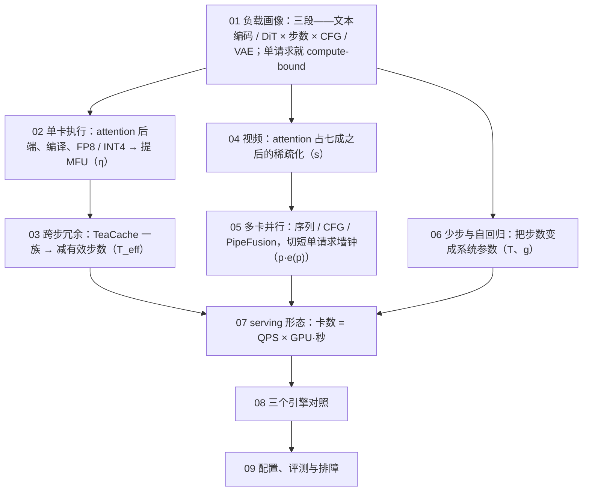
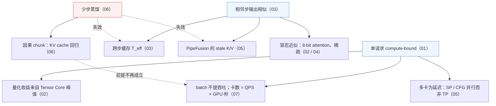

## 这个系列的一句话主张

> 先算清一次生成的**三本账（FLOPs、字节、秒）**，再看每一类优化在账上的哪一项做交换。

一切从一个数字出发：**一次 DiT 前向的算术强度是 3,100 FLOP/字节，LLM decode 是 2**——

| 于是 | 与 LLM serving 相反 |
|---|---|
| 单请求就在算力屋顶上 | 优化的是 FLOPs 与 MFU，不是字节 |
| 多卡是为了切短一个请求的墙钟 | 不是为了装下权重 |
| 调度面对的是时长完全可预测的批任务 | 不是不可预测的流 |

<aside class="notes" markdown="1">
总纲：/diffusion-model-inference-infrastructure.html。
</aside>

---

## 那张账：九篇各改公式的哪一项

$$t = t_{txt} + g \cdot T_{eff} \cdot \dfrac{2P_{tok}N + 4LN^2d \cdot s^{-1}}{\text{峰值}\cdot\eta\cdot p\cdot e(p)} + t_{VAE}$$，卡数 = QPS × GPU·秒

---

## 01 · 负载画像：一次生成在 GPU 上发生什么

**结论**：三段里**算力全在 DiT**，一次前向就是 compute-bound；**图像模型是 GEMM 负载，视频模型是 attention 负载**。

| | FLUX.1-dev 1024² 28 步 | Wan 5 秒 720p |
|---|---|---|
| token N | 4096 + 512 | **75,600** |
| 每步 FLOPs | 74.3 T | 6.5 P（attention 4.7 P） |
| 总 FLOPs | 2.1 P | 650 P |
| H100 时间（η 0.45） | 4.8 s | **24 min** |
| 算术强度 | 3,100（拐点 295） | |

- 「一次前向的 FLOPs 按参数量算」——双流块每 token 只走一条流：用 $$P_{tok}$$ 6.45B 而非 11.9B，用 P 高估 85%
- 「扩散推理与 LLM 一样有 KV cache」——每步 K/V 由本步带噪输入算出、用完即弃；只有 cross-attn 的文本 K/V 可缓存

<aside class="notes" markdown="1">
原文 /diffusion-inference-workload-anatomy-and-cost-ledger.html。与 LLM 比：150× FLOPs、0.8× 时间。
</aside>

---

## 02 · 单卡执行：无损先有损后

**结论**：**编译是最大的无损收益**；**量化的收益来自 Tensor Core 峰值而不来自字节**（FP8 GEMM 2× → 端到端 1.3–1.5×）；逐层 offload 的判据是每层计算 / 搬运之比。

| FLUX 每步 | 时间 | η |
|---|---|---|
| eager | 6.71 s | 0.31 |
| + `torch.compile` | **4.30 s（1.56×）** | 0.49 |
| + FP8 | ÷ 1.3–1.5 | |
| SVDQuant INT4 | 22 → 6.5 GiB；4090 上 3×；**Hopper 无 INT4 Tensor Core，只省显存** | |

- 可见性门限：PSNR > 35 dB 不可见、30–35 细看可见
- 逐层 offload：Wan 免费（每层算 0.7 s vs 搬 27 ms）、FLUX 慢 6×（2.7 ms vs 16 ms）
- 「权重量化减半，每步时间减半」——单请求在算力屋顶上，字节不是瓶颈

<aside class="notes" markdown="1">
原文 /single-gpu-diffusion-execution-attention-compile-quantization-offload.html。
</aside>

---

## 03 · 跨步冗余：TeaCache 一族

**结论**：便宜信号 → 阈值 → 复用缓存残差，首末步强制全算；**本质是自适应的少步采样，上限约 2×，与步数蒸馏互斥**——在 schnell 的 4 步上一步都省不下来。

| FLUX 28 步，阈值 | 加速 | 质量 |
|---|---|---|
| 0.25 | 1.5× | |
| **0.4** | **1.8×**（约 16 全算、12 复用） | 约 30 dB |
| 0.6 | 2.0× | |
| 视频 | 到 4.4× | |

- $$T \to T_{full} + T_{hit}\,\epsilon$$，speedup ≈ $$T / T_{full}$$
- CFG 两份状态；SP 下决策要全局一致
- 「跨步缓存是无损的、蒸馏模型也能开」——4 步模型每步都在转折点，零命中或图坏

<aside class="notes" markdown="1">
原文 /timestep-redundancy-caching-and-step-skipping.html。
</aside>

---

## 04 · 视频：N 到十万后 attention 压过线性项

**结论**：交叉点 $$N \approx 6d$$；Wan 一步 attention 4.7 P / 6.5 P = **72%**；分数矩阵 425 GiB **不可物化**——稀疏必须落到 FlashAttention 的 128 块粒度；收益受 **Amdahl** 约束。

$$
\text{speedup} = \frac{1}{(1 - a) + a/s}：\quad a = 0.72,\ s = 3.5 \Rightarrow 2.06\times,\qquad \text{上限 } 3.57\times
$$

| 量 | 数 |
|---|---|
| 17 → 129 帧 | 每步 FLOPs 21× |
| 叠加全部优化 | 24 min → **40 s** |

- 「attention 稀疏 80% 端到端快 5×」——28% 的线性项不动
- 「稀疏就是把小分数置零」——不能物化，要整块跳、模式与 layout 对齐

<aside class="notes" markdown="1">
原文 /video-diffusion-long-sequence-attention-and-sparsity.html。
</aside>

---

## 05 · 多卡并行：为什么不是张量并行

**结论**：扩散多卡**为延迟**（切一个请求），**吞吐永远是 DP 最优**；SP 通信是 TP 的 1/p，PipeFusion 是 TP 的 1/L；NVLink 用 USP、弱互联加 PipeFusion。

| FLUX，p = 4，每步通信 | 量 |
|---|---|
| TP $$4\frac{p-1}{p}Nd$$ | 4.8 GB，关键路径 |
| Ulysses $$4\frac{p-1}{p^2}Nd$$ | **1.2 GB** |
| CFG 并行 | 0.6 MB |
| PipeFusion | 28 MB |

- 4×H100 1.63 s（2.63×）；Wan 8 卡一步 29 → 4 s；CFG × SP × PP 乘积 = 卡数
- 「用 SP 切请求能减少服务的卡数」——SP 只减延迟，GPU·秒不变、效率不到线性；只要吞吐就 DP

<aside class="notes" markdown="1">
原文 /multi-gpu-diffusion-parallelism-usp-cfg-pipefusion.html。
</aside>

---

## 06 · 少步与自回归：把步数变成系统参数

**结论**：蒸馏拿走了「几十步里大半是保守余量」——**依赖相邻步相似的优化全部失效**（缓存、PipeFusion、CFG 并行），CUDA graph 变必需，VAE 占比升到 15%；**因果化让视频生成向 LLM serving 收敛**——KV cache 回来了。

| | dev 28 步 | schnell 4 步 |
|---|---|---|
| DiT FLOPs | 2.08 P | **0.30 P（1/7）** |
| 每张 | 4.8 s | 0.80 s、1.25 张/s |
| 另两段占比 | 2.6% | 15.6% |

- 自回归视频 KV 每 token $$2dL \times 2$$ 字节：Wan 1.3B 184 KB、chunk 0.86 GB、窗口 21 帧 6 GB
- SD-Turbo 在 4090 上约 90 fps

<aside class="notes" markdown="1">
原文 /few-step-and-autoregressive-video-generation-systems.html。
</aside>

---

## 07 · serving 形态：卡数 = QPS × GPU·秒

**结论**：**batch 不参与、SP 只减延迟**；时长收到请求时即确定 → 分池、SJF、SLO 准入、**事前定价**；视频必须异步 job。

| 100 QPS 的 FLUX 1024² | 张 H100 | 每张成本 |
|---|---|---|
| eager | 670 | \$0.0047 |
| + compile + FA3 | 390 | |
| + FP8 | 290 | |
| + TeaCache | 170 | |
| schnell | **80** | **\$0.0006** |

- 抢占状态只有 latent 0.6 MB；Wan 5 秒 8 卡 40 s = 320 GPU·秒 ≈ \$0.22；LoRA 前 k ≤ 4 步不挂
- 「吞吐不随并发增长是引擎的 bug」——compute-bound 下 batch 2 ≈ 2× 时间，正常；加实例或换少步模型

<aside class="notes" markdown="1">
原文 /diffusion-serving-shapes-batching-disaggregation-and-cost.html。
</aside>

---

## 08 · 三个引擎：同一张图的请求各走过什么

**结论**：**SGLang** 把扩散塞进 LLM serving 的结构；**vLLM-Omni** 把扩散做成全模态流水线的一个 stage；**xDiT** 只做并行、包装 diffusers；三者共用 diffusers 底座与 vLLM 式并行组。

| | SGLang Diffusion | vLLM-Omni | xDiT |
|---|---|---|---|
| 进程模型 | HTTP / Scheduler / GPUWorker 三类 | stage 0 + stage N | torchrun SPMD |
| pipeline 抽象 | `ComposedPipelineBase`（四 stage） | `DiffusionEngine` | `xFuserPipelineBaseWrapper` |
| 调度 | 同构静态批 | 同构静态批 | 无 |
| 并行 | USP、CFG | 同 | USP、CFG、PipeFusion |

<aside class="notes" markdown="1">
原文 /diffusion-engines-compared-sglang-diffusion-vllm-omni-xdit.html。
</aside>

---

## 09 · 配置、评测与排障：八步推导

**结论**：算账 → 无损单卡 → 有损 I → 有损 II → 多卡 → 少步 → serving → 面板；**无损先于有损、切卡先于换模型、卡数由 GPU·秒决定**；评「开不开某项优化」不能用 FID。

| 症状 | 先查 |
|---|---|
| p99 抬升 | 重编译（shape 变了） |
| 半夜 OOM | `vae.decode`（分辨率长尾） |
| 伪影 | 有损项：缓存阈值、量化、稀疏——对基线图 PSNR / SSIM / LPIPS |
| 告警 | 每步 +20%、缓存命中率 ±30%、抽检 −3 dB |

- 门限 PSNR > 35 / 30 dB；同一部署内确定、跨部署不保证
- 「评优化用 FID」——FID 对单图细节与模式坍缩不敏感、需几千张；用 PSNR / SSIM / LPIPS + 偏好模型 + 人工 A/B

<aside class="notes" markdown="1">
原文 /diffusion-inference-configuration-evaluation-and-troubleshooting.html。
</aside>

---

## 两个根、一个破坏者

---

## 常见误区（一）

- 「FLOPs 按参数量算」——用 $$P_{tok}$$，否则高估 85%
- 「扩散推理也有 KV cache」——用完即弃；只有文本 K/V 可缓存
- 「权重量化减半时间减半」——字节不是瓶颈
- 「逐层 offload 是免费的」——看每层计算 / 搬运
- 「SVDQuant 在 H100 上也提速」——Hopper 无 INT4
- 「跨步缓存无损、蒸馏模型也能开」——上限 2×、schnell 零命中
{: .fragments}

---

## 常见误区（二）

- 「稀疏 80% 端到端 5×」——Amdahl 2.06×
- 「多卡默认 TP」——SP 通信是 TP 的 1/p
- 「SP 能减少卡数」——只减延迟
- 「少步模型照搬前几篇优化」——缓存、PipeFusion、CFG 并行失效
- 「吞吐不随并发增长是 bug」——compute-bound 的正常现象
- 「评优化用 FID」——PSNR / SSIM / LPIPS
{: .fragments}

---

## 九个出口

| 篇 | 一个数 / 一个公式 |
|---|---|
| 01 | 强度 3,100 vs 2；FLUX 74.3 T / 步、4.8 s；Wan 24 min |
| 02 | compile 1.56×；FP8 1.3–1.5×；PSNR > 35 dB |
| 03 | 阈值 0.4 → 1.8×、30 dB；上限 2× |
| 04 | N ≈ 6d；Amdahl 2.06× / 3.57×；24 min → 40 s |
| 05 | TP 4.8 GB vs Ulysses 1.2 GB；乘积 = 卡数 |
| 06 | 1/7 FLOPs；KV 184 KB / token |
| 07 | 100 QPS：670 → 80 张；\$0.0047 → \$0.0006 |
| 08 | 三种进程模型、共用 diffusers |
| 09 | 八步推导；p99 看重编译、OOM 看 VAE |

---

## 下一步

- **算法侧**：《多模态》第 6–8 篇——DDPM、flow matching、DiT 本身
- **往下**：《GPU Kernel 工程》第 8 篇——FlashAttention 的 block 粒度；《通信与互联》——Ulysses 的 all-to-all
- **往旁**：《vLLM 源码》——对照：有 KV、memory-bound、不可预测的流
- 原文总纲：`/diffusion-model-inference-infrastructure.html`；通关自测在系列总结
