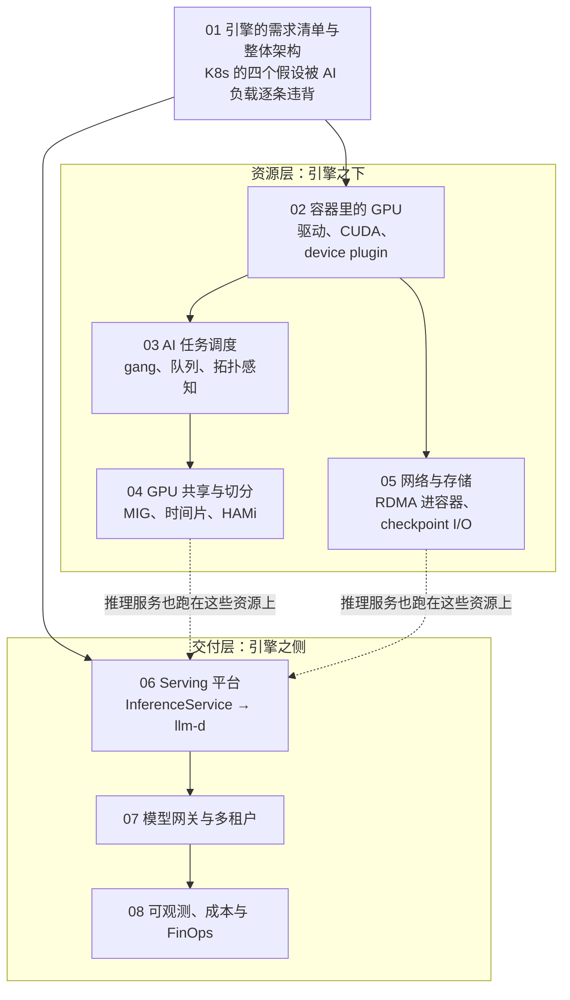

## 这个系列的一句话主张

> 平台的每一个设计决定都是**被引擎的某个需求推出来的**，而**每个决定都有代价**。

| Kubernetes 的假设 | AI 负载怎样违背 | 于是有了 |
|---|---|---|
| Pod 独立 | 32 卡训练要么全起要么都不起 | Kueue / Volcano 的 gang |
| 资源可细分 | GPU 是不透明整数 | device plugin、MIG / HAMi、DRA |
| 一张 overlay 网卡 | NCCL 要 RDMA | Multus、RDMA device plugin、GDR |
| HPA 看 CPU | 推理看 KV 占用与队列 | LeaderWorkerSet、InferencePool、DCGM 映射 |

每篇同一个骨架：**引擎的需求 → K8s 的空缺 → 平台的机制 → 代价与边界**；每一层都填一个洞，也都挖一个新的。

<aside class="notes" markdown="1">
总纲：/ai-platform-engineering.html。
</aside>

---

## 八篇怎么连起来：资源层与交付层

---

## 01 · 需求清单：原生 K8s 满足不了哪几条

**结论**：训练 15 条原生满足 **1 条**、推理 15 条满足 **2 条**；空缺分**缺插件、缺概念、缺信号**三种；训练卡在调度与网络，推理卡在扩缩容与路由，唯一共同的空缺是「**GPU 是不透明整数**」；平台分资源层与交付层，分界线是「Pod 能跑了」。

| 80 GB 卡 × 0.92 可用 | 权重 | 留给 KV |
|---|---|---|
| 7B | 14 GB | 约 60 GB |
| 30B | 60 GB | 约 14 GB |

- 扩容一个副本 5–10 分钟（拉镜像 + 加载权重 + 预热）——第六篇扩缩容的全部难点
- 「`Insufficient nvidia.com/gpu` 说明卡不够」——调度器把「键不存在」与「等于 0」当同一回事；是没有组件把 GPU 上报给 kubelet

<aside class="notes" markdown="1">
原文 /ai-platform-engine-requirements-and-architecture.html。
</aside>

---

## 02 · 容器里的 GPU：四层栈、三条规则

**结论**：驱动（宿主）/ CUDA runtime（镜像）/ 库 / 应用；**向后兼容无条件**（新驱动跑旧 Toolkit）；**minor version** 同大版本内旧驱动跑新 Toolkit（新驱动 API 与 PTX JIT 除外）；**forward** 跨大版本只有数据中心 GPU + cuda-compat 包。

| 问题 | 答案 |
|---|---|
| 驱动 580 + CUDA 13.1 镜像 + 调用 13.1 新 API | 能跑（规则一） |
| 驱动 570 + CUDA 13.1 镜像 | 13.x 基线是 580.65.06——不行，除非数据中心卡 + cuda-compat |
| 基线 | 12.x ≥ 525.60.13；13.x ≥ 580.65.06 |
| 错误码 | 35 驱动太旧 / 36 API 不支持 / 222 PTX 版本 |

- device plugin **只计数、无属性、不跨 Pod 共享**；DRA `resource.k8s.io/v1` 自 1.34 GA 才有属性与共享
- 10 GB 镜像冷拉 2–3 分钟
- 「`nvidia-smi` 与 `torch.version.cuda` 不一致就有问题」——前者是驱动上限，后者是 Toolkit 版本

<aside class="notes" markdown="1">
原文 /gpu-in-containers-driver-cuda-device-plugin.html。
</aside>

---

## 03 · AI 任务调度：gang、队列与借用

**结论**：Volcano 在 Pod **之后**做节点级 gang，Kueue 在 Pod **之前**做配额级 gang；**默认值下 Volcano 与 Kueue 借了不还、Slurm 不借**；「Pod 起不来靠应用层重试」——已起的 Pod 占着卡等同伴，gang 只能在调度 / 准入层做。

| A、B 各 16 卡配额，A 提交 32 卡，B 空闲 | 结果 |
|---|---|
| Volcano | 借 B 的 16 卡起；B 回来时默认 actions 不含 `reclaim`——不还 |
| Kueue | cohort 借用起；默认 `reclaimWithinCohort: Never`——不还 |
| Slurm | 排队等 A 自己的配额 |

- Volcano：`guarantee ≤ deserved ≤ capability`；Kueue：`nominalQuota` / `borrowingLimit` / `lendingLimit` + 三个抢占开关
- 抢占代价 $$N_{gpu} \times (T_{since\_ckpt} + T_{restart})$$；30/32 死锁：两个任务各占一半卡等对方

<aside class="notes" markdown="1">
原文 /ai-job-scheduling-gang-queue-topology.html。
</aside>

---

## 04 · GPU 共享与切分：四档取舍

**结论**：都是「device plugin 把一张卡复制成 N 个逻辑设备」的不同底座——**时间片无隔离、HAMi 软件隔离但故障域整卡、MIG 连 Xid 都隔离但几何刚性**；训练不切。

| 方式 | 算力隔离 | 显存隔离 | 故障域 | 弹性 |
|---|---|---|---|---|
| 时间片 | 无 | 无（OOM 蔓延） | 整卡 | 任意 N |
| MPS | 软 | 软 | 整卡 | 任意 |
| HAMi | 软（拦截 kernel） | 软（拦截 `cudaMalloc`，不切带宽与 L2） | 整卡 | `deviceSplitCount` 默认 10 |
| MIG | 硬 | 硬 | slice（Xid 隔离） | 几何刚性 |

- A100：7 个计算 slice、8 个显存 slice；`3g.20gb` = 3/7 算力 + 4/8 带宽；`3g.20gb × 2` 已用尽 8 个显存 slice——**塞不进 `1g.5gb`**，浪费 1 个计算 slice

<aside class="notes" markdown="1">
原文 /gpu-sharing-and-partitioning-mig-mps-hami.html。
</aside>

---

## 05 · 网络与存储：NCCL 找不到 RDMA 就静默回落

**结论**：容器里 `nccl-tests` 只有裸机三分之一——Pod 网络、device plugin、NCCL 环境变量三层任一缺项都**不报错**；Multus 给第二张网卡、RDMA device plugin 给 `/dev/infiniband`、`IPC_LOCK` 与 peermem / DMA-BUF 给 GDR。

| checkpoint I/O：70B、14 字节 / 参数 ≈ 1 TB | 带宽 |
|---|---|
| 30 分钟一次、同步 1 分钟写完 | 聚合 **16.7 GB/s**、每节点 2.1、每 rank 260 MB/s |
| 异步 | **0.56 GB/s**；代价每节点约 125 GB pinned 内存 |

- `NCCL_DEBUG=INFO` 看 `Using network IB/Socket` 与 `/GDRDMA`；`NCCL_NET_GDR_LEVEL` 默认 `PXB`
- 「checkpoint 写不完只能买更快的存储」——先改形态：分片 + `dcp.async_save`

<aside class="notes" markdown="1">
原文 /rdma-networking-storage-and-checkpoint-io.html。
</aside>

---

## 06 · Serving 平台：扩缩容看什么、提前多久

**结论**：CPU 无意义；**领先指标 `num_requests_running` / `kv_cache_usage_perc`**，`waiting` 只兜底；**纯反应式阈值 = 峰值过配**（为 9 分钟就绪预留的 headroom 在稳态也被保留）；可预测的高峰用 cron 提前。

| TP=4 的 70B，晚高峰 2 → 6 副本，就绪 8 分钟 | 结果 |
|---|---|
| 反应式阈值 36 / 副本（饱和点 64 的 56%） | 峰值 **10 副本**而非 6 |
| cron 提前 12 分钟 + running 56 + waiting 4 + 缩容 15 分钟窗口 | ≈ **5 卡时 / 天** |
| 常驻 6 副本 | 328 卡时 / 天 |
| 信号延迟 | 约 1 分钟 |

- 从 InferenceService（KServe）到 LeaderWorkerSet（多卡一个副本）到 llm-d（InferencePool + EPP）
- 「阈值调准了就不会过配」——反应式的结构性代价

<aside class="notes" markdown="1">
原文 /serving-platforms-kserve-triton-ray-serve-llm-d.html。
</aside>

---

## 07 · 模型网关与多租户：「配额」是什么

**结论**：外层按 RPM / TPM / 并发 429，内层 EPP 按 priority **严格优先、同级 round-robin，无按权重公平**；选副本与租户无关；配额是 token + 并发 + RPM，GPU 时间只做内部成本。

| 量 | 数 |
|---|---|
| EPP 打分权重 | 前缀亲和 3、队列 2、KV 2、LoRA 1；每 50 ms 抓一次 `/metrics` |
| 64 会话 × 8k 对 4 副本 × 160k | 前缀亲和让 TTFT 从 0.5 s 级到几十 ms |
| TPM 预扣 | 输入估算 + min(max_completion_tokens, 上限) |

- 「给 A 更高 priority 就是 3:1 的配额」——flow control 无加权公平；比例只能在外层 TPM / 并发桶上体现，饱和时 B 先撞 429

<aside class="notes" markdown="1">
原文 /model-gateway-multi-tenancy-and-quota.html。
</aside>

---

## 08 · 可观测、成本与 FinOps：50 个点去了哪里

**结论**：分配率 A = 85%、`SM_ACTIVE` U = 35%，$$E \approx A \times U$$；四层指标靠 `pod` / `namespace` join；**`GPU_UTIL` 只表示「有 kernel 在跑」**（NCCL 自旋也是 100%）；**按分配计费让闲置有主**。

| 50 个点 | 去向 | 对应篇 |
|---|---|---|
| ~15 | 推理低峰 | 06 |
| ~10 | dev 环境占着不用 | 04 |
| ~10 | 通信等待 | 05 |
| ~5 | 排队占位（gang 半起） | 03 |
| ~3 | checkpoint | 05 |
| ~2 | 冷启动 | 02 |
| ~5 | 测量上限 | — |

- 每百万 token 成本：U 从 100% 到 40% 贵 2.5 倍（1.39 → 3.47 美元）

<aside class="notes" markdown="1">
原文 /ai-platform-observability-cost-and-finops.html。
</aside>

---

## 贯穿线：每一层填一个洞、挖一个新的

| 空缺 | 机制 | 新的洞 |
|---|---|---|
| GPU 是不透明整数 | device plugin | 无属性、不共享 → DRA |
| Pod 独立 | gang（Kueue / Volcano） | 借了不还、30/32 死锁 |
| 一张卡太大 | MIG / HAMi / 时间片 | 几何刚性 / 故障域整卡 / OOM 蔓延 |
| overlay 网卡 | Multus + RDMA plugin | 三层任一缺项静默回落 |
| HPA 看 CPU | KV / running 指标 + cron | 反应式过配 |
| 一个模型一个服务 | 网关 + EPP | 无加权公平 |
| 利用率一个数 | A × U、按分配计费 | `GPU_UTIL` 骗人 |

---

## 常见误区（一）

- 「`Insufficient nvidia.com/gpu` 说明卡不够」——没装 device plugin
- 「`nvidia-smi` 与 `torch.version.cuda` 不一致就有问题」——驱动上限 vs Toolkit 版本
- 「旧驱动跑新 CUDA 装 cuda-compat 就行」——仅数据中心卡
- 「Pod 起不来靠重试解决 gang」——反复占卡释放
- 「借出去的卡自然会收回」——默认不还
- 「MIG 3g.20gb × 2 还能塞 1g.5gb」——显存 slice 用尽
{: .fragments}

---

## 常见误区（二）

- 「HAMi 有显存配额所以互不影响」——故障域整卡
- 「多机训练慢但没报错，不是网络问题」——静默回落 Socket
- 「checkpoint 写不完只能买存储」——先改异步
- 「扩缩容阈值调准了就不过配」——反应式的结构性代价
- 「priority 高就是 3:1 配额」——严格优先
- 「GPU 利用率 78% 用得不错」——看 `SM_ACTIVE`
{: .fragments}

---

## 八个出口

| 篇 | 一个数 / 一个判据 |
|---|---|
| 01 | 15 条满足 1 / 2 条；扩容 5–10 分钟 |
| 02 | 12.x ≥ 525.60.13、13.x ≥ 580.65.06；错误码 35 / 36 / 222 |
| 03 | guarantee ≤ deserved ≤ capability；默认借了不还 |
| 04 | 7 计算 / 8 显存 slice；3g.20gb × 2 只放两个 |
| 05 | 同步 16.7 GB/s vs 异步 0.56；`NCCL_DEBUG=INFO` |
| 06 | 阈值 36 → 10 副本；cron 5 卡时 vs 常驻 328 |
| 07 | 打分 3 / 2 / 2 / 1；每 50 ms |
| 08 | E ≈ A × U；U 40% 贵 2.5 倍 |

---

## 下一步

- **往下**：《大规模训练》——32 卡任务在 Pod 里跑的是什么；《通信与互联》——RDMA 进容器之后的 NCCL
- **往旁**：《vLLM 源码》——被扩缩容的那个副本内部；《Python 在 AI-Infra》第 7 篇——镜像怎么分层
- **应用侧**：《生产与运维》——网关之上的应用层限流与降级
- 原文总纲：`/ai-platform-engineering.html`；通关自测在系列总结
