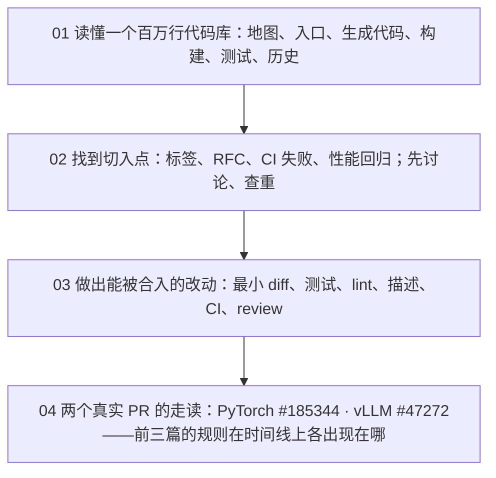

## 这个系列的一句话主张

> **maintainer 的 review 时间是项目最稀缺的资源，所有规则都是为了保护它**；细节会变，这条逻辑不变——理解了它就能在规则变化后自己推导出新的做法。

| | PyTorch | vLLM |
|---|---|---|
| 历史 | 十年、治理成熟 | 两年、规则快速演化 |
| 发布 | 约 2 个月 | 约 2 周 |
| CI | 全跑、bot 合入 | 按需跑（`/ci run`）、maintainer 手动合入 |
| 门槛 | 2000 行硬上限、33 条 merge rule | 6 个 open PR 上限、DCO 每个 commit |

四篇按一次贡献的自然顺序：**读懂 → 找到 → 做出 → 看两个完整实例**。

<aside class="notes" markdown="1">
总纲：/contributing-to-ai-infra-open-source.html。
</aside>

---

## 四篇怎么连起来

---

## 01 · 读懂一个百万行的代码库：两小时定位到一个函数

**结论**：靠**有目标的检索**——提取符号 → 画地图 → `rg` → 找登记表 → 沿链追 → 识别生成代码 → 读测试 → 读历史；**构建是为了工具链，可选、放最后**。

| | PyTorch | vLLM |
|---|---|---|
| 地图（依赖只向下） | `c10/` → `aten/` → `torch/csrc/` → `torch/` | `csrc/` → `vllm/` |
| 登记表 | `native_functions.yaml` | `pyproject.toml` / `torch_bindings.cpp` |
| 生成代码 | `ATen/ops/*.h`、`.pyi` 由 `torchgen` 生成 | `torch.ops._C.<op>` 在 `.so` 里 |

- 引言案例：四十分钟得出「已在 v2.11.0 修复」
- 「`rg` 找不到 `def`、头文件不存在，说明仓库不完整」——是生成代码；回登记表

<aside class="notes" markdown="1">
原文 /reading-a-million-line-codebase.html。
</aside>

---

## 02 · 找到切入点：maintainer 最希望有人做的是哪类

**结论**：**他们已决定要做、写清了要什么、自己没时间做的事**；预测「一周后会不会被关」看六个信号：标签状态、maintainer 最后一条评论、open PR 数、规模与 RFC 门槛、硬件、项目政策。

| 信号 | PyTorch | vLLM |
|---|---|---|
| 标签 | 682 个，`actionable` 396 占不到 3%；状态链四态 | 63 个；`closed-as-slop` 已打在 97 个 PR 上 |
| RFC 门槛 | 设计决策 | > 500 LOC（不含 kernel / data / config / test） |
| stale | 90 + 30 天 | |
| 查重 | #191394 下挂着 5 个 open PR | |

- 「issue 还 open 就是没人在做」——三条查重命令看 open PR 数与最后一条评论；`good first issue` 是最挤的池子
- 「typo PR 是最安全的第一个 PR」——vLLM 明文不接受 busywork；做成有范围、有依据、能说出「怎么找全」的 systematic 批次

<aside class="notes" markdown="1">
原文 /finding-your-entry-point-in-open-source.html。
</aside>

---

## 03 · 做出一个能被合入的改动：reviewer 十分钟要确认四件事

**结论**：**改了什么且只改了这一件**（diff）、**为什么改怎么验证**（描述）、**怎么证明对怎么防回归**（测试）、**有没有弄坏别的**（CI）——四样各答一个问题。

| | PyTorch | vLLM |
|---|---|---|
| 大小 | 2000 行硬上限 | 6 个 open PR 上限 |
| lint | 61 个 linter | pre-commit；需 `verified` / `ready` 或 ≥ 4 个合入 PR 才自动跑 |
| CI | 148 个 workflow、49 个 `ciflow/*`、33 条 merge rule | 35 个 test_area；测试任务要 `/ci run`，新 commit 不自动重跑 |
| 催 | 4 个工作日 | 2–3 天 / 7 天 |
| 签名 | CLA | DCO 每个 commit |

- 「vLLM 的 PR 开出来 CI 是灰的，等它自己跑」——本地 `pre-commit run --all-files`；等 reviewer 敲 `/ci run`；每次 push 后重新敲

<aside class="notes" markdown="1">
原文 /landing-a-mergeable-change.html。
</aside>

---

## 04 · 两个真实 PR：时间花在哪里

**结论**：小 PR 的时间**不在写代码**——PyTorch 那个在**数据**（正常成本），vLLM 那个在**等待**（大半可省）。

| | PyTorch #185344 | vLLM #47272 |
|---|---|---|
| diff | +104 −0 | +109 −16 |
| 时间线 | 27 天采 3792 个点 → PR 5 天 | 47 天无 review、**未 ping** |
| review | 3 小时 42 分收到；三条意见全是注释与来源 | 6 个自己引入的 CI 失败 |
| 合入 | `merge -i`，进 v2.13.0 | 合入 08-20，**不在 v0.28.0**（分支 08-17 切出） |

- 「review 意见是在检查算法对不对」——提交前用描述里的数字校对代码注释；署名放描述不放代码
- 「合入了就在最新版里」——`git tag --contains <sha>`；`merge-base --is-ancestor` 核对

<aside class="notes" markdown="1">
原文 /two-real-prs-pytorch-and-vllm.html。
</aside>

---

## 一条贯穿线：每条规则保护的是 review 时间

| 规则 | 省了 reviewer 什么 |
|---|---|
| 先讨论、查重 | 不 review 一个会被关的 PR |
| RFC 门槛 | 设计决策一次拍板，不在 diff 里反复 |
| 最小 diff、一件事 | 十分钟能看完 |
| 描述写数字与验证方法 | 不用自己复现 |
| 测试 + lint 本地过 | 不当人肉 CI |
| `/ci run` 门槛、6 个 open PR 上限 | CI 机器时间也是 review 时间 |
| 不接受 busywork、`closed-as-slop` | 不 review 没有价值的改动 |

---

## 常见误区

- 「`rg` 找不到 `def` 说明仓库不完整」——生成代码，回登记表
- 「issue 还 open 就是没人在做」——看 open PR 数
- 「代码写得多就要 RFC」——标准是有没有设计决策
- 「typo PR 最安全」——vLLM 不接受 busywork
- 「vLLM 的 CI 会自己跑」——要 `/ci run`
- 「review 是在检查算法」——多半是注释、来源、范围
- 「合入了就在最新版里」——看分支切出时间
{: .fragments}

---

## 四个出口

| 篇 | 一个判据 |
|---|---|
| 01 | 地图 + 登记表 + `rg`；构建放最后 |
| 02 | 已决定、写清了、没时间；六个预测信号 |
| 03 | diff / 描述 / 测试 / CI 各答一个问题 |
| 04 | 数据是正常成本，等待可省——ping |

---

## 下一步

- **往下**：《C++ 在 AI-Infra》第 8 篇、《ML 编译器》第 13 篇——工具链与工作台
- **往旁**：《PyTorch 深度实践》第 10 篇——被贡献的那个工程体系长什么样；《vLLM 源码》——被贡献的那个引擎
- 原文总纲：`/contributing-to-ai-infra-open-source.html`；通关自测在系列总结
