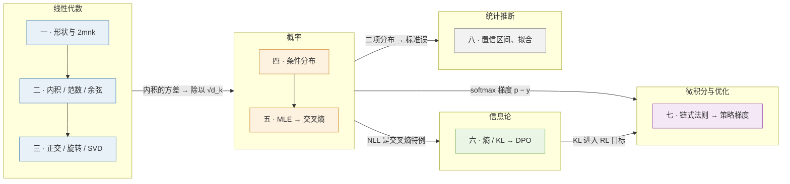

## 这个系列回答一个问题

> 拿到一篇 LLM 论文，能不能读懂它的**每一个公式**；
> 给一个建模假设，能不能推出它的**训练 loss**；
> 给一个评测结果，能不能判断差异是**真的还是噪声**？

- 面向：会一门编程语言、大学数学基本忘光、还没碰过 AI
- 不是「先学两年数学」，也不是「调库就行」——是一个**最小集**
- 两个标准：**读公式不卡壳**、**推导 loss 不出错**
- 每个概念都要**代进真实模型算出一个数字**

<aside class="notes" markdown="1">
开场：两个极端的答案都不对。总纲：/math-for-ai-algorithm-engineers.html
</aside>

---

## 一个例子说明取法：矩阵乘法

教材第一章的「矩阵乘法」，本系列只要三件事：

| 事 | 内容 | 用处 |
|---|---|---|
| 形状规则 | $$[m,k] \times [k,n] \to [m,n]$$，内维必须相同 | 读任何结构图的第一反应 |
| 成本规则 | 每个输出元素 $$k$$ 次乘加 → $$2mnk$$ FLOPs | 训练要花多少钱 |
| 代一个数 | Llama-3-8B，$$d=4096$$：一个 token 过 $$W_Q$$ 是 **33.5 MFLOPs**，4096 个 token 是 **137 GFLOPs** | L4 整本算力账只是它的重复 |

<aside class="notes" markdown="1">
用最熟悉的概念示范「学到什么程度」：形状、成本、数字。
</aside>

---

## 四个分支、八个出口

箭头是**推导上的依赖**，不是阅读顺序：只想弄懂一个公式，沿箭头往回找就是最小前置。

<aside class="notes" markdown="1">
全景图。先会算形状与成本 → 把模型看成分布 → 度量分布之差 → 对目标求导 → 判断实验结果。
</aside>

---

## 一 · 向量、矩阵与形状

**结论**：两条规则够用——形状规则 $$[m,k]\times[k,n]\to[m,n]$$、成本规则 $$2mnk$$；一个 token 过整个模型约 $$2N$$ FLOPs，训练约 $$6ND$$。

{: style="max-height: 380px"}

<aside class="notes" markdown="1">
看到任何矩阵乘法，立刻写出输出形状和 FLOPs。原文 /vectors-matrices-shapes-and-flops.html
</aside>

<!-- v -->

### 代 Llama-3-8B 的数字

| 对象 | 数字 |
|---|---|
| $$W_Q$$（$$4096 \times 4096$$）一个 token | 33.5 MFLOPs |
| 4096 个 token | 137 GFLOPs |
| 一层七个矩阵 | 218M 参数，**81% 在 MLP** |
| 全模型 | 8.03B 参数，一个 token 前向约 15 GFLOPs |
| 训练总算力 | $$C \approx 6ND$$（第八篇 Chinchilla 直接沿用） |

- 张量与广播：训练代码里的形状操作都是这两条规则的变体
- 读结构图第一反应：**先对形状，再数 FLOPs**

---

## 二 · 内积、范数与余弦相似度

**结论**：三个词一套语言——**内积**含方向与大小、**范数**只量大小、**余弦**只比方向；范数有长度 / 正则化项 / 误差度量三个身份。

{: style="max-height: 380px"}

<aside class="notes" markdown="1">
两个向量「像不像」有几种算法、各在哪里用。原文 /inner-product-norms-and-cosine-similarity.html
</aside>

<!-- v -->

### 它们在 LLM 里长什么样

| 概念 | 在模型里 | 数字 |
|---|---|---|
| 内积 | attention score $$q^\top k$$；$$QK^\top$$ 是一张内积表 | $$\langle a,b\rangle = \lVert a\rVert\lVert b\rVert\cos\theta$$ |
| 余弦 | embedding 检索、CLIP | 高维随机余弦标准差 $$1/\sqrt d$$，1024 维约 **0.03** |
| 范数 = 正则项 | weight decay $$\frac{\lambda}{2}\lVert W\rVert_F^2$$；$$L_1$$ 产生稀疏 | — |
| 范数 = 误差 | 量化：GPTQ 最小化 $$\lVert WX - \hat W X\rVert_F$$，**不是** $$\lVert W - \hat W\rVert_F$$ | 逼近的是权重作用在输入上的结果 |

---

## 三 · 正交、旋转与 SVD：从 RoPE 到 LoRA

**结论**：正交保内积，所以旋转 $$m\theta$$ 与 $$n\theta$$ 后的内积只剩 $$n-m$$——RoPE 编码相对位置；截断 SVD 是最好的低秩近似，LoRA 的参数省在 $$r(m+n) \ll mn$$。

{: style="max-height: 380px"}

<aside class="notes" markdown="1">
原文 /orthogonal-rotation-svd-and-low-rank.html
</aside>

<!-- v -->

### 两行推导、一个数字

- RoPE：$$(R_{m\theta}q)^\top(R_{n\theta}k) = q^\top R_{(n-m)\theta}\,k$$——两次旋转等于角度相加，正交矩阵 $$R^\top R = I$$
- 频率 $$\theta_i = \text{base}^{-2i/d_h}$$，128 维的头拆成 64 对二维旋转
- SVD $$W = U\Sigma V^\top$$；Eckart–Young：保留前 $$r$$ 个奇异值是 Frobenius 意义下最优
- LoRA：$$\Delta W = BA$$，Llama-3-8B 上 $$r = 16$$ 只有 **41.9M 参数、0.52%**
- 结合律 $$x \to xB \to (xB)A$$ 与先算 $$BA$$ 相差约两千倍成本——**读形状**就能看出

---

## 四 · 语言模型是一个条件分布

**结论**：语言模型是链式法则 $$p(x_{1:T}) = \prod_t p(x_t \mid x_{<t})$$ 里每一项的参数化；这个定义决定了 next-token 目标、逐 token 生成、KV cache、评测依赖采样设置。

{: style="max-height: 380px"}

<aside class="notes" markdown="1">
「语言模型是一个条件分布」每个词是什么意思。原文 /probability-basics-language-model-as-conditional-distribution.html
</aside>

<!-- v -->

### 一条性质出现六次：独立和的方差相加

| 在哪里 | 怎么用 |
|---|---|
| 性质本身 | $$n$$ 个独立变量之和方差相加，标准差只按 $$\sqrt n$$ 涨；均值的标准差 $$\sigma/\sqrt n$$ |
| 初始化 | 一层输出方差 $$d\,\sigma_W^2\sigma_x^2$$ → 标准差取 $$1/\sqrt d$$ 量级（Llama 0.02 vs $$1/\sqrt{4096} = 0.0156$$） |
| attention | $$q^\top k$$ 是 $$d_k$$ 项之和，方差 $$d_k$$；$$d_k = 128$$ 时标准差约 **11.3**，不除 $$\sqrt{d_k}$$ softmax 就饱和 |
| 扩散 | $$T$$ 步加高斯噪声等价一步 |
| 第七篇 | 随机梯度噪声方差 $$\propto 1/B$$ |
| 第八篇 | 评测的标准误 $$\sqrt{p(1-p)/n}$$；高斯 95% 在 $$\mu \pm 1.96\sigma$$——1.96 从这里来 |

---

## 五 · 从最大似然到交叉熵

**结论**：取对数 → 取负 → 除以 token 数，得到每 token 负对数似然 $$\mathcal L = -\frac1T\sum_t \log p_\theta(x_t\mid x_{<t})$$；所有 loss 都是这个模板换一个概率。

{: style="max-height: 380px"}

<aside class="notes" markdown="1">
从一枚硬币开始：选让训练集出现概率最大的参数。原文 /from-maximum-likelihood-to-cross-entropy.html
</aside>

<!-- v -->

### 一个立刻能用的数字：初始 loss ≈ ln V

{: style="max-height: 400px"}

- 随机初始化的模型是均匀分布，交叉熵 $$= \ln V$$：Llama-3 词表 128256 → **11.8**
- 远高：初始化太大；**远低：泄漏或 mask 算错**——没学之前就知道答案

<!-- v -->

### softmax、温度与采样（GPT-2 真实分布）

{: style="max-height: 360px"}

- softmax 里差值决定比值：logit 差 1 是 2.7 倍，差 5 是 148 倍
- 温度改变的是**分布**，greedy 与 T=0.6 / top-p 0.95 的分数不能直接比
- SFT 的 loss mask：一条 26 个 token 的对话只有 3 个算 loss；奖励模型、DPO 同一模板

---

## 六 · 熵、交叉熵与 KL：从困惑度到 DPO

**结论**：$$H(p,q) = H(p) + D_{\mathrm{KL}}(p\Vert q)$$——交叉熵是熵加上「多付的那部分」；KL 不对称，**方向决定行为**；从 KL 约束的最优策略四步推出 DPO。

{: style="max-height: 380px"}

<aside class="notes" markdown="1">
后训练的主语言。原文 /entropy-cross-entropy-and-kl-to-dpo.html
</aside>

<!-- v -->

### 必记的数字

| 量 | 数字 |
|---|---|
| 困惑度 $$= e^{\text{loss}}$$ | loss 1.8 ↔ PPL 6.05 ↔ 2.6 bit/token（1 nat = 1.44 bit） |
| loss 的下限 | 数据本身的熵：Chinchilla 的 $$E = 1.69$$ |
| $$p=(0.5,0.5)$$、$$q=(0.9,0.1)$$ | $$H(p)=0.693$$、$$H(p,q)=1.204$$、$$D(p\Vert q)=0.511$$、$$D(q\Vert p)=0.368$$ |
| RLHF 的 KL 项 | $$\beta D_{\mathrm{KL}}(\pi\Vert\pi_{\text{ref}})$$ 是 **reverse**：不能去参考模型认为不可能的地方 |
| 跨 tokenizer 比 | PPL 依赖词表，要换成 bits per byte |

<!-- v -->

### DPO 的推导链：四步

1. KL 约束目标 $$\max_\pi \mathbb E_\pi[r] - \beta D_{\mathrm{KL}}(\pi\Vert\pi_{\text{ref}})$$ 的闭式解：$$\pi^* = \frac1Z\,\pi_{\text{ref}}\,e^{r/\beta}$$
2. 反解奖励：$$r = \beta\log\frac{\pi^*}{\pi_{\text{ref}}} + \beta\log Z$$
3. 代入 Bradley-Terry $$\sigma(r_w - r_l)$$，同一 prompt 的 $$Z(x)$$ **抵消**
4. 用 $$\pi_\theta$$ 代 $$\pi^*$$，套 $$-\log$$ 模板：

$$
\mathcal L_{\text{DPO}} = -\log\sigma\Big(\beta\log\tfrac{\pi_\theta(y_w)}{\pi_{\text{ref}}(y_w)} - \beta\log\tfrac{\pi_\theta(y_l)}{\pi_{\text{ref}}(y_l)}\Big)
$$

去掉 $$\pi_{\text{ref}}$$ 就失去「不偏离」的约束。

---

## 七 · 梯度、链式法则与策略梯度

**结论**：梯度与参数同形；softmax + 交叉熵的梯度是 $$p - y$$；期望的梯度用 $$\nabla\pi = \pi\nabla\log\pi$$ 写回期望——策略梯度是「按奖励加权的最大似然」，减 baseline 期望不变。

{: style="max-height: 380px"}

<aside class="notes" markdown="1">
原文 /derivatives-gradients-chain-rule-and-policy-gradient.html
</aside>

<!-- v -->

### 策略梯度的可跑实验：10 个 token，偶数得 1 分

{: style="max-height: 360px"}

| 估计 | 结果 |
|---|---|
| 精确梯度 | 0.0500 |
| REINFORCE | 无偏，std **0.144** |
| 减合理 baseline | std 0.070（方差减半） |
| 减离谱 baseline | std 0.898（**更糟**） |
| GRPO 组内均值（含自己） | 缩了 $$(1 - 1/G)$$ 倍，0.75×；RLOO 留一法无偏 |

<!-- v -->

### nanoGPT 上最小的 RL：奖励 = 元音比例

{: style="max-height: 330px"}

- 不加 KL：奖励一路涨，模型坍缩成一串元音，val loss 从 1.66 飙到 6–9
- $$\beta = 0.5$$ 的 KL 惩罚把它拉回 3.2——**这就是 RLHF 里 KL 项存在的理由**

---

## 八 · 统计推断：置信区间与 scaling law

**结论**：95% 区间 $$= \hat p \pm 1.96\,\text{SE}$$，$$\text{SE} = \sqrt{\hat p(1-\hat p)/n}$$；**HumanEval 164 题分辨不出 3 个点**；幂律在双对数上是直线；固定 $$C = 6ND$$ 用拉格朗日乘子，$$N$$、$$D$$ 同步增长。

{: style="max-height: 380px"}

<aside class="notes" markdown="1">
原文 /statistical-inference-and-fitting-scaling-laws.html
</aside>

<!-- v -->

### 代真实 benchmark 的题数

| Benchmark | 题数 / 正确率 | SE | 95% 半宽 | 独立比较显著差异 |
|---|---|---|---|---|
| HumanEval | 164 / 0.80 | 3.1% | **±6.1%** | 8.7 个点 |
| GSM8K | 1319 / 0.90 | 0.8% | ±1.6% | 2.3 个点 |
| MMLU | 14042 / 0.70 | 0.4% | ±0.8% | 1.1 个点 |

- 「HumanEval 80.0%」的真实含义是 **74% 到 86%**
- 差值的 SE $$= \sqrt{\text{SE}_1^2 + \text{SE}_2^2}$$；配对检验只看分歧题，更灵敏但量级不变
- 训练有随机性：**实跑 20 次**，+20% 学习率显著、+2% 分不出来、单种子对比 8% 会反向

<!-- v -->

### Chinchilla：等 loss 线与等算力线相切

{: style="max-height: 300px"}

- $$L = E + A/N^\alpha + B/D^\beta$$，约束 $$6ND = C$$ → $$N_{\text{opt}} \propto C^{0.45}$$、$$D_{\text{opt}} \propto C^{0.55}$$
- 8B 配 160B token 是 2.16，配 15T 是 1.95：**94 倍数据换 0.21 nat**，值不值看推理成本

---

## 贯穿八篇的五条线

| 线 | 出现的篇 | 一句话 |
|---|---|---|
| 形状规则、$$2mnk$$ | 一、二、三、七、八 | 内积是最小情形，Jacobian 用它检查，$$C = 6ND$$ 沿用成本规则 |
| 独立和的方差相加 | 二、四、七、八 | 初始化、$$\sqrt{d_k}$$、SGD 噪声 $$\propto 1/B$$、评测的 SE |
| 同一个 $$-\log p$$ 模板 | 四、五、六、七 | 预训练、SFT、奖励模型、DPO、REINFORCE、GRPO 换的只是放进去的概率 |
| 拉格朗日乘子与「不偏离」 | 六、七、八 | KL 约束的闭式解、PPO 的裁剪、Chinchilla 的最优 $$N,D$$ |
| loss 这个数字的一生 | 一、五、六、八 | 从 $$\ln V = 11.8$$ 出发，经过 1.95，逼近数据的熵 1.69 |

<aside class="notes" markdown="1">
读新 loss 先问：什么概率进了 −log？读梯度公式先对形状。
</aside>

---

## 常见误区（训练侧）

- 「第一步 loss 越低越好」——远低于 $$\ln V$$ 几乎总是**泄漏或 mask 算错**
- 「KL 是距离，方向无所谓」——不对称，两个方向行为相反；RLHF 用 reverse 是有意的选择
- 「减 baseline 会让梯度有偏」——$$b$$ 不依赖 $$y$$ 时期望严格不变；但 GRPO 的组均值含 $$y$$ 自己，缩了 $$(1-1/G)$$ 倍
{: .fragments}

---

## 常见误区（评测侧）

- 「HumanEval 提升 3 个点」——在 ±6.1% 的噪声里
- 「p < 0.05 说明提升很大」——只说不像噪声；MMLU 上 1.1 个点可以显著但意义要另论
- 「Chinchilla 说 8B 配 160B 最优，Llama-3 训 15T 是浪费」——那是**训练算力**下的最优，推理成本另算
{: .fragments}

---

## L0 的出口标准：八个公式

| # | 公式 | 出处 | 篇 |
|---|---|---|---|
| 1 | $$\mathcal L = -\frac1T\sum_t\log p_\theta(x_t\mid x_{<t})$$ | 预训练 / SFT | 四、五、六 |
| 2 | $$\partial\mathcal L/\partial z = p - y$$ | softmax 梯度 | 五、七 |
| 3 | $$\text{softmax}(QK^\top/\sqrt{d_k})\,V$$ | Transformer | 一、二、四 |
| 4 | $$(R_{m\theta}q)^\top(R_{n\theta}k) = q^\top R_{(n-m)\theta}k$$ | RoPE | 三 |
| 5 | $$L = E + A/N^\alpha + B/D^\beta$$，$$C \approx 6ND$$ | Chinchilla | 八 |
| 6 | $$-\log\sigma(\beta\log\frac{\pi_\theta(y_w)}{\pi_{\text{ref}}(y_w)} - \beta\log\frac{\pi_\theta(y_l)}{\pi_{\text{ref}}(y_l)})$$ | DPO | 六 |
| 7 | $$\nabla_\theta J = \mathbb E_{\pi_\theta}[A(y)\nabla_\theta\log\pi_\theta(y)]$$ | 策略梯度 | 七 |
| 8 | $$\alpha = \sum_x\min(p(x), q(x))$$ | 投机解码接受率 | 六 |

八个都能读懂，L0 就够了；卡在哪一个，回到右边那一篇。

---

## 下一步

- **原文**：总纲 [/math-for-ai-algorithm-engineers.html](/math-for-ai-algorithm-engineers.html) · 总结与通关自测 [/math-for-ai-series-recap-and-self-test.html](/math-for-ai-series-recap-and-self-test.html)
- **配套代码**：[ai-learning-labs/math-for-ai](https://github.com/arganzheng/ai-learning-labs/tree/main/math-for-ai)——硬币似然、GPT-2 分布、10 个 token 的策略梯度、nanoGPT 最小 RL、20 次多种子、7 个小模型的 scaling law，CPU 可跑
- **往后读**：L1 [工具箱](/tooling-for-ai-algorithm-engineers.html) → L2 [经典机器学习](/classical-machine-learning-in-the-llm-era.html) → L3 [深度学习基础](/deep-learning-foundations.html)
- 不需要「学完再走」——后面各层的文章本身就是最好的练习题

<aside class="notes" markdown="1">
收尾，留时间提问。
</aside>
