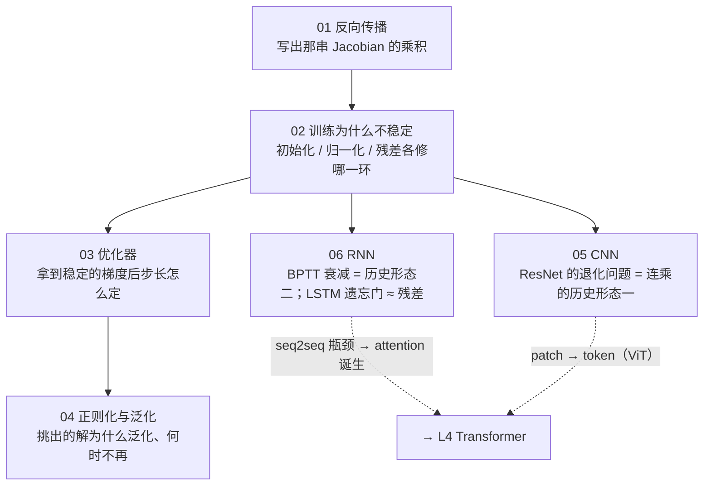
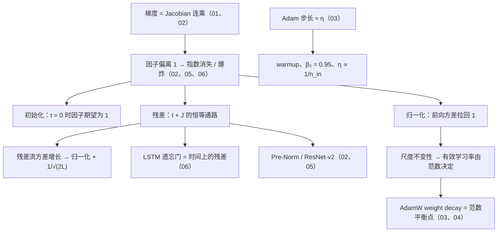

## 这个系列回答一个问题

> 深网络训练里的每个现象，能不能**推到公式、代到数字、用几十行代码复现**，然后在 LLM 里认出它的形态？

- 主线是**一条连乘链**：前向的方差每层乘一个因子、反向的梯度是一串 Jacobian 的乘积——因子偏离 1 就指数放大或消失
- 01 写出这串乘积 → 02 它怎么坏、三样东西各修哪一环 → 03 步长怎么定 → 04 挑出的解为什么泛化 → 05 / 06 在卷积与循环上再看一遍
- 六篇用同一份几百行的 NumPy 小框架，全部实验笔记本 CPU 几分钟跑完

<aside class="notes" markdown="1">
总纲：/deep-learning-foundations.html。ResNet 的退化问题与 RNN 的 BPTT 衰减是同一条链的两个历史形态，残差与 LSTM 的遗忘门是同一个修法。
</aside>

---

## 全景：一条连乘链

---

## 01 · 反向传播：手推一个两层网络

**结论**：反向传播 = 沿计算图反向拓扑序对每个算子算一次 **VJP**，从不构造 Jacobian；每个 Linear 反向做两个 GEMM，所以反向 = 2 × 前向、训练 $$6ND$$；$$\partial L/\partial W = X^\top G$$ 需要本层输入，所以**激活要存**。

{: style="max-height: 420px"}

<aside class="notes" markdown="1">
原文 /backpropagation-by-hand.html。实测反向 / 前向比值 2.00；梯度检查 float64 相对误差 < 1e-6。
</aside>

<!-- v -->

### 三个公式与两个数字

| 量 | 公式 | 形状检查 |
|---|---|---|
| 输出层梯度 | $$G = (P - Y)/m$$ | 与 logits 同形 |
| 权重梯度 | $$\partial L/\partial W = X^\top G$$ | $$[n_{in}, m] \times [m, n_{out}]$$——需要本层输入 $$X$$ |
| 传给下一层 | $$\partial L/\partial X = G\,W^\top$$ | $$[m, n_{out}] \times [n_{out}, n_{in}]$$ |

- 一个 20 万参数网络的一层 Jacobian 就有 13 GB——所以只算 $$J^\top v$$
- 激活 552 KiB 对权重 795 KiB，batch × 32 → 17.3 MiB：**激活显存与 batch × 序列 × 层数 × 宽度成正比，与参数量无关**；重算用 33% 算力换掉（$$8ND$$）

---

## 02 · 训练为什么不稳定：初始化、归一化与残差

**结论**：深网络的稳定性是连乘问题；初始化只管 $$t = 0$$，归一化切断前向的连乘但修不了反向，残差把 Jacobian 变成 $$I + J$$ 给梯度一条恒等通路；**三样必须同用，Pre-Norm 是当前摆法**。

{: style="max-height: 420px"}

<aside class="notes" markdown="1">
原文 /initialization-normalization-and-residual.html。Var(y) = n_in σ_w² Var(x)，Kaiming 2/n_in；0.9^128 ≈ 1.4e-6。
</aside>

<!-- v -->

### 七种接法只有 Pre-Norm 两个学习率都能训

{: style="max-height: 400px"}

- Kaiming 初始化的 64 层 plain 网络：梯度范数在层间 1.7 到 13，lr 0.05 三步 NaN——初始化只管 $$t = 0$$
- 加了 LN 不加残差：300 步 37%；Post-Norm 顶层梯度是底层 4 倍，lr 0.05 时 8.8% 对 Pre-Norm 91.6%

<!-- v -->

### Post-LN vs Pre-LN（Xiong 等 2020）

{: style="max-height: 400px"}

- 残差流无归一化每层翻倍（$$2^{64}$$），Pre-Norm 下线性增长；GPT-2 把残差分支缩放 $$1/\sqrt{2L}$$；LLM 用 Pre-Norm 加 final norm

---

## 03 · 优化器：从 SGD 到 AdamW 与学习率调度

**结论**：Adam 让每个参数的步长 $$\approx \eta$$、与梯度大小无关——所以第一步是满步长 $$\eta \cdot \text{sign}(g)$$、**必须 warmup**；$$L_2$$ 被 $$1/\sqrt v$$ 缩放而 AdamW 不被；线性 scaling 只在临界 batch 内成立。

{: style="max-height: 420px"}

<aside class="notes" markdown="1">
原文 /optimizers-from-sgd-to-adamw.html。Adam 状态 8 字节 / 参数，Llama-3-8B 64 GB——16 字节里的 12。
</aside>

<!-- v -->

### warmup 为什么不能省

{: style="max-height: 400px"}

- 偏差修正后第一步是 $$\eta \cdot \text{sign}(g)$$，$$v$$ 还没学到尺度
- batch 翻倍 lr 翻倍：512 成立、2048 NaN——只在「$$k$$ 步内梯度基本不变」时成立；裁剪 1.0 限制步长上界

<!-- v -->

### Adam + L2 不是 AdamW（Kingma & Ba 2014 Algorithm 1）

{: style="max-height: 360px"}

- $$\lambda\theta$$ 混进 $$g$$ 被 $$1/\sqrt v$$ 缩放，梯度小的参数被过度衰减；同一 $$\lambda = 0.1$$：$$\lVert W_1\rVert$$ 2.33 对 23.59，准确率 86.2% 对 95.6%
- $$\beta_2 = 0.95$$ 记 20 步；Momentum 有效学习率 $$\times 1/(1-\beta)$$

---

## 04 · 正则化与泛化：为什么参数比样本多却不过拟合

**结论**：先算参数 / 数据比定体制；过参数化时优化器挑最小范数、平坦、先学简单的解——**隐式正则化**；double descent 越过插值阈值再变好；预训练在数据体制里不用 dropout、一个 epoch。

{: style="max-height: 420px"}

<aside class="notes" markdown="1">
原文 /regularization-and-generalization.html。N/D：预训练 0.0005、SFT 1600、RM 160、本实验 407。
</aside>

<!-- v -->

### 过拟合最常见的形态：loss 涨而准确率不动

{: style="max-height: 380px"}

- 测试 loss 0.40 → 0.55 而准确率不动——是**过度自信**；dropout 0.5 到 300 epoch 反而最差（0.62）
- 重复数据 4 epoch 以内几乎无损；2 万字符第 16 epoch 拐点、记忆率 10%，200 万字符未到

---

## 05 · CNN：从 LeNet 到 ResNet，再到 ViT

**结论**：卷积 = 全连接 + **局部性 + 参数共享**两条约束；深度是为了感受野，深了就训不动——BN 修前向、残差修反向；数据够多时约束成负担，ViT 把图切成 token，只留下 patch embedding 这一个 stride 卷积。

{: style="max-height: 300px"}

<aside class="notes" markdown="1">
原文 /cnn-from-lenet-to-resnet-and-vit.html。3×3 核相当于 16×36 的矩阵、144 个非零、9 个自由参数。
</aside>

<!-- v -->

### 残差块（He 等 2015）：与 Transformer 的残差是一回事

{: style="max-height: 340px"}

- plain 56 层 loss 0.72、首末层梯度比 2849——退化问题就是连乘；bottleneck 69K 参数对 1.18M
- ResNet-50 25.6M 参数、**8.2 GFLOPs**（4.1 数的是 MACs）、每参数用 320 次
- ViT：196 / 576 / 5476 个 token；patch embedding = kernel = stride = p 的卷积，两种写法差 $$10^{-6}$$、参数同为 590,592

<!-- v -->

### 案例：复现 LeNet-5

{: style="max-height: 360px"}

- 61,706 个参数、5 个 epoch、**0.82%**——MLP 的 1/3 参数、1/3 错误率；第一层学出边缘检测器

---

## 06 · RNN：从 LSTM 到 attention 的诞生

**结论**：BPTT 是同一个 $$W$$ 的连乘，训练信号传不到远处；LSTM 的 $$c_t = f_t \odot c_{t-1} + i_t \odot \tilde c_t$$ 是**时间上的残差**，遗忘门偏置要初始化为 1；attention 为绕过 seq2seq 的固定向量瓶颈而生，然后人们发现循环可以不要。

{: style="max-height: 380px"}

<aside class="notes" markdown="1">
原文 /rnn-lstm-and-the-birth-of-attention.html。J_k = diag(1 − h_k²) W；20 步外梯度千分之四、60 步外 1e-10。
</aside>

<!-- v -->

### 从固定向量瓶颈到对齐（Bahdanau 等 2015）

{: style="max-height: 360px"}

- seq2seq 把整句压进一个向量（Sutskever 2014）；倒序 16 token 任务整句正确率 0% → **76%**
- attention 算力 4.5 倍、$$O(T^2 d)$$ 对 $$O(Td^2)$$——换来的是可并行与不衰减的通路

<!-- v -->

### 案例：字符级 LSTM 写莎士比亚，与 nanoGPT 同预算

{: style="max-height: 380px"}

- 这个规模看不出 Transformer 的优势——差别在顺序 vs 并行；RNN 记不住远处不是隐状态太小（64 维装得下 69 bit），是训练信号传不到

---

## Transformer 部件的来历：都从这条链上长出来

---

## 常见误区

- 反向传播要算出每层的 Jacobian——一层就 13 GB，只算 VJP
- 激活显存与参数量成正比——与 batch × 序列 × 层数 × 宽度成正比
- 初始化对了深网络就能训——初始化只管 $$t = 0$$，64 层 plain 三步 NaN
- Adam + L2 就是 AdamW——$$\lambda\theta$$ 被 $$1/\sqrt v$$ 缩放，86.2% 对 95.6%
- 参数比样本多就会过拟合——407 倍的网络测试 loss 最好；别停在插值阈值
- 验证准确率没掉就没过拟合——loss 涨而准确率不变是过度自信
- ViT 完全不用卷积——patch embedding 就是 stride 卷积
- RNN 记不住远处是隐状态太小——是训练信号传不到
{: .fragments}

---

## 下一步

- **原文**：总纲 [/deep-learning-foundations.html](/deep-learning-foundations.html) · 总结与通关自测 [/deep-learning-foundations-series-recap-and-self-test.html](/deep-learning-foundations-series-recap-and-self-test.html)
- **配套代码**：[ai-learning-labs/deep-learning-foundations](https://github.com/arganzheng/ai-learning-labs/tree/main/deep-learning-foundations)——几百行 NumPy 小框架、64 层七种接法、优化器扫描、double descent、LeNet-5 复现、字符级 LSTM
- **往后读**：L4 [Transformer 与 LLM](/transformer-and-llm-for-infra-engineers.html)——这条链在 Transformer 里的形态：Pre-Norm、残差缩放、warmup、QK-norm

<aside class="notes" markdown="1">
收尾。
</aside>
