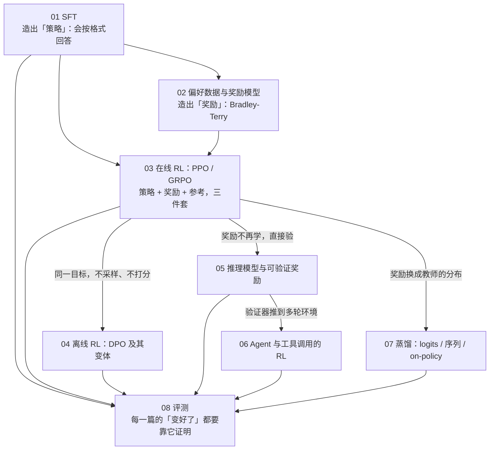
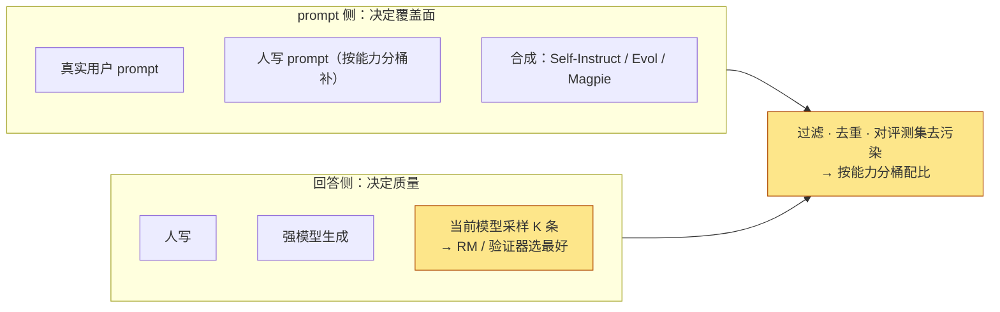
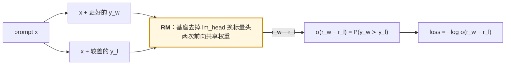
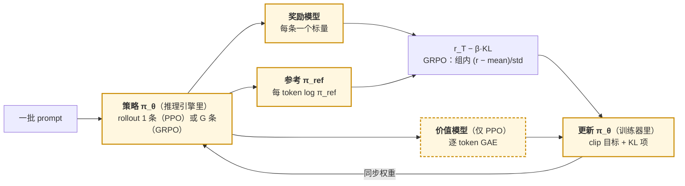
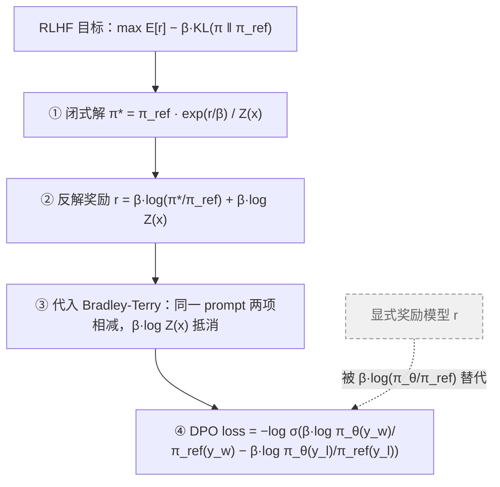
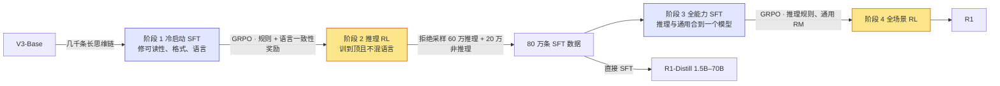
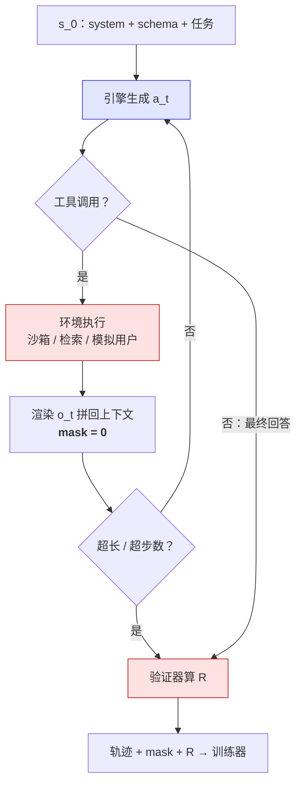
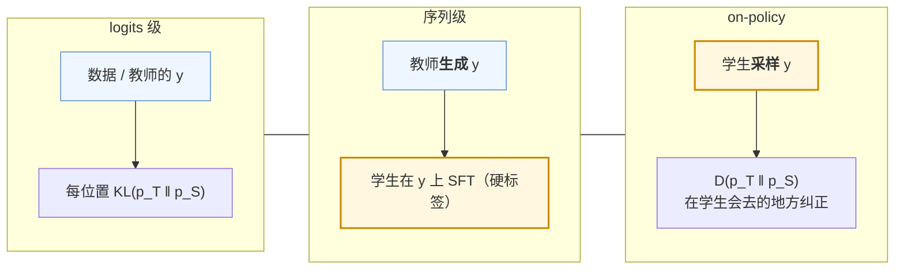
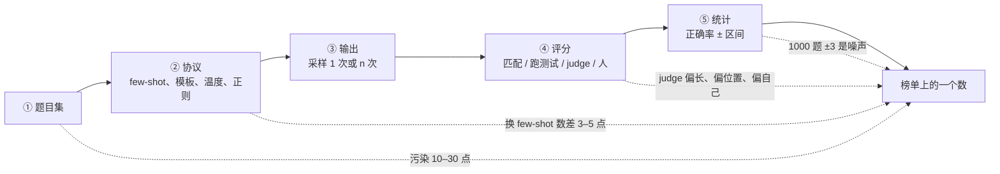

## 这个系列回答一个问题

> 一个只会续写的基座模型，经过哪几步变成能回答、能拒绝、能一步步推导的模型？每一步的**目标函数**是什么？训完怎么知道它真的变好了，而**不是学会了讨好评委**？

**一句话主张**：所有基于偏好或奖励的后训练方法都在操作同样**三个组件——策略、奖励、参考**；每个名字只是这三件套上的一处改动：奖励从哪来、参考怎么约束、要不要第四个组件（价值模型）。

<aside class="notes" markdown="1">
总纲：/post-training-from-sft-to-verifiable-rewards.html。每篇同一套方法：写出目标函数并解释每一项 → 算显存、token 与数据的账 → Qwen2.5 0.5B / 1.5B 上跑一遍的骨架 → 对到 InstructGPT、Llama 3、Tülu 3、DeepSeek-R1、Qwen3、Kimi K2 公开配方里的那一行。
</aside>

---

## 三件套在八篇里逐篇替换

---

## 01 · SFT：只教格式，不加知识

**结论**：SFT 是「表面对齐」——分布差异集中在少数格式 token 上；**格式是低秩的、知识是高秩的**，所以 LoRA 够用；遗忘看 lr 与更新的秩，用一份无关文本的 loss 度量。

| 实验（Qwen2.5-0.5B） | 数字 |
|---|---|
| lr | \(10^{-5}\)，预训练的 1/10 |
| LoRA r = 16 全部线性层 | 1.78% 参数，验证 loss 只差 **0.001**，优化器状态 1/7 |
| 遗忘（无关文本 loss 变化） | 全量 lr 1e-5 **+0.02** · 全量 lr 1e-4 **+0.62** · LoRA **+0.01** |
| padding 有效率 | 45–56% → packing |
| 8B × 2B token | **67 GPU 小时**——成本几乎全在数据 |

<aside class="notes" markdown="1">
原文 /sft-data-chat-template-loss-mask-and-peft.html。InstructGPT 验证 loss 1 epoch 就过拟合，人评却涨到 16 epoch——看下游指标与无关文本 loss，不看 SFT 验证 loss。
</aside>

<!-- v -->

### 一条 SFT 样本的两半，与 loss mask

- **loss mask**：prompt 位置 label = −100，多轮只算每轮 assistant——这个开关之后每一篇都在用
- 数据成本正从人时变成推理 FLOPs：K = 8 的拒绝采样与训练本身同量级

---

## 02 · 偏好数据与奖励模型：一个逻辑回归

**结论**：RM 就是 Bradley-Terry 的逻辑回归，给的是**梯度方向不是判决**；准确率停在 65–75% 够用；问题不是「不够准」而是「**偏在哪**」——失效在分布外，训 RL 前用 best-of-N 免费预演。

<aside class="notes" markdown="1">
原文 /preference-data-and-reward-models.html。独立 80% 正确的两个人一致率只有 68%——人际一致率不是 RM 准确率的上限。1 epoch；8B、10 万对 7 GPU 小时。
</aside>

<!-- v -->

### 过优化曲线：代理奖励单调涨，金奖励先升后降

| 量 | 公式 / 数 |
|---|---|
| 金奖励随 KL | \(R_{gold}(d) = d(\alpha - \beta\log d)\)，\(d = \sqrt{\text{KL}}\)：先升后降 |
| best-of-N 的 KL | \(\log N - (N-1)/N\)：N = 16 → **1.83 nats**——不训 RL 就能预演 |
| 系数 | RM 变大、数据变多，β 变小——曲线顶点右移 |
| 训 RL 前的探针 | 长度相关、BoN 扫描、对抗探针 |

- 随机错误被 RL 的平均平掉，**留下的是系统偏差**（长度、格式、自我偏好）
- 「RL 训练奖励涨就是变好」——要有 KL 预算，按 KL 与 held-out judge 决定停

---

## 03 · 在线 RL：PPO 四个模型、GRPO 三个

**结论**：\(\max\ \mathbb E[r] - \beta\,\text{KL}(\pi_\theta \Vert \pi_{ref})\)；baseline 不依赖当前样本就无偏——GRPO 的组内均值含自己、带 (1 − 1/G) 的小偏差；**FLOPs 训练占一半，墙钟生成占一半以上**。

<aside class="notes" markdown="1">
原文 /online-rl-ppo-grpo-and-the-rlhf-trio.html。β 0.01–0.05，规则奖励下 0；GAE γ = 1、λ = 0.95；clip 0.2（DAPO 0.2 / 0.28）。
</aside>

<!-- v -->

### 一步 RL 的账（8B）

| 量 | PPO | GRPO |
|---|---|---|
| 同时在显存的模型 | 策略 + 参考 + RM + 价值 = **288 GB** | 策略 + 参考 + RM = **160 GB** |
| 一步的 token | 512 prompt × 8 条 × 1000 = **410 万** | 同 |
| 每 token FLOPs | 约 12N（生成 2N + 三次前向 + 反向） | 同 |
| 墙钟 | 生成 50–80%（memory-bound decode + 长尾） | 同 |

- 贵的不是 FLOPs，是**训练循环里的推理引擎**、三四个模型同时在显存、每步同步
- 严格在线 vs 滞后一步：生成用上一步的权重几乎无损——异步的入口
- 三种 KL 估计量：\(k_1\) 进奖励、\(k_3\) 进 loss；KL 到 2–3 nats 该用 held-out judge 核对

---

## 04 · 离线 RL：DPO 四步推出来

**结论**：\(\hat r = \beta\log(\pi_\theta/\pi_{ref})\) **就是一个与策略共享参数的 RM**，只在数据分布上受约束——所以似然同降、过优化、偏长。

<aside class="notes" markdown="1">
原文 /offline-rl-dpo-and-its-family.html。β 0.1；8N/token，10 万对 9 GPU 小时；两模型 128 GB，LoRA 约 20 GB；Llama 3 六轮、RPO α = 0.2。
</aside>

<!-- v -->

### DPO 与 PPO 差在哪，变体差在哪

- PPO 上限略高：能**探索**到参考下低概率的正确回答；DPO 性价比高（不采样，9 GPU 小时）
- DPO 逃不掉过优化：曲线形状与 PPO 相同，hacking 的对象换成**数据没覆盖的地方**；KL 用 \(\mathbb E[\hat r]/\beta\) 自己估
- 变体（IPO、KTO、SimPO、RPO、ORPO）在标准 benchmark 上互有胜负——**换一份更 on-policy 的数据收益大于换方法**
- 有效的两个要素：on-policy 采样 + 负梯度
- Llama 3 在 DPO loss 里 mask 掉特殊 token：模板 token 在 chosen 与 rejected 里都出现，对数比差是纯噪声

---

## 05 · 推理模型与可验证奖励：R1 的四阶段

**结论**：验证器正确时**难 hack** → 可以撤 KL、让探索走极远；规则奖励对长度中立，长思维链是策略自己找到的；RL **放大基座已有的推理模式**（pass@k 大 k 端基座追上）。

<aside class="notes" markdown="1">
原文 /reasoning-models-and-verifiable-rewards.html。R1-Zero AIME 15.6 → 71.0（cons@64 86.7）。每阶段修上一步暴露的一个问题。
</aside>

<!-- v -->

### rollout 放大了多少，PRM 与蒸馏

| 量 | 数 |
|---|---|
| 一步 rollout | 512 × 16 × 16K = **1.3 亿 token**，比 RLHF 多 8–64 倍；KV 16 TiB |
| 总算力 | \(10^{22}\)–\(10^{23}\) FLOPs |
| PRM vs ORM | 78.2 vs 72.4 @ N = 1860（test-time compute） |
| 32B：蒸馏 vs 直接 RL | **72.6 vs 47**，且 RL 贵一到两个数量级 |

- 验证器自己的漏洞成了新入口：多个 `\boxed{}`、改测试文件——「预算」变成「堵漏」
- 小模型靠探索碰不到正确解 → **先蒸馏（序列级冷启动）再可选 RL**
- 五种长度控制；DAPO 干脆去掉 KL、clip 0.2 / 0.28

---

## 06 · Agent 与工具调用的 RL：瓶颈在环境

**结论**：对数概率变成 T 段之和、环境转移不含 θ；**工具输出必须 mask**（否则学会编造工具结果）；轨迹八成 token 是环境的；异步 rollout 从优化变成**必需**。

<aside class="notes" markdown="1">
原文 /agentic-rl-tool-use-environments-and-trajectories.html。KL ≈ 0；落后 k = 1–4 步几乎无损。
</aside>

<!-- v -->

### 账：模型 7 GPU·小时，环境 320 CPU·小时

| 量 | 数 |
|---|---|
| 20 轮轨迹 | 48K token，八成是环境的 → 每个有效 token 成本 **5 倍** |
| 前缀缓存 | prefill 48 万 → 4.8 万 |
| 500 任务 × 8 条 | 环境 **320 CPU·小时** vs 模型 **7 GPU·小时** |
| 异步 | 按轮记录 \(\log\pi_{old}\)、限制落后步数；GPU 别闲着 |

- 「Agent RL 的瓶颈是模型」——是沙箱集群与环境时间
- 奖励延后到轨迹末尾：credit assignment 靠 GRPO 的组内比较，不靠价值模型

---

## 07 · 蒸馏：三种形态，差别只在谁生成序列

**结论**：**logits 级学分布、序列级学模式、on-policy 修暴露偏差**——采样像 RL、梯度是 token 级散度（不经采样反传）；前向 KL 覆盖、反向 KL 集中，反向 KL 里学生的熵项不能丢。

<aside class="notes" markdown="1">
原文 /knowledge-distillation-for-llms.html。R1-Distill 一两千 GPU 小时 vs RL 几万；1.5B 29% / 7B 55% / 32B 72.6%（AIME）；Minitron 940 亿 token、少 40 倍。
</aside>

<!-- v -->

### 每 token 的信息量，与存储的账

| 量 | 数 |
|---|---|
| 软标签 vs 硬标签 | 每 token **几到几十 bit** vs < 1 bit |
| 128K 词表 BF16 完整 logits | 每 token 256 KB；top-64 约 256 B |
| on-policy 蒸馏成本 | ≈ RL 的 1/10 |
| 序列级 = 拒绝采样 = R1 阶段 3 | 同一件事的三个名字 |

- 教师的逐 token 对数概率：稠密、精确、来自一个不会被 hack 的固定模型——**参考也不再需要**
- 蒸馏是最好的冷启动；小模型的推理能力走「蒸馏 → 可选 RL」

---

## 08 · 评测：分数 = 能力 + 协议 + 噪声 + 污染

**结论**：三关都过才是能力——**协议**相同（差 5–15 点）、超出**置信区间**（1000 题 ±3）、新题复测不掉（**污染**子集高 10–30 点）；judge 有位置、长度、自我偏好三种偏差，要用长度控制的 win rate。

<aside class="notes" markdown="1">
原文 /evaluating-llms-benchmarks-judges-and-contamination.html。judge 是一个没被训练的 RM，偏差方向与 RM 的 hacking 完全一致。
</aside>

<!-- v -->

### 数字

| 量 | 数 |
|---|---|
| 置信区间 \(\pm 1.96\sqrt{p(1-p)/n}\) | 1000 题 ±3、AIME 30 题 **±18**、MMLU ±0.8 |
| 污染 | GSM1K 掉 13 点；污染子集高 10–30 点 |
| 题目本身 | MMLU-Redux 6.5% 错题 |
| judge 位置偏差 | 换位置改判 20–30% |
| 长度控制 | 与 Arena 相关 0.94 → 0.98 |
| 成本 | judge 几十美元 vs 人评几千美元 |

- 自建评测集的四个理由之一：检测「代理奖励涨、真实质量掉」需要一个与奖励不同的度量

---

## 五条贯穿线

| 线 | 落点 |
|---|---|
| **奖励从哪来** | 标注序列 → RM → 隐式对数比 → 验证器 / 环境 → 教师分布；越是学出来的代理越需要参考与 KL 预算 |
| **KL 预算与 Goodhart** | 金奖励随 √KL 先升后降；β 是汇率；DPO 同一曲线；规则奖励下 β → 0，「预算」变「堵漏」 |
| **只算自己生成的 token** | loss mask 从 SFT（prompt = −100）→ PPO 只算回答 → DPO mask 特殊 token → Agent mask 工具输出，同一份代码路径 |
| **on-policy 与探索** | RM 要 on-policy 数据；PPO 上限高在探索；DPO 有效靠 on-policy + 负梯度；R1 探索到极致；on-policy 蒸馏修暴露偏差 |
| **成本结构** | SFT 67 → RM 7 → GRPO 几百上千 GPU 小时 → DPO 9 → RLVR rollout ×8–64 → Agent 环境 CPU → 蒸馏 1/10 → judge 几十美元 |

<!-- v -->

### 三件套的最终一张表

| 方法 | 同时在场的模型 | 奖励 | 参考 |
|---|---|---|---|
| SFT | 1 | 隐含在数据里 | — |
| RM | 1 | 学出来 | — |
| PPO / GRPO | 4 / 3 | RM | KL 惩罚 |
| DPO | 2 → 1（参考可离线） | \(\beta\log(\pi_\theta/\pi_{ref})\) | loss 里的分母 |
| RLVR / Agent RL | 2–3 + 环境 | 验证器 | β → 0 |
| 蒸馏 | 2 | 教师分布 | 不需要 |
| 评测 | judge | 未训练的 RM | — |

---

## 常见误区

- 「SFT 能注入知识」——格式低秩、知识高秩；知识来自预训练
- 「SFT 验证 loss 上升就该停」——InstructGPT 人评涨到 16 epoch
- 「RM 的问题是不够准」——随机错误被平掉，留下的是系统偏差
- 「RL 训练奖励涨就是变好」——金奖励先升后降，要有 KL 预算
- 「RL 后训练的成本在 FLOPs」——墙钟 50–80% 在生成
- 「DPO 不需要奖励模型」——它训的就是一个与策略共享参数的 RM
- 「RL 教会了模型推理」——pass@k 大 k 端基座追上；RL 放大已有模式
- 「小模型要推理就直接 RL」——32B 蒸馏 72.6 对 RL 47
- 「分数涨 2 个点就是进步」——协议 5–15、噪声 ±3、污染 10–30
{: .fragments}

---

## 八个出口

| 篇 | 一个公式 / 一个数 |
|---|---|
| 01 | lr 1e-5；LoRA r = 16 差 0.001；遗忘 +0.02 / +0.62 / +0.01 |
| 02 | \(P(y_w \succ y_l) = \sigma(r_w - r_l)\)；\(\text{KL}_{BoN} = \log N - (N-1)/N\) |
| 03 | \(\max \mathbb E[r] - \beta\,\text{KL}\)；PPO 288 GB / GRPO 160 GB；(1 − 1/G) |
| 04 | \(\hat r = \beta\log(\pi_\theta/\pi_{ref})\)；β 0.1；9 GPU 小时 |
| 05 | AIME 15.6 → 71.0；一步 1.3 亿 token；蒸馏 72.6 vs RL 47 |
| 06 | 48K token 八成是环境；320 CPU·小时 vs 7 GPU·小时 |
| 07 | 软标签几十 bit vs < 1 bit；on-policy ≈ RL 的 1/10 |
| 08 | \(\pm 1.96\sqrt{p(1-p)/n}\)；AIME ±18；长度控制 0.94 → 0.98 |

---

## 下一步

- **往前**：《预训练》——这里的基座从哪来；《数学》07 / 08——策略梯度与 DPO 的推导、置信区间
- **往后（算法）**：《高效推理与压缩》——训好的模型怎么便宜地跑；《多模态》
- **Infra 侧**：《RL 后训练 Infra》——推理引擎进训练循环、权重同步、异步 rollout、沙箱集群
- 原文总纲：`/post-training-from-sft-to-verifiable-rewards.html`；通关自测 22 题在系列总结
