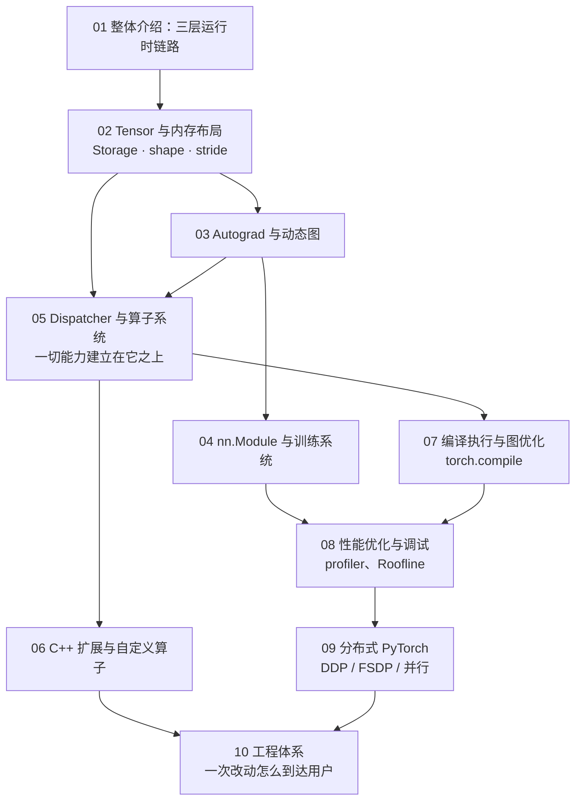
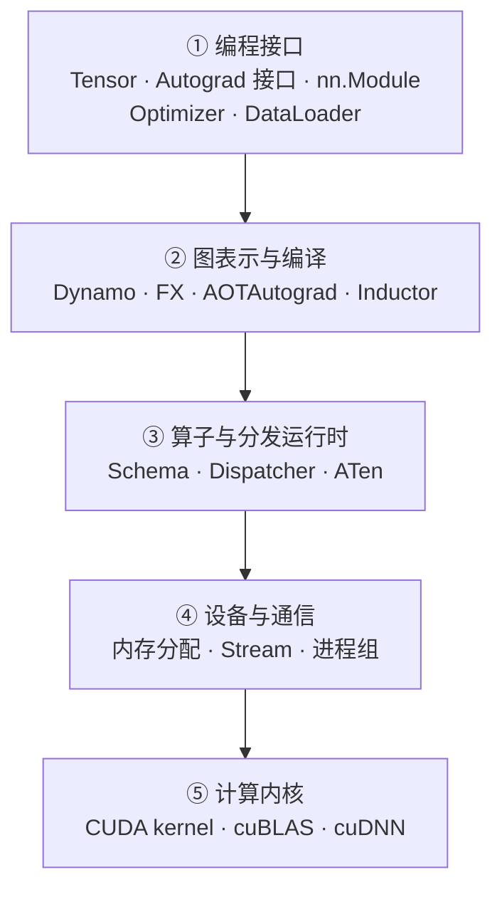
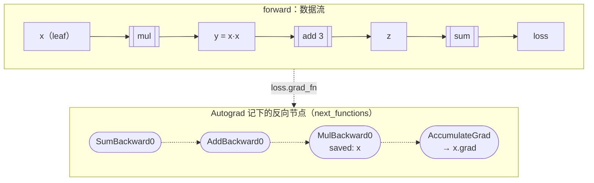
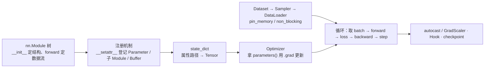
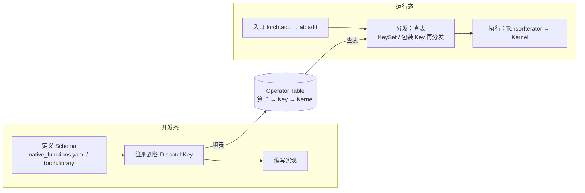
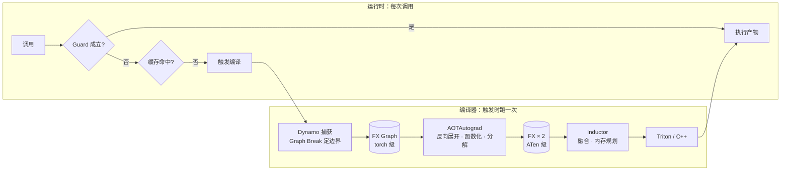
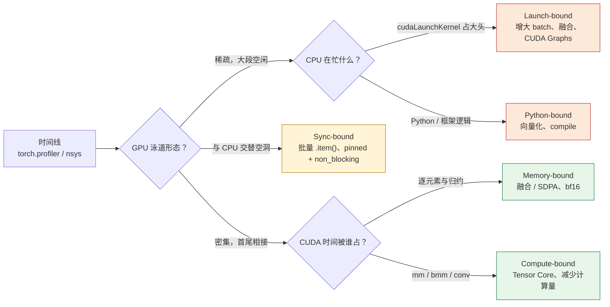

## 这个系列的一句话主张

> PyTorch 不是一个 Python 库，而是一条**分层的运行时链路**——Python 表达、C++ 运行时、CUDA 执行——每一层各解决一件事；而所有能力（求导、跨设备、编译、分布式）都建立在**同一个算子系统**之上。

| 线索 | 路径 |
|---|---|
| 抽象线 | Tensor → Autograd → Module → Operator → Compiler |
| 执行线 | Python → C++ → CUDA → Kernel → Hardware |
| 工程线 | Training → Profiling → Distributed → Testing → Build |

读每一篇问同一组问题：**这一层的职责是什么、边界在哪、代价是多少。**

<aside class="notes" markdown="1">
总纲：/deep-dive-into-pytorch.html。源码四层 torch/ → torch/csrc/ → aten/src/ATen/ → c10/，依赖只能向下。
</aside>

---

## 十篇怎么连起来

---

## 01 · 整体介绍：`torch.add(x, y)` 经过了哪几层

**结论**：六个职责层、一条动态调用路径、四层源码；**Autograd 只是 Operator Table 上优先级更高的一个 Key**。

<aside class="notes" markdown="1">
原文 /pytorch-overall-introduction.html。PyTorch 2.0 于 2023 年 3 月 15 日发布。
</aside>

<!-- v -->

### 要点

- Python 只是表达和控制层；C++ 是运行时和抽象；CUDA 是设备执行——「PyTorch 是一个 Python 库」是第一个误区
- 源码四层 `torch/` → `torch/csrc/` → `aten/src/ATen/` → `c10/`，依赖只能向下

---

## 02 · Tensor 与内存布局：view 只改元数据

**结论**：Tensor = 数据 + 形状 + 布局 + 类型 + 设备 + 生命周期；\(\text{offset} = \text{storage\_offset} + \sum_k i_k \cdot \text{stride}_k\)；**view 只改元数据，`contiguous` / `.to()` / `clone` 才复制**。

{: style="max-height: 360px"}

<aside class="notes" markdown="1">
原文 /pytorch-tensor-and-memory-layout.html。[2,3,4] 连续 strides (12, 4, 1)；fp16 最大 65504、bf16 尾数 7 位。
</aside>

<!-- v -->

### 三维 stride 与 expand 的 stride = 0

{: style="max-height: 250px"}

{: style="max-height: 220px"}

<!-- v -->

### 三个误区

- **`reshape` 总是零拷贝**——不连续时先 `contiguous()` 复制再 view；返回值是否共享内存不确定
- **`del x` 后显存就释放了**——小 view 仍持有同一 Storage；释放的块只回缓存分配器，`reserved` 不降是缓存不是泄漏
- **`allocated` 与 `reserved` 是一个东西**——前者是 Tensor 实际占用，后者是分配器向 CUDA 要来的；差值是碎片与缓存

---

## 03 · Autograd：链式法则变成一次沿图的反向遍历

**结论**：前向就地建图，每个 `Node.apply` 算一次 **VJP**（不物化 Jacobian），梯度 `+=` 到叶子的 `.grad`；**保存一个输出等于保存整张图**。

<aside class="notes" markdown="1">
原文 /pytorch-autograd-and-dynamic-computation-graph.html。「把 loss 存进 list 只是保存一个数」——loss 通过 grad_fn 持有整张图与所有激活；用 .item() 或 .detach()。
</aside>

<!-- v -->

### 要点

- `[B, 4096]` 的一层若物化 Jacobian 每样本 \(4096^2\) 个数；VJP 只算 \(v^\top J\)
- `.grad` 是累加，所以要 `zero_grad()`；version counter 抓 in-place；`gradcheck` 必须 float64

---

## 04 · nn.Module 与训练系统：一切状态都在 `state_dict` 里

**结论**：`__setattr__` 的注册机制决定框架能否发现对象（**list 不是 Module**，用 `ModuleList`）；Adam 训练**每参数 16 字节**——7B 模型 112 GB，一张卡放不下的根源。

{: style="max-height: 340px"}

<aside class="notes" markdown="1">
原文 /pytorch-module-and-training-system.html。GradScaler 初始 65536、溢出 ÷2、连续 2000 步 ×2；prefetch_factor 默认 2；DataLoader worker 是进程。
</aside>

<!-- v -->

### 从模型对象到训练循环

- `model.eval()` 只切换 dropout / BN，**不关梯度**——评估要 `eval()` + `inference_mode()` 一起用

---

## 05 · Dispatcher：开发态填表、运行态查表

**结论**：开发态（定义 → 注册 → 实现）与运行态（入口 → 分发 → 执行）**交汇于 Operator Table**；DispatchKeySet = 各输入 OR + TLS include − exclude，取最高优先级；**包装 Key 做完事再次分发**——一次 `add` 两次经过 Dispatcher。

<aside class="notes" markdown="1">
原文 /pytorch-dispatcher-and-operator-system.html。五种实现模式；Autograd 只是优先级更高的一个 Key（呼应第一篇）。
</aside>

<!-- v -->

### 要点

- AutocastCUDA → AutogradCUDA → CUDA：autocast 先 cast，autograd 记图，最后 kernel；「Dispatcher 是按 device 的 if/else」是误区

---

## 06 · C++ 扩展与自定义算子：三步、两种接入、四个阶段

**结论**：定义 / 注册 / 实现三步；`torch.library` 或 `TORCH_LIBRARY` 接入；Python → C++ CPU → CUDA → Autograd 与 Meta 四阶段；实现层必须处理 **device、dtype、stride、生命周期**四件事。

| 阶段 | 做什么 | 要处理的 |
|---|---|---|
| 一 · Python 实现 | 先用 torch 算子拼出正确答案 | 作为 oracle |
| 二 · C++ CPU | `AT_DISPATCH` 展开 dtype、`TensorIterator` 或 `contiguous()` | dtype、stride、空 Tensor |
| 三 · CUDA | `blocks = (n + 255) / 256`；`CUDAGuard` 切设备 | 合并访存：warp 32 线程按 32 B 扇区取数 |
| 四 · Autograd 与 Meta | `autograd.Function` 或 `register_autograd`；`register_fake` 给 compile | `gradcheck` 用 float64 |

- stride 2 访问带宽利用 50%，最坏多搬 8 倍
- ABI：`_GLIBCXX_USE_CXX11_ABI` 与 torch 一致，否则符号找不到

<aside class="notes" markdown="1">
原文 /pytorch-cpp-extension-and-custom-operators.html。「自定义 Kernel 处理连续 float32 就够了」——dtype、device、stride、空 Tensor、生命周期、backward 都要处理。
</aside>

---

## 07 · 编译执行：`torch.compile` 到底做了什么

**结论**：前端 **Dynamo** 捕获、中端 **AOTAutograd** 变换、后端 **Inductor** 生成，共享 FX Graph；运行时靠 **Guard** 决定复用——能确定的固化进代码，不能确定的变成运行时检查，捕获不了就 graph break 退回 Eager。

<aside class="notes" markdown="1">
原文 /pytorch-compilation-and-graph-optimization.html。backend="eager" / "aot_eager" / "inductor" 三档定位问题在哪一段。
</aside>

<!-- v -->

### 要点

- 热路径：3 次分发 → 0 次、3 次 launch → 2 次；Guard `size[0] == 128` → `s0 > 64`；缓存条目上限 8
- 「换 batch size 变慢是编译器 bug」——静态 shape 下每个新 shape 是一次 Guard 失败 + 重编译；`dynamic=True` / `mark_dynamic`

---

## 08 · 性能优化：CPU 与 GPU 是两条异步时间线

**结论**：五类瓶颈——launch / Python / sync-bound（CPU 侧）、memory / compute-bound（GPU 侧）——**优化是把瓶颈从一类推到另一类**。

<aside class="notes" markdown="1">
原文 /pytorch-performance-optimization-and-debugging.html。CPU 每算子固定成本 10–30 µs；T ≥ max(字节/带宽, FLOPs/算力)；A100 ridge FP32 ≈ 10、BF16 ≈ 156 FLOP/Byte。
</aside>

<!-- v -->

### 案例：五步 166 → 2207 samples/s（13 倍）

{: style="max-height: 380px"}

- 「低精度总能加速」——launch-bound 下 Kernel 数不变，autocast 还插入 cast Kernel；**先解决 CPU 侧问题，再上 bf16**

<!-- v -->

### Roofline：A100

{: style="max-height: 400px"}

- 融合把 5N 访存变 2N；ridge FP32 ≈ 10、BF16 ≈ 156 FLOP/Byte

---

## 09 · 分布式：五类状态各做一个决定

**结论**：参数、梯度、优化器状态、激活、数据——各选**复制还是分片**，每个决定对应一种集合通信原语与一个时机；ring all_reduce 每 rank 收发 \(2(N-1)/N \cdot n \to 2n\)。

| 策略 | 每 rank 静态显存 | 每步通信 | 范围 |
|---|---|---|---|
| DDP | 16P | 2P（梯度 all_reduce，按桶与反向重叠） | 任意 |
| FSDP | **16P / N** | 3P（all_gather 参数 ×2 + reduce_scatter 梯度） | 任意 |
| TP | 参数 / N | 每层 4 次 all_reduce | 节点内 |
| PP | 参数 / K | 层间激活 | 气泡 \((K-1)/(M+K-1)\) |

- 「FSDP 比 DDP 省显存也省通信」——通信 3P 对 2P 多 50%；省的是 16P → 16P/N
- 「加卡就该线性加速」——带宽项通信量不随 N 减少，per-rank 计算随 N 缩小；藏不住就换策略

<aside class="notes" markdown="1">
原文 /pytorch-distributed-training.html。DDP Reducer 的桶按注册顺序逆序划分、每桶约 25 MB；compute stream 与 NCCL stream 两条 stream 重叠。
</aside>

---

## 10 · 工程体系：一次改动过七关

**结论**：守住**正确性、性能、兼容性**；框架工程是在**组合爆炸**下求可行——2000+ 算子 × 约 15 种 dtype × 设备 × 布局 × 模式 → 几十万测试实例，五种 oracle。

| 关 | 内容 |
|---|---|
| lint / 类型 | 格式、mypy、clang-tidy |
| 单测（`pull` 层约两小时） | OpInfo 驱动，五种 oracle：参考实现、`gradcheck`、跨设备、跨 dtype、`compile` vs eager |
| 性能基准 | TorchBench、每日回归 |
| 兼容性 | 弃用保留至少一个小版本（通常两个）；ABI 检查 |
| 发布 | 小版本每三到四个月，cut 距发布约 6 周 |

- flaky 测试：自动开 disable issue 隔离、定期重跑、连续通过后恢复——不是让作者重跑到过
- `gradcheck`：数值 Jacobian（float64、中心差分）对解析 Jacobian 逐元素比

<aside class="notes" markdown="1">
原文 /pytorch-engineering-system.html。
</aside>

---

## 五条贯穿线

| 线 | 落点 |
|---|---|
| **一切建立在算子系统上** | Autograd 是一个 Key；autocast 是一个 Key；compile 捕获的是算子；自定义算子填的是同一张表 |
| **元数据 vs 数据** | view / stride / expand 只改元数据；state_dict 是元数据到 Tensor 的映射；Guard 检查的是元数据 |
| **异步与同步点** | CUDA stream 异步；`.item()` / `.cpu()` 是同步点；NCCL 走另一条 stream；DDP 桶与反向重叠 |
| **每参数多少字节** | 16 B（4 + 4 + 4 + 4）→ 7B 112 GB → DDP 16P、FSDP 16P/N → 混合精度改这个数 |
| **代价** | CPU 每算子 10–30 µs；VJP 不物化 Jacobian；FSDP 多 50% 通信；compile 缓存上限 8 |

---

## 常见误区（一）

- 「PyTorch 是一个 Python 库」——三层分工，Python 只是表达层
- 「`reshape` 总是零拷贝」——不连续时先复制
- 「`del x` 后显存就释放了」——view 共享 Storage；`reserved` 不降是缓存
- 「把 `loss` 存进 list 只是保存一个数」——它持有整张图与所有激活
- 「`model.eval()` 关闭了梯度」——只切换 dropout / BN
{: .fragments}

---

## 常见误区（二）

- 「Dispatcher 是按 device 的 if/else」——多维、可多次的运行时分发
- 「`torch.compile` 把 Python 翻译成 CUDA」——只捕获可分析的 Tensor 计算，其余变 Guard
- 「GPU 利用率低就优化 Kernel」——先看 GPU 泳道：在等 CPU 还是同步点
- 「FSDP 省显存也省通信」——通信多 50%
- 「加卡就该线性加速」——通信、同步等待、计算效率、算法效率四组原因
{: .fragments}

---

## 十个出口

| 篇 | 一个公式 / 一个数 |
|---|---|
| 01 | 源码四层 torch/ → csrc/ → ATen/ → c10/，依赖只向下 |
| 02 | \(\text{offset} = \text{storage\_offset} + \sum i_k\,\text{stride}_k\)；expand 的 stride = 0 |
| 03 | VJP 不物化 Jacobian；`.grad` 累加；gradcheck float64 |
| 04 | 16 B / 参数；GradScaler 65536、÷2、2000 步 ×2 |
| 05 | KeySet = 输入 OR + TLS include − exclude；一次 add 两次分发 |
| 06 | blocks = (n + 255) / 256；stride 2 带宽 50% |
| 07 | Dynamo → AOTAutograd → Inductor；Guard；缓存 8 |
| 08 | CPU 每算子 10–30 µs；ridge A100 BF16 ≈ 156；13 倍 |
| 09 | ring all_reduce 2n；DDP 2P / FSDP 3P；PP 气泡 (K−1)/(M+K−1) |
| 10 | 2000+ 算子 × 15 dtype × …；cut 距发布 6 周 |

---

## 下一步

- **往下**：《GPU Kernel 工程》——第六篇的 CUDA 阶段展开成一个系列；《ML 编译器》——第七篇的 Inductor 展开
- **往上**：《大规模训练》——第九篇的五类状态在几千卡上怎么切；《通信与互连》——NCCL 之下
- **算法侧**：《算法工程师的工具箱》第 3–4 篇是本系列的使用层摘要
- 原文总纲：`/deep-dive-into-pytorch.html`；通关自测在系列总结
