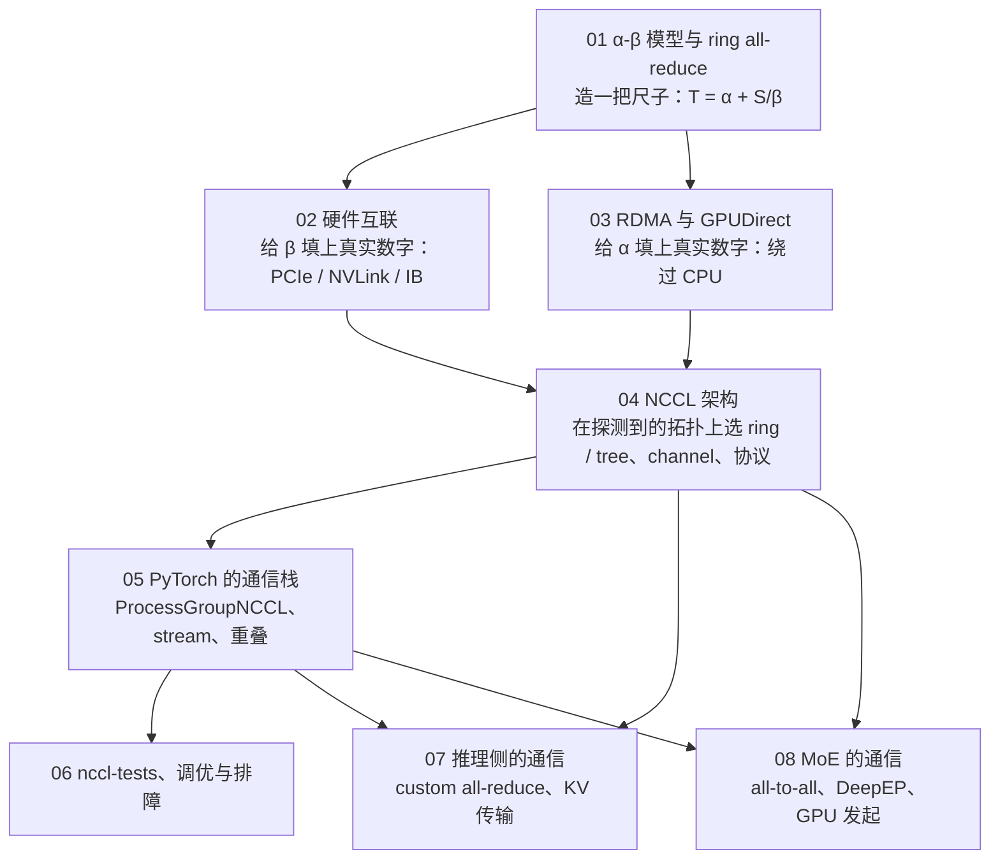
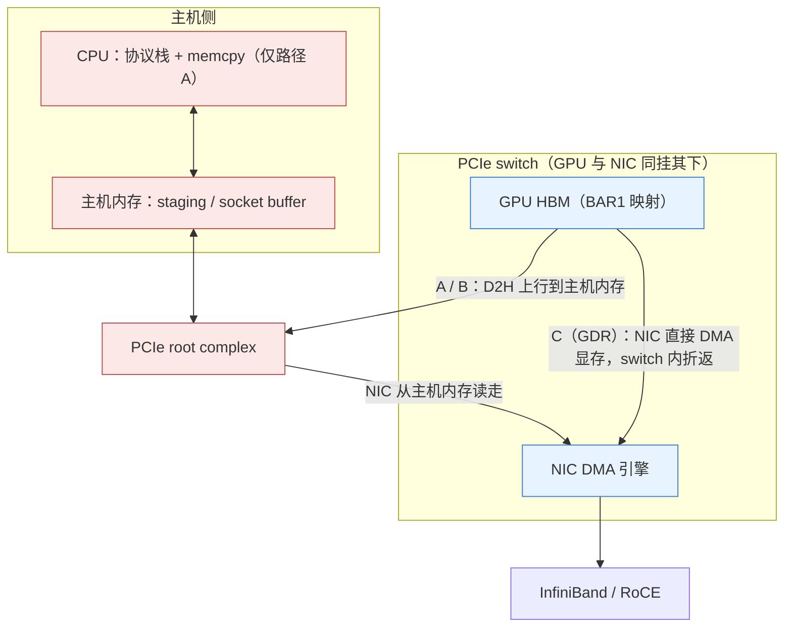
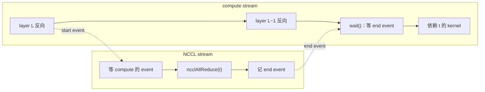

## 这个系列的一句话主张

> 每一次通信都在算**两本账——带宽的账与延迟的账**——分清在算哪本账，才知道该换算法、该换硬件、还是什么都不用换。

\[
T = \underbrace{\text{步数} \times \alpha}_{\text{延迟的账}} + \underbrace{\text{每 rank 字节数} / \beta}_{\text{带宽的账}},\qquad
\text{拐点}\ S^* = n\,\alpha\,\beta
\]

| 账 | 看什么 |
|---|---|
| 带宽 β | 链路速率、算法的带宽效率、协议的有效载荷比例 |
| 延迟 α | 步数、握手次数、kernel 启动、proxy 线程响应；MoE decode 再加**发起速率** |

八篇同一个四段法：算一算 → 看一看 → 测一测 → 比一比；留下诊断工具集 comm-probe。

<aside class="notes" markdown="1">
总纲：/communication-and-interconnect-for-ai-infra.html。
</aside>

---

## 八篇怎么连起来：先造尺子，再填数

---

## 01 · α-β 模型：1 GB 与 64 KB 是两本不同的账

**结论**：\(T_{ring} = 2(n-1)\alpha + \frac{2(n-1)}{n}\frac{S}{\beta}\)——带宽项与 n 无关、延迟项随 n 线性增长；8 卡 IB 上 **1 GB 约 70 ms（延迟占 0.2%）、64 KB 约 145 µs（带宽占 3%）**。

{: style="max-height: 360px"}

<aside class="notes" markdown="1">
原文 /collective-communication-primitives-and-cost-model.html。busbw = algbw × 2(n−1)/n；8 卡 IB 拐点约 2 MB；tree 2⌈log₂n⌉ 步。「通信慢就换更快的网卡」——延迟主导的小消息对 β 不敏感。
</aside>

---

## 02 · 硬件互联：节点内三个量级

**结论**：NVLink 几百 GB/s、PCIe 与网卡几十、跨 socket 个位数到几十；`nvidia-smi topo -m` 的六个等级就是 NCCL 决策的输入；**厂商标的 NVLink 带宽是双向合计，β 要用单向**。

| 链路 | 单向带宽 | 备注 |
|---|---|---|
| NVLink A100 / H100 / Blackwell | 300 / **450** / 900 GB/s | 厂商 600 / 900 / 1800 是双向合计 |
| PCIe x16 3.0 / 4.0 / 5.0 | ≈ 16 / 32 / 64 GB/s | 网卡速率约为 PCIe 链路的 78% |
| IB HDR / NDR | 25 / 50 GB/s | 200 / 400 Gb/s |
| 整机 NVLink 容量 | 网卡总带宽的 **9 倍** | 跨机是瓶颈的根源 |

- 选网卡的规则：带宽最大、其次路径最近——GPU0 配 NIC0 不配 NIC4
- 「拓扑是 `PIX` 所以 P2P 一定快」——ACS / IOMMU 可能把 switch 内 P2P 重定向到 root complex；`p2pBandwidthLatencyTest` 对比、查 `ACSCtl`

<aside class="notes" markdown="1">
原文 /hardware-interconnect-pcie-nvlink-and-topology.html。
</aside>

---

## 03 · RDMA 与 GPUDirect：显存到对端显存的三条路

**结论**：TCP 每端 2 次拷贝、跑不满 400 Gb/s；RDMA 无 GDR 1 次拷贝；**RDMA + GDR 0 次拷贝、PCIe switch 内一跳**，上限 min(NIC, PCIe)。

<aside class="notes" markdown="1">
原文 /rdma-and-gpudirect.html。
</aside>

<!-- v -->

### 数字

| 量 | 数 |
|---|---|
| 上限 min(NIC, PCIe) | H100 / PCIe 5.0 / NDR = 50 GB/s；A100 / PCIe 4.0 / HDR = 25；**A100 配 NDR 被卡在 32** |
| 延迟 | IB 1–2 µs、RoCE 2–4 µs、TCP 15–50 µs |
| `NCCL_NET_GDR_LEVEL` | 默认 `PXB`（同一 switch 下才开 GDR） |
| `NCCL_IB_TIMEOUT=20` | 4.3 s × 7 次重传 ≈ 30 s 后 status=12 |

- 「RDMA 不开 GDR 也差不了多少」——A100 上 D2H 与 NIC DMA 共享主机内存，8 卡合计 800 GB/s 顶到内存带宽
- 「`GPU Direct RDMA Disabled` 就设 `GDR_LEVEL=SYS`」——跨 root complex 的 P2P 可能只有几 GB/s；先修亲和，再用 `ib_write_bw --use_cuda` 证明路径能跑

---

## 04 · NCCL 架构：决策全在 init 里做完

**结论**：`ncclCommInitRank` 里拓扑 → 路径 → 图搜索 → channel → **调优表**；`ncclAllReduce` 只查表；调优表就是 α-β 模型按算法 × 协议 × 拓扑算出的 lat 与 bw——所以同一次 8 卡 all_reduce 在不同机器选不同算法。

| 机器 | 选择 | 为什么 |
|---|---|---|
| NVSwitch（H100 ×8） | NVLS + Simple | 交换机做归约，带宽项最优 |
| NVLink 直连（A100 ×8） | Ring + LL128 | LL128 有效载荷约 94%，只在 NVLink 路径启用 |
| PCIe 机 | Simple / LL | LL 50% 载荷，小消息延迟低 |
| 32 节点 | Tree | ring 510 步 vs tree 2 × (7 + 5) 步 |

- 强行 Ring：NVSwitch 大消息慢约 2 倍、32 节点中小消息慢 4–7 倍
- 「设 `NCCL_ALGO` / `NCCL_PROTO` 是常规调优」——常是三年前留下的 env；先看 TUNING 日志与 nccl-tests 扫描，再写 tuner 配置

<aside class="notes" markdown="1">
原文 /nccl-architecture-topology-channels-algorithms-and-protocols.html。T = lat × latCount + S / (1000 × bw)。
</aside>

---

## 05 · PyTorch 的通信栈：三个「不一定」

**结论**：`async_op=True` 返回时通信**不一定**开始、`wait()` 返回时**不一定**完成、期间改 `t` **不一定**安全——全部换成 stream 与 event 的精确陈述：NCCL stream 等当前 stream 的 event，`wait()` 是当前 stream 等 end event，**CPU 全程不停**。

<aside class="notes" markdown="1">
原文 /pytorch-communication-stack-processgroupnccl-and-streams.html。重叠的来源与失效的来源是同一套编排。
</aside>

<!-- v -->

### 数字

| 量 | 数 |
|---|---|
| watchdog | 每 100 ms 轮询；`opTimeout_` 默认 10 分钟；heartbeat monitor 480 s 强杀 |
| DDP bucket 25 MiB | 节点内带宽项约 97 µs、跨机约 875 µs |
| 1000 个 25 KB 各做一次 vs 合并一次 | 延迟项差 1000 倍——bucket 存在的理由 |

- 「`work.wait()` 阻塞 CPU 到通信完成」——CPU 只在 `TORCH_NCCL_BLOCKING_WAIT`、barrier、显式 synchronize 时阻塞
- 「trace 里 NCCL kernel 很长 = 带宽不够」——本 rank 先到、在自旋等别人；**kernel 最短的是最晚到的 straggler**

---

## 06 · nccl-tests、调优与排障：曲线怎么读，hang 怎么找

**结论**：曲线**左端看 α、右端看 β**、拐点 \(S_{knee} = n\alpha\beta\)，到 90% 平台约 9 倍拐点；hang 分六类，前四类各 rank 最后一次操作不一致、后两类一致；**Flight Recorder 按 `collective_seq_id` 对齐给出 culprit**。

{: style="max-height: 360px"}

<aside class="notes" markdown="1">
原文 /nccl-tests-tuning-and-debugging-hangs.html。8×H100 节点内拐点约 10 MB、64 卡跨机约 30 MB；参考线 8×H100 350–480 GB/s、2 节点 NDR 每 GPU 40–48。
</aside>

<!-- v -->

### 参考线与 hang 的六类

| 参考线 | 值 |
|---|---|
| 8×H100 节点内 all_reduce busbw | 350–480 GB/s |
| 2 节点 NDR，每 GPU | 40–48 GB/s |
| 参数优先级 | env > `NCCL_CONF_FILE` > `~/.nccl.conf` > `/etc/nccl.conf` |

| hang 类型 | 各 rank 最后一次操作 |
|---|---|
| 少一次调用 / 多一次调用 / 顺序不同 / 形状不同 | **不一致**——Flight Recorder 对齐序号找出谁 |
| 网络断 / 某 rank 死在计算里 | 一致——看 dmesg 与 py-spy |

- 「所有 rank 停在 all_reduce 是 NCCL 的 bug」——kernel 自旋无超时，唯一计时器是 c10d 的 watchdog；任何 rank 掉队都表现为全体 timeout

---

## 07 · 推理侧的通信：decode TP 是纯 α 的账

**结论**：8 卡 TP decode 每层 128 KB 的 all_reduce，NCCL 30 µs、custom all-reduce 10 µs——省在 launch 路径、**14 步 → 2 步**、无 channel buffer 中转、可捕获进 CUDA Graph；**KV 传输是纯 β 的点对点账**，单边 RDMA 比 NCCL 更自然。

| 量 | 数 |
|---|---|
| 128 KB | 8 × 8192 × 2 B（TP8、d = 8192、BF16） |
| NCCL Ring + LL 模型 | 6.6 + 14 × 0.6 ≈ 15 µs |
| custom AR | 36 个 block；8 卡 < 256 KB one-shot；上限 8 MB；只能节点内 |
| Llama-3-70B KV | 每 token 320 KB；4096 token 1.25 GiB；TP8 每 rank 160 MiB，400 Gb/s 约 3.4 ms |

- 「custom all-reduce 在所有小消息上都赢」——36 个 block 的启动与两次 flag 交换也是固定成本；8 卡优势区间 (16 KB, 128 KB)，更小的消息 NCCL 对称内存更快
- 不能用在梯度同步上：一致性模型只保证 one-shot 内，且 25 MB bucket 在带宽账上

<aside class="notes" markdown="1">
原文 /inference-communication-custom-all-reduce-and-kv-transfer.html。
</aside>

---

## 08 · MoE 的通信：prefill 是网卡带宽的账，decode 是发起速率的账

**结论**：通信矩阵由路由决定、每步不同、最慢的 rank 决定时间；prefill **按节点去重**把网卡上的份数从 7 压到 3.2；decode 是 1024 条 7.4 KB 的消息，**CPU proxy 给不了发起速率，IBGDA 让 warp 自己写 WQE 与 doorbell**。

| 量 | 数 |
|---|---|
| 每 token | FP8 dispatch 59 KB、BF16 combine 115 KB |
| 跨节点比例 | 1 − 1/N |
| 去重份数 \(N(1-(1-1/N)^k)(1-1/N)\) | 7 → 4.6 → 3.2 |
| prefill 一层 | 5.6–12.5 ms |
| decode 一层 | 理论 429 µs、DeepEP README 487 µs；3/4 是字节、40–60 µs 是 α |

- 「MoE 的 decode 通信是纯延迟问题」——EP=64 时 6.6 MB 过 50 GB/s 网卡本身就要 132 µs；瓶颈是发起速率
- NCCL 的 all_to_all 在 decode 不够用：CPU proxy 每条消息一次响应

<aside class="notes" markdown="1">
原文 /moe-communication-all-to-all-deepep-and-gpu-initiated.html。
</aside>

---

## 两本账在八篇里

| 篇 | 带宽的账 β | 延迟的账 α |
|---|---|---|
| 01 | ring 带宽项与 n 无关 | 延迟项随 n 线性；拐点 nαβ |
| 02 | 单向 450 GB/s、PCIe 78%、整机 9 倍 | 路径等级 PIX / PXB / SYS |
| 03 | 上限 min(NIC, PCIe) | IB 1–2 µs、TCP 15–50 µs；0 拷贝 |
| 04 | LL 50% / LL128 94% / Simple 100% 载荷 | ring 510 步 vs tree 24 步 |
| 05 | bucket 25 MiB | 1000 次 vs 1 次差 1000 倍 |
| 06 | 曲线右端、参考线 | 曲线左端、六类 hang |
| 07 | KV 传输 3.4 ms | custom AR 14 → 2 步 |
| 08 | prefill 去重 7 → 3.2 | decode 发起速率、IBGDA |

---

## 常见误区

- 「通信慢就换更快的网卡」——先判断消息在拐点哪一侧
- 「algbw 能和硬件带宽比」——用 busbw
- 「H100 的 NVLink 是 900 GB/s」——单向 450
- 「拓扑是 PIX 所以 P2P 一定快」——ACS / IOMMU 可能重定向
- 「RDMA 不开 GDR 也差不了多少」——主机内存带宽顶住
- 「Ring 是 all_reduce 的最优算法」——只在带宽账上
- 「`work.wait()` 阻塞 CPU」——只是 stream 等 event
- 「NCCL kernel 很长 = 带宽不够」——是在等 straggler
- 「所有 rank 停在 all_reduce 是 NCCL 的 bug」——找 culprit
- 「MoE decode 通信是纯延迟问题」——3/4 是字节，瓶颈是发起速率
{: .fragments}

---

## 八个出口

| 篇 | 一个公式 / 一个数 |
|---|---|
| 01 | \(T_{ring} = 2(n-1)\alpha + \frac{2(n-1)}{n}\frac{S}{\beta}\)；\(S^* = n\alpha\beta\) |
| 02 | NVLink 单向 300 / 450 / 900；PCIe 5.0 x16 64 GB/s；NDR 50 |
| 03 | 拷贝 2 / 1 / 0 次；IB 1–2 µs；上限 min(NIC, PCIe) |
| 04 | 决策在 init；LL 50% / LL128 94%；tree 2⌈log₂n⌉ |
| 05 | NCCL stream 等 event、wait() 等 end event；watchdog 10 分钟 |
| 06 | 左 α 右 β；90% 平台 ≈ 9 S_knee；Flight Recorder |
| 07 | 128 KB：30 → 10 µs；14 → 2 步；KV 320 KB / token |
| 08 | 去重 7 → 3.2；decode 487 µs，3/4 是字节 |

---

## 下一步

- **往上**：《大规模训练》——这些原语怎么组成 DP / TP / PP / EP；《vLLM 源码》——TP decode 与 PD 分离里的 custom AR 与 KV 传输
- **往下**：《GPU Kernel 工程》——通信 kernel 也是 kernel
- **实践**：comm-probe 在任何新机器上跑一遍
- 原文总纲：`/communication-and-interconnect-for-ai-infra.html`；通关自测在系列总结
