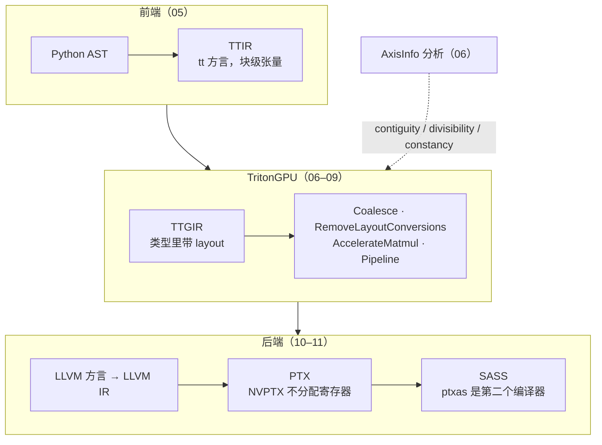
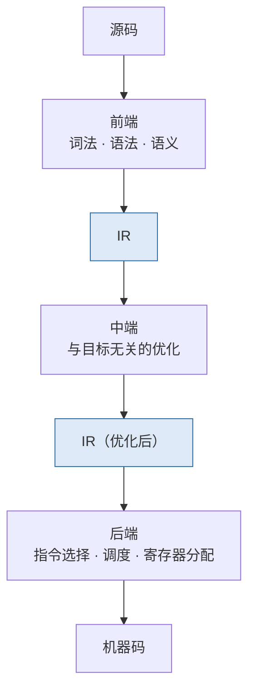
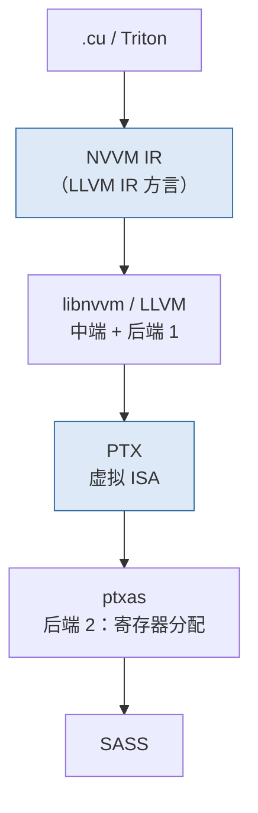

## 这个系列的一句话主张

> **一个编译器 = IR + pass + lowering**；Triton 把 **layout 放进类型**、把**决定放进 pass**、把**正确性放进 verifier 与分析**——每一个可观察的编译结果（一条 `ld.global.v4`、一个 `bar.sync`、一个 `convert_layout`、两个 shared memory 缓冲）都能追到某一个 pass 与它依赖的某一个分析。

| 段 | 篇 |
|---|---|
| 通用编译器 | 01 骨架 · 02 LLVM |
| MLIR | 03 IR 结构 · 04 怎样改 IR |
| Triton 编译器 | 05 前端 · 06 AxisInfo · 07 layout · 08 layout 优化 · 09 流水 · 10 下降 · 11 缓存与运行时 |
| 另一条路与工作台 | 12 TVM · 13 工作台 |

<aside class="notes" markdown="1">
总纲：/ml-compiler-internals.html。
</aside>

---

## 从 Python 到 SASS：Triton 的流水线



---

## 01 · 编译器的骨架：IR、SSA 与 pass

**结论**：**渐进式下降每层丢一类信息**——标量 IR 丢了「这是矩阵乘」，所以 ML 编译器另起块级 IR。



<aside class="notes" markdown="1">
原文 /compiler-skeleton-ir-ssa-and-passes.html。
</aside>

<!-- v -->

### 要点

- **SSA 让 def-use 成为数据结构**，φ 在汇合处：`mem2reg` 后 `sum` 变成两个 φ
- 数据流分析 = 格 + 传递函数 + 不动点；pass 的「变换 → 清理」节奏；`-O2` 是 119 项 pass、126 次 dump

---

## 02 · LLVM：所有 ML 编译器共同的后端

**结论**：一切是 `Value`；后端三件事——但 **NVPTX 不做寄存器分配，`ptxas` 是第二个编译器**；`align` 决定向量宽度；内联汇编让 LLVM 对 `mma` 无知。



<aside class="notes" markdown="1">
原文 /llvm-the-shared-backend-and-nvptx.html。AMD 直接打印 NumVgprs / Occupancy。
</aside>

<!-- v -->

### 要点

- `align 16` → 一条 `ld.global.v4`；`align 4` → 四条 `b32`
- 地址空间 1 / 3 / 5 = global / shared / local；`ptxas -v --regAllocOptLevel=2`；`n_regs` 来自 `cuFuncGetAttribute`
- 「Triton 编译器决定寄存器数」——`ptxas` 决定，Triton 只能经 `num_warps` / `num_stages` / tile / `maxnreg` 间接影响

---

## 03 · MLIR（上）：Operation、Region、Dialect

**结论**：**基础设施 / 内容分离**；Operation 是唯一单位，Region / Block / Value；通用形式 = 数据结构打印；ODS 十几行生成五百行；Trait 静态、Interface 动态；**Block 参数代替 φ**；Type / Attribute 唯一化不可变 → **改 layout 只能建新 op**。

| MLIR | 对应 LLVM |
|---|---|
| Operation（任意方言） | Instruction（固定集合） |
| Block 参数 | φ |
| Region（嵌套） | 没有——控制流平铺 |
| Dialect | 一个 IR 就是一个方言 |
| `RankedTensorType` 的 encoding 槽位 | Triton 把 layout 放进这里 |

- LICM 只用 4 个接口就能对任意方言工作；`scf → cf` 后 Block 参数与 `mem2reg` 的 φ 逐行对应

<aside class="notes" markdown="1">
原文 /mlir-ir-structure-dialects-and-ods.html。
</aside>

---

## 04 · MLIR（下）：怎样改 IR

**结论**：三种机制——**pass**（`builtin.module(func.func(...))` 嵌套、analysis 默认失效）、**pattern rewrite**（改动全经 rewriter、greedy 到不动点、`fold` 不建 op）、**dialect conversion**（类型一起变、adaptor、materialization、延迟提交 / 回滚）。

| 机制 | Triton 里的例子 |
|---|---|
| pass | `Passes.td → passes.cc → compiler.py` 链 |
| pattern rewrite | `make_ttir` 八个 pass 全是 pattern；canonicalize 弱于 instcombine |
| dialect conversion | `ConvertTritonToTritonGPU`：TypeConverter 加默认 `#blocked`，target materialization = `convert_layout` |

- `unrealized_conversion_cast` 是未完成转换的痕迹
- 「canonicalize 会做所有代数简化」——只做规范化；`(x*8+7)-x*8` 留给 LLVM

<aside class="notes" markdown="1">
原文 /mlir-passes-pattern-rewriting-and-dialect-conversion.html。linalg.matmul 在笔记本上跑出 16。
</aside>

---

## 05 · Triton 前端：Python AST → TTIR

**结论**：`JITFunction` 保存源码不执行；**特化 key**（dtype、constexpr、16 的倍数、等于 1）；`CodeGenerator` 是 `ast.NodeVisitor`，每个节点一次 builder 调用；`for` → `scf.for`（空跑找携带值）。

```python
@triton.jit
def add(x_ptr, y_ptr, n, BLOCK: tl.constexpr):
    pid = tl.program_id(0)
    offs = pid * BLOCK + tl.arange(0, BLOCK)     # splat + arange：contiguity 的唯一来源
    mask = offs < n
    x = tl.load(x_ptr + offs, mask=mask)          # tt.addptr：类型化地址，AxisInfo 的对象
```

- `tt.divisibility = 16` 从**实参对齐**来——同一个 kernel，指针不对齐就是另一份编译
- `constexpr` 折叠 vs 物化；`Combine` 模式认形状不认语义（隔着 `broadcast` 不合并）

<aside class="notes" markdown="1">
原文 /triton-compiler-frontend-python-ast-to-ttir.html。
</aside>

---

## 06 · AxisInfo：编译器凭什么知道一条 load 可以 128 bit

**结论**：三个量 **contiguity / divisibility / constancy** 的格与 gcd join，逐 op 传递；`splat + arange` 是 contiguity 的唯一来源，参数属性是 divisibility 的来源；\(\text{vec} = \min(128/\text{位宽},\ \text{contiguity},\ \text{alignment})\)，mask 用 constancy。

| 表达式 | contiguity, divisibility, constancy | 结果 |
|---|---|---|
| `pid * 1024 + arange(1024)` | [1024], [1024], [1] | 128 bit |
| `pid * n + arange(1024)` | [1024], **[1]**, [1] | divisibility 1 → 标量 load |
| `multiple_of(n, 16)` 之后 | [1024], [16], [1] | 恢复 |
| matmul 的 `a_ptrs` | [1, 32], [2, 16] | alignment 8 |

- 「contiguity 大就 128 bit」——还需 divisibility 对齐与 mask constancy

<aside class="notes" markdown="1">
原文 /triton-compiler-ttir-analysis-axisinfo.html。
</aside>

---

## 07 · layout 系统与 Linear Layout

**结论**：**layout = 硬件位置（寄存器、lane、warp）→ 张量下标的函数，写在类型里**；`#blocked` / `#slice` / `#mma` / `#dot_op`；**Linear Layout = GF(2) 上的线性映射**，基向量表；转换代价由 \(dst^{-1} \circ src\) 逐维 `quotient` 判定；Coalesce 按 AxisInfo 定 `order` 与 `sizePerThread`。

| `[64, 64]` 默认 `#blocked` | 哪些位管什么 |
|---|---|
| lane（5 位） | 列的低 5 位 |
| warp 位 2 | 行 1 |
| 寄存器 | 行 2..32 |
| 到 `#mma` | 需 shared memory（warp 位 → lane 位的换位） |

- 默认 layout 每线程 1 元素；A tile → `[1, 8], [8, 4], [4, 1]`（sizePerThread、threadsPerWarp、warpsPerCTA）
- 「`sizePerThread` 是用户选的」——Coalesce 由 AxisInfo 推出

<aside class="notes" markdown="1">
原文 /triton-compiler-layouts-and-linear-layout.html。
</aside>

---

## 08 · layout 优化与 Tensor Core 路径

**结论**：`RemoveLayoutConversions` 两阶段——锚点前向传播 + 冲突消解 + 后向重物化（代价模型）+ 三种 hoist：**23 → 3 → 7 → 3 → 1** 个 `convert_layout`；`AccelerateMatmul` 选 MMA 版本、`warpsPerCTA` 偏向 M、`kWidth = 32 / 位宽`。

| 量 | 数 |
|---|---|
| `[128, 128]` tile | `warpsPerCTA = [2, 2]` |
| `#mma → #dot_op` | `[4, 1]` 下零 shared memory；`[2, 2]` 下 8 条 `st.shared` + 15 barrier |
| epilogue 的 `convert_layout` | 被 `dot` 与 `store` 两个锚夹住——消不掉 |

- 「所有 `convert_layout` 走 shared memory」——三条路，同 warp 内的用 shuffle / 寄存器重排
- 「epilogue 的转换是优化没做好」——两端被硬件决定锚住；Gluon 或 TMA store 是绕法

<aside class="notes" markdown="1">
原文 /triton-compiler-layout-optimization-and-tensor-cores.html。
</aside>

---

## 09 · 软件流水：`num_stages` 变成了什么

**结论**：`AssignLatencies`（提前 (S−1)/(层级+1) 个迭代）→ `ScheduleLoops`（最长 latency 路径分 stage）→ `LowerLoops`（**缓冲数 = stage 差**）→ `PipelineExpander`；Hopper `wgmma` 异步 +1 缓冲、TMA + mbarrier；Blackwell TMEM + `tcgen05`；`warp_specialize` 三区；**Gluon 跳过全部自动 pass**。

| `num_stages = 3` | Ampere | Hopper |
|---|---|---|
| 缓冲数 | **2** | 3（`wgmma` 异步 +1） |
| prologue | 2 次 load | TMA + mbarrier |
| 等待 | `async_wait {num = 2}` | `pendings = 1` |
| iter_args | 15 | 4 |

- warp specialization：默认区 4 warp epilogue、1 warp MMA、2 warp TMA
- 「`num_stages = 3` → 3 个缓冲」——缓冲数 = stage 差 = 2

<aside class="notes" markdown="1">
原文 /triton-compiler-software-pipelining-hopper-blackwell-gluon.html。
</aside>

---

## 10 · TritonGPU 到 LLVM：tile 级 op 怎样变成每线程指令

**结论**：张量 → 每线程 struct；`applyLinearLayout` 把基向量 XOR 成地址算术；`load` 按 `vec` 发谓词 `ld.global.vN`；`reduce` 三级由规约维落在 register / lane / warp 位决定；`convert_layout` 三条路；`AllocateSharedMemory` **着色复用**；`Membar` 区间相交插 barrier——**TTGIR 里一个 barrier 都没有**。

| kernel | 生成的指令 |
|---|---|
| rowsum | 7 加 + 5 shuffle + 16 字节 |
| matmul | 64 条 `mma.sync`、26 条 `ldmatrix`、24 条 `cp.async`、10 个 barrier |
| shared memory | 流水线缓冲与 epilogue scratch 同为 32 KB，生命期不重叠 → `ttg.shared = 32768` 不是 64 KB |

- `mma.sync` 是内联汇编——LLVM 对它无知（第二篇）

<aside class="notes" markdown="1">
原文 /triton-compiler-lowering-tritongpu-to-llvm.html。
</aside>

---

## 11 · 编译流水线的组织、缓存、运行时与 AMD

**结论**：`compile()` 按阶段表逐级、`metadata` 累积、缓存组原子；**key 五成分**（含 `libtriton.so` 哈希）；惰性加载、运行时生成的 C launcher、`cuLaunchKernelEx`；AMD：layout pass 共用、`#amd_mfma`、自己的流水器、**LLVM 直出 ISA、无第二编译器**。

| 量 | 数 |
|---|---|
| 元数据字段 | 34 个 |
| block | `32 × num_warps` |
| gfx942 | wave 64、MFMA 32×32×8、144 VGPR、0 spill、Occupancy 3 |

- 「改 `.cpp` 就生效」——要重新构建且装进 import 到的那份 Triton；否则 `triton_key` 不变、旧缓存命中
- dump / override：`MLIR_ENABLE_DUMP`、`TRITON_KERNEL_OVERRIDE`

<aside class="notes" markdown="1">
原文 /triton-compiler-ptx-cubin-cache-runtime-and-amd.html。
</aside>

---

## 12 · TVM：调度语言与自动调优，另一条路

**结论**：**算法 / 调度分离**——block 是算法、循环是调度；原语带形式化前置条件（写错只会慢、不会算错）；DLight 规则 = Triton 自动决定的显式版；MetaSchedule 搜带采样点的 trace；设计空间是一条轴。

| 量 | 数 |
|---|---|
| CPU matmul | 1089 → 52 μs |
| Metal | 700 GFLOP/s |
| DLight | `storage_align(…, 16, 8)` 代替 swizzle |
| 搜索空间 | MetaSchedule 10⁴–10⁶ vs Triton autotune 几十个 |

- 两条路的对照：Triton 把决定放进 pass（用户不可见），TVM 把决定放进调度（用户可见、可搜索）

<aside class="notes" markdown="1">
原文 /tvm-schedule-language-and-auto-tuning.html。
</aside>

---

## 13 · 编译器开发者的工作台

**结论**：**macOS 可构建**，假 `ptxas` 编到 PTX；lit 277 文件 9.5 s、gtest 毫秒、pytest 需 GPU；`MLIR_ENABLE_DUMP` 74 份；二分八步；加 pass 七步；读 PR 倒序——**改编译器不必有 GPU**。

| 工具 | 用途 |
|---|---|
| `triton-opt --pass` | 单独跑一个 pass，lit 断言 |
| `MLIR_ENABLE_DUMP=1` | 每个 pass 后 dump，74 份 |
| `--run-reproducer` | 崩溃复现 |
| `TRITON_INTERPRET=1` | 编译器 bug 还是 kernel bug 的分界线 |
| lit 两种断言 | `CHECK` 精确 / `CHECK-DAG` 无序 |

- 「`.llir` dump 是 lowering 刚出来的 IR」——是 `-O3` 之后的；优化前要看 MLIR LLVM 方言那一步

<aside class="notes" markdown="1">
原文 /ml-compiler-developer-workbench.html。
</aside>

---

## 贯穿线：一个可观察的结果 ← 一个 pass ← 一个分析

| 你在 PTX / SASS 里看到 | 来自哪个 pass | 依赖哪个分析 |
|---|---|---|
| 一条 `ld.global.v4` | Coalesce 定 `sizePerThread`，lowering 按 `vec` 发 | AxisInfo（06） |
| 一个 `convert_layout` 留下 | RemoveLayoutConversions 消不掉的锚 | Linear Layout 代价（07、08） |
| 一个 `bar.sync` | Membar | shared memory 区间相交（10） |
| 两个 shared 缓冲 | LowerLoops：缓冲数 = stage 差 | AssignLatencies（09） |
| 64 条 `mma.sync` | AccelerateMatmul 选版本，lowering 内联汇编 | `#mma` layout（08、10） |
| 寄存器数 | **不是 Triton**——`ptxas` | （02） |

---

## 常见误区（一）

- 「Triton 编译器决定寄存器数」——`ptxas` 决定
- 「`.llir` dump 是 lowering 刚出来的」——是 -O3 之后的
- 「canonicalize 做所有代数简化」——只规范化
- 「`Combine` 合并所有地址运算」——认形状，隔着 broadcast 不合
- 「contiguity 大就 128 bit」——还要 divisibility 与 constancy
- 「`sizePerThread` 是用户选的」——AxisInfo 推出
- 「所有 `convert_layout` 走 shared memory」——三条路
{: .fragments}

---

## 常见误区（二）

- 「epilogue 的转换是优化没做好」——被两个锚夹住
- 「`num_stages = 3` → 3 个缓冲」——2 个
- 「TTGIR 里有 barrier」——一个没有，Membar 推出
- 「shared memory = 各缓冲之和」——着色复用
- 「改 `.cpp` 就生效」——重新构建 + 装对那份
- 「改编译器必须有 GPU」——lit / gtest / 编到 PTX 都不需要
{: .fragments}

---

## 十三个出口

| 篇 | 一个数 / 一个结论 |
|---|---|
| 01 · 02 | -O2 119 项 pass；NVPTX 不分配寄存器；align 16 → v4 |
| 03 · 04 | Block 参数 = φ；layout 在 encoding 槽位；conversion 的 materialization = `convert_layout` |
| 05 · 06 | 特化 key 四项；divisibility 16 从实参来；vec = min(128/位宽, contiguity, alignment) |
| 07 · 08 | Linear Layout = GF(2)；23 → 1 个 convert；`[4, 1]` 零 shared |
| 09 · 10 | 缓冲数 = stage 差；rowsum 7 加 + 5 shuffle；matmul 64 mma / 32 KB |
| 11 · 12 · 13 | key 含 libtriton 哈希；TVM 1089 → 52 μs；lit 9.5 s、不需 GPU |

---

## 下一步

- **往上**：《GPU Kernel 工程》第 7 篇——Triton 的使用侧与边界；《PyTorch 深度实践》第 7 篇——Inductor 生成的正是 Triton
- **往下**：《GPU Kernel 工程》第 6 篇——`mma` / `ldmatrix` / swizzle 手写版
- **实践**：《参与 AI-Infra 开源》——第 13 篇的工作台在 Triton PR 里怎么用
- 原文总纲：`/ml-compiler-internals.html`；通关自测在系列总结
