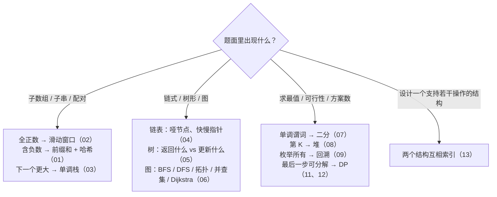

## 这个系列的一句话主张

> 中等难度的面试题背后只有**十来种模式**，每种模式有一个**可以背下来的骨架**、**两三处必错的边界**、一组**典型的追问**；AI 岗的手撕题不考识别，考对组件的理解**是否精确到能写出来、并且知道怎么验证**。

| | 算法篇 01–13 | AI 手撕篇 14–19 |
|---|---|---|
| 主线 | 识别信号 → 模板 → 主讲题推演 → 变式与追问 → 两种语言的坑 | 面试怎么出题 → 形状推演 → 从零实现 → 与 torch 对拍 → 数值与形状陷阱 → 追问 |
| 共用方法 | 先说清骨架与不变量，再写代码，写完用最小的边界输入走查 | |

<aside class="notes" markdown="1">
总纲：/coding-interview.html。本系列不在任何路线图上。
</aside>

---

## 识别信号 → 模式



---

## 01–03 · 数组、双指针、单调栈

| 篇 | 一句话骨架 | 必错边界 |
|---|---|---|
| 01 哈希与前缀和 | 「把见过的记下来」：$$\text{sum}(i, j] = \text{pre}[j] - \text{pre}[i]$$ | `count[0] = 1`；原地哈希值 v 放下标 v − 1 |
| 02 双指针与滑动窗口 | 单调性：右扩不会让违规变合法、左收不会让合法变违规 | **含负数的「和 = k」不满足**——用前缀和 |
| 03 单调栈与单调队列 | 弹出时结算：被弹出者的右侧第一个更大 = 当前元素、左侧 = 新栈顶 | 两端哨兵 0；窗口最值用单调队列 O(n) 不用堆 O(n log k) |

- LC 76 用 `missing` 计数使每步 O(1)；接雨水水位 = min(leftMax, rightMax)

<aside class="notes" markdown="1">
原文 /coding-interview-arrays-hashing-prefix-sum.html、/coding-interview-two-pointers-and-sliding-window.html、/coding-interview-stack-monotonic-stack-and-queue.html。
</aside>

---

## 04–06 · 链表、二叉树、图

| 篇 | 一句话骨架 | 必错边界 |
|---|---|---|
| 04 链表 | 哑节点统一头特判；三指针反转先存 `nxt`；快慢指针找中点 / 判环 | Floyd $$a = (k-1)c + (c-b)$$；归并切分 `fast = head.next` |
| 05 二叉树 | **返回给父节点的是能继续向上延伸的链，答案在拐点处用全局变量更新** | 层序先记 `len(q)`；BST 验证带上下界 `(lo, hi)` 不是比父子 |
| 06 图 | 五个算法：BFS、DFS、Kahn、并查集、Dijkstra；**BFS 入队时标记** | Kahn 出队数 < n 即有环；Dijkstra 堆 + 懒删除 O(E log E) |

- 并查集路径压缩 + 按大小合并 O(α(n))；双向 BFS $$O(b^{d/2})$$

<aside class="notes" markdown="1">
原文 /coding-interview-linked-list.html、/coding-interview-binary-tree.html、/coding-interview-graph-bfs-dfs-topological-union-find.html。
</aside>

---

## 07–09 · 二分、堆与贪心、回溯

| 篇 | 一句话骨架 | 必错边界 |
|---|---|---|
| 07 二分 | **只有一个模板**：在「假假假真真真」的单调谓词上找第一个真；`[lo, hi)`、真收 `hi = mid`、假收 `lo = mid + 1` | 「有序数组找值」只是谓词 `a[i] >= t` 的特例；答案二分 O(n log V) |
| 08 堆、Top-K、区间、贪心 | **第 K 大用大小为 K 的最小堆**；区间按起点排一趟扫、选最多不重叠按终点；贪心靠交换论证 | 双堆先进 `small` 再倒；会议室 = 起点排序 + 结束时间最小堆 |
| 09 回溯 | 做选择 → 递归 → 撤销；排列用 `used[]`、组合用 `start` | `out.append(path[:])` 必须拷贝；**剪枝不改量级**：排列仍 O(n · n!) |

- 子集 $$O(n \cdot 2^n)$$、括号 $$O(4^n/\sqrt n)$$、单词搜索 $$O(mn \cdot 3^L)$$

<aside class="notes" markdown="1">
原文 /coding-interview-binary-search.html、/coding-interview-heap-topk-intervals-greedy.html、/coding-interview-backtracking.html。
</aside>

---

## 10–13 · 字符串、DP、设计题

| 篇 | 一句话骨架 | 必错边界 |
|---|---|---|
| 10 字符串 | 中心扩展（2n − 1 个中心）、KMP `lps`、状态机解析、竖式 `res[i + j + 1]`、`a + b` vs `b + a` | atoi 溢出在乘 10 之前判 |
| 11 DP（一） | 五步法：定义状态（「前 i 个」还是「以 i 结尾」）→ 枚举最后一步 → 初始 → 顺序 → 答案 | LIS `tails` 只有长度是对的、不是子序列；`INF = amount + 1` |
| 12 DP（二） | **倒序 = 一次、正序 = 无限**；区间枚举最后被处理的元素；状态机画图再写 | 组合数外层物品、排列数外层容量（LC 377）；`hold` 初值 −∞ |
| 13 设计题 | 单一结构做不到的复杂度用**两个结构互相索引**：哈希 → 双向链表（LRU）、频次桶 + `min_freq`（LFU）、数组 + 值到下标（O(1) 随机集） | LFU `min_freq` 最多 +1 或重置为 1；树状数组 `lowbit` |

<aside class="notes" markdown="1">
原文 /coding-interview-strings.html、/coding-interview-dynamic-programming-linear-and-grid.html、/coding-interview-dynamic-programming-knapsack-interval-state-machine.html、/coding-interview-design-problems-lru-lfu-trie.html。
</aside>

---

## 14 · 手撕 attention 家族

**结论**：multi-head 的四次形状变换——先 `reshape(B, T, H, d)` 再 `transpose`；softmax 减最大值；**mask 用 −∞ 或 `finfo.min`**（0 经 softmax 仍有权重、fp16 下 −1e4 不够小）；online softmax 最大值变时重缩放；KV cache 缓存 K、V 不缓存 Q。

```python
q = self.wq(x).view(B, T, H, d).transpose(1, 2)          # [B, H, T, d]
att = (q @ k.transpose(-2, -1)) / math.sqrt(d)            # [B, H, T, T]
att = att.masked_fill(mask == 0, float('-inf')).softmax(-1)
y = (att @ v).transpose(1, 2).contiguous().view(B, T, D)  # 拼回去要 contiguous
```

| 账 | 数 |
|---|---|
| 参数 | $$4D^2$$；FLOPs $$8TD^2 + 4T^2D$$ |
| 每 token KV | $$2LH_{kv}d \cdot$$ bytes：Llama-3-8B 128 KB；GQA 缩 $$H/H_{kv}$$ 倍 |

<aside class="notes" markdown="1">
原文 /coding-interview-attention-from-scratch.html。
</aside>

---

## 15 · 手撕 Transformer block 与反向传播

**结论**：一层参数约 **12D²**（attention 4 + FFN 8）；每参数一次乘加 → 前向 2N、训练 6N；**CE 的梯度就是 p − y**；反向 = 局部导数 × 上游梯度，写完用形状自查；micrograd 里梯度累加要 `+=`。

| 量 | 数 / 公式 |
|---|---|
| GPT-2 small | 124,439,808 |
| LayerNorm 反向 | $$\frac{1}{\sigma}\big(d\hat x - \overline{d\hat x} - \hat x\,\overline{d\hat x \odot \hat x}\big)$$ |
| softmax + CE 反向 | $$p - y$$ |
| 残差 | 梯度直接相加——所以深了能训 |

<aside class="notes" markdown="1">
原文 /coding-interview-transformer-block-and-backprop.html。
</aside>

---

## 16 · 手撕 tokenizer 与解码

**结论**：BPE 编码**按 merge 顺序**而不是贪心最长匹配，tie-break `(频次, 字典序)`；采样流水线 **penalty → T → softmax → top-k → top-p → min-p**；投机解码的输出分布恰为 p。

| 边界 | |
|---|---|
| top-p | 保留首个越界项 |
| 蓄水池采样 | 第 i 个以 k / i 替换 |
| 投机接受率 | $$1 - \text{TV}(p, q)$$ |

<aside class="notes" markdown="1">
原文 /coding-interview-tokenizer-and-decoding.html。
</aside>

---

## 17 · 手撕损失函数与训练算法

**结论**：论文公式落成十行正确代码——DPO 四个序列 log 概率、初值 ln 2；**GAE 从末尾递推** $$A_t = \delta_t + \gamma\lambda A_{t+1}$$；PPO 取 `min`；**AdamW 衰减解耦**（加进梯度的是 L2，会被 $$\sqrt{\hat v}$$ 归一化）；LoRA `B = 0` 初始化。

```python
# AdamW：衰减不进 m、v
m = b1*m + (1-b1)*g;  v = b2*v + (1-b2)*g*g
p -= lr * (m/(1-b1**t)) / ((v/(1-b2**t)).sqrt() + eps)
p -= lr * wd * p                      # 解耦：直接加在更新里
```

- Adam 第一步移动约 η · sign(g)；每参数 16 字节训练状态；LoRA 参数 $$r(\text{in} + \text{out})$$

<aside class="notes" markdown="1">
原文 /coding-interview-losses-and-training-algorithms.html。
</aside>

---

## 18 · 手撕经典 ML 与评测指标

**结论**：**模型 = 目标 + 优化**——逻辑回归梯度 $$X^\top(p - y)/n$$、k-means 每步目标单调不增所以收敛；**AUC = （正样本秩和 − $$n_+(n_+ + 1)/2$$）/ $$n_+ n_-$$**，O(n log n)；conv = im2col + GEMM。

| 量 | 公式 |
|---|---|
| NDCG 折扣 | $$1/\log_2(i + 1)$$ |
| 卷积输出 | $$H_{out} = \lfloor (H + 2p - k)/s \rfloor + 1$$ |
| im2col | 大 $$k_h k_w$$ 倍 |

<aside class="notes" markdown="1">
原文 /coding-interview-classical-ml-and-metrics.html。
</aside>

---

## 19 · Infra 岗手撕：并发与系统

**结论**：**一把锁保护什么、条件变量为什么 `while`**——`get` 也要锁；两个条件变量各叫各的；异常进 Future；内存池的空闲链表嵌在块内；**分块要测了再说**。

| 题 | 一句话 |
|---|---|
| 线程安全 LRU | `get` 也要锁——它改链表顺序 |
| 有界阻塞队列 | `not_empty` / `not_full` 两个条件变量，`while` 防虚假唤醒 |
| 线程池 | 异常进 Future 不吞掉 |
| ring allreduce | 每 rank $$2\frac{N-1}{N}V$$，与 N 无关 |
| 矩阵乘法 | ikj 比 ijk 快 11 倍；n = 512 时分块只加循环开销 |
| paged KV | fork 只加引用、写时复制一块 |

<aside class="notes" markdown="1">
原文 /coding-interview-infra-concurrency-and-systems.html。
</aside>

---

## 四条贯穿线

| 线 | 落点 |
|---|---|
| **识别信号 → 模式** | 一道题落在两个分支是常态（接雨水：双指针 / 单调栈；第 K 大：堆 / 快速选择；LC 287：原地哈希 / Floyd / 值域二分）——这正是追问的来源 |
| **不变量思维** | 窗口「每个 right 处合法」、对撞「被排除的一侧不可能更优」、`tails`「严格递增、tails[k] 是长度 k+1 的最小末尾」、双堆「small ≤ large 且大小差 ≤ 1」 |
| **Python 与 Java 的差异** | 溢出（`long`、`lo + (hi − lo)/2`、乘 10 之前判）；容器（不用 `java.util.Stack`、`int[]` 不能做 key、`[[0]*n]*m` 是同一行） |
| **AI 手撕的方法论** | 形状推演 → 从零实现 → 与 torch 对拍（`allclose` 的 atol / rtol）→ 数值陷阱（−∞、减最大值、fp16）→ 追问（账：参数、FLOPs、KV） |

---

## 常见误区（一）

- 「子数组和等于 k 用滑动窗口」——含负数不单调；前缀和 + 哈希
- 「滑动窗口最大值用堆」——单调队列 O(n)
- 「验证 BST 比较父子即可」——带上下界
- 「BFS 出队时标记」——入队时标记
- 「二分是在有序数组里找值」——单调谓词找第一个真
- 「第 K 大用最大堆」——大小 K 的最小堆
{: .fragments}

---

## 常见误区（二）

- 「剪枝改变回溯量级」——只减实际访问
- 「`tails` 就是一个 LIS」——只有长度对
- 「完全背包计数内外层可换」——组合 vs 排列
- 「mask 填 0 或 −1e4 就够」——−∞ 或 `finfo.min`
- 「weight decay 加进梯度就是 AdamW」——那是 L2
- 「矩阵乘法分块一定更快」——先测；ikj 快 11 倍
{: .fragments}

---

## 下一步

- 算法篇的每一篇末尾有「两种语言的坑」表；AI 手撕篇的每一份实现都在 labs 里有 torch 对拍脚本
- **往深**：《Transformer 与 LLM》第 1–4 篇——attention 手算与 nanoGPT；《后训练》第 3–4 篇——PPO / DPO 的完整推导；《数学》07 篇——反向传播与策略梯度
- 原文总纲：`/coding-interview.html`；通关自测 23 题在系列总结
