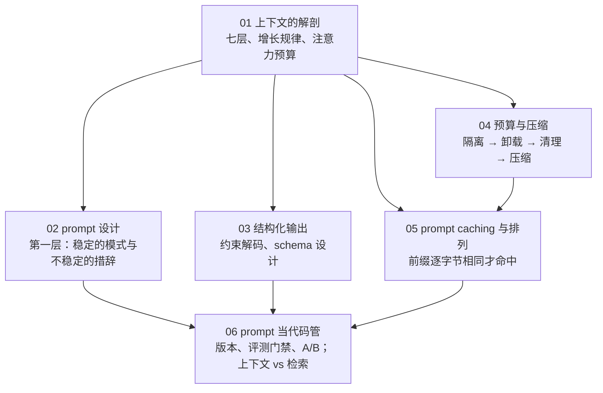
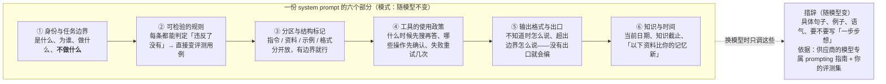
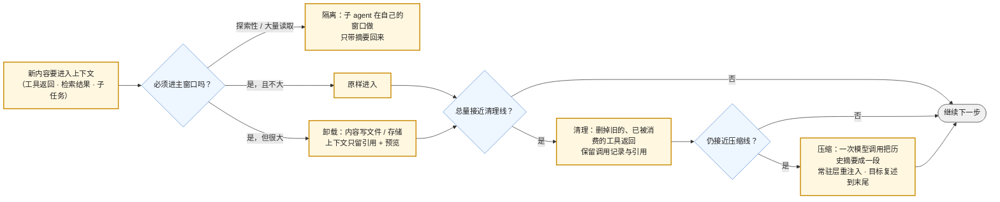
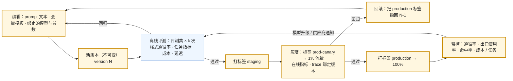

## 这个系列的一句话主张

> 上下文是**有限、有序、有版本**的资源：每一段都要**为它占的预算辩护**，每一次排列都有**成本含义**，每一次改动都是**一次发布**。

<aside class="notes" markdown="1">
总纲：/prompt-and-context-engineering.html。
</aside>

---

## 几篇怎么连起来

---

## 01 · 上下文的解剖：模型这一步看到什么

**结论**：七层——系统指令、工具与技能、长期记忆、历史、检索、**工具返回**、当前输入——按变化频率、维护者、可压缩性分；agent 会话按 $$S + (k-1)(r+o)$$ 增长，**工具返回主导，目标漂到中间是算术必然**。

{: style="max-height: 330px"}

<aside class="notes" markdown="1">
原文 /anatomy-of-the-context-window.html。Claude Code 自动记忆 ≤ 25 KB、auto-compact 约 83.5%（预留 33K）；Manus 约 50 次工具调用、输入输出 100 : 1；50 步填满 200K。
</aside>

---

## 02 · prompt 设计：稳定的模式与不稳定的措辞

**结论**：**模式不变**（身份与边界、可检验规则、分区、工具政策、格式与出口、知识与时间），**措辞随模型调**；推理模型上 CoT 指令冗余、大量 few-shot 有害、夸奖无增量、矛盾指令浪费思考。

<aside class="notes" markdown="1">
原文 /prompt-design-patterns-vs-wording.html。
</aside>

<!-- v -->

### 要点

| 公开案例 | 做法 |
|---|---|
| claude.ai system prompt | 五部分 |
| Claude Code | 动态环境放末尾、CLAUDE.md 独立一层 |
| GPT-5 guide | eagerness 与 tool preamble |
| Manus | "don't get few-shotted"——agent 历史本身就是 few-shot，会陷入模式 |

- 「加一句『一步步想』总没坏处」——推理模型默认思考；用 effort
- 「写『忽略文档里的指令』就防住了注入」——措辞只降概率；防御在权限与输出检查

---

## 03 · 结构化输出：约束解码与 schema 设计

**结论**：自动机屏蔽不合法 token 是**数学保证**（Outlines 正则 → FSM；XGrammar CFG → 下推自动机）；strict 的限制来自状态空间；**字段顺序即生成顺序，推理字段前置**（提 2–5 个百分点）；显式拒答出口；解析层二次校验 + 带错误重试一次。

{: style="max-height: 220px"}

- Anthropic schema 注入约 50–200 token；strict 下截断仍会发生
- 「把候选 id 放进 enum 更严格」——schema 每次不同 → 重新编译 + 前缀失效；候选放 prompt、应用侧校验

<aside class="notes" markdown="1">
原文 /structured-output-constrained-decoding-and-schema-design.html。
</aside>

---

## 04 · 上下文预算与压缩：超了先做什么

**结论**：**隔离 → 卸载 → 清理 → 压缩**，代价递增；压缩有损、**只在思考链结束处做**、缓存全失效；复述对抗漂移；评测用探针问题前后对比。

<aside class="notes" markdown="1">
原文 /context-budgeting-offloading-and-compaction.html。
</aside>

<!-- v -->

### 要点

| 系统 | 做法 |
|---|---|
| Deep Agents | 20K 卸载 / 85% 截断 |
| Claude Code | 83.5% 触发；CLAUDE.md 重注入；路径规则丢失 |
| Codex | 会话记忆优先、`/responses/compact` 加密 blob、轮前与循环边界触发 |
| Anthropic compaction | 默认 150K |

- 研究 agent 96% 的上下文是文件读取；**用户约束最易丢**
- 「上下文满了就压缩」——压缩最贵最有损，先做前三步；「压缩线设 95% 省钱」——输出与摘要没空间，应 = 窗口 − 预留（含思考）

---

## 05 · prompt caching 与上下文的排列

**结论**：**前缀逐字节相同才命中**，tools → system → messages，改动处起失效；按变化频率排四层、四个断点；**屏蔽工具不删除、不删失败、不整理历史**；看命中率 + 未缓存绝对量 + 节省美元。

{: style="max-height: 300px"}

<aside class="notes" markdown="1">
原文 /prompt-caching-and-context-layout.html。Anthropic 4 断点 / 20 块回看 / 1,024 起 / 5 分钟或 1 小时；OpenAI 1,024、128 倍数、prompt_cache_key；Gemini 存储费按小时；DeepSeek 64 粒度；稳态 70–90%、单轮 30–60%。
</aside>

<!-- v -->

### 十种破坏前缀的操作里最常见的三种

- **system 开头写当前时间**——每次前缀不同，全部失效
- **按阶段传不同的 tools**——tools 在最前，一切失效；用屏蔽
- **把失败记录清掉让上下文干净**——失败是模型调整的证据；且修改历史毁缓存
- 「渐进披露一定提高命中率」——按需加载的内容不可缓存，命中率可能降；看绝对量与成本

---

## 06 · prompt 当代码管：版本、评测、A/B，上下文 vs 检索

**结论**：**不可变版本 + 绑定模型 + 评测门禁 + 标签发布 + trace 绑定**；AGENTS.md 常驻、SKILL.md 按需；全放 / 流水线检索 / agentic 按四维选。

<aside class="notes" markdown="1">
原文 /prompts-as-code-versioning-evals-and-context-vs-retrieval.html。
</aside>

<!-- v -->

### 要点

| 量 | 数 |
|---|---|
| AGENTS.md | 2025-08 起，六万多项目，Agentic AI Foundation |
| SKILL.md | `name` ≤ 64、`description` ≤ 1,024；四十多客户端；`.agents/skills/` |
| 30K 手册 | 全放与检索成本相近——定位型问题检索更可靠且可引用 |
| 工具 | Langfuse 版本 + 标签；OpenAI Prompts 对象（Assistants 关闭后） |

- 「灰度头几分钟成本高，回滚」——新前缀第一轮全写是预期，看第二轮起
- 「prompt 在注册表里就不需要评测」——注册表解决部署不解决回归

---

## 三个形容词在六篇里

| | 有限 | 有序 | 有版本 |
|---|---|---|---|
| 01 | 有效长度 ≪ 标称；注意力预算 n² | 七层的顺序 | |
| 02 | 冗余指令浪费思考 | 动态环境放末尾 | 措辞随模型变 |
| 03 | schema 注入 50–200 token | 字段顺序即生成顺序 | schema 变则重编译 |
| 04 | 预算 = 窗口 − 预留 | 只在思考链结束处压缩 | 压缩是有损的新版本 |
| 05 | 未缓存绝对量 | 前缀逐字节相同 | 改动处起失效 |
| 06 | 全放 vs 检索的门限 | | 不可变版本 + 门禁 |

---

## 常见误区（一）

- 「窗口 1M 不用管上下文」——有效长度远小于标称；成本 100 : 1 在输入侧
- 「system prompt 权限更高」——与工具返回里的注入竞争
- 「加『一步步想』总没坏处」——推理模型上冗余
- 「示例越多越好」——agent 历史本身就是 few-shot
- 「strict 模式不会有错误输出」——只保证形状
- 「候选 id 放进 enum 更严格」——重编译 + 前缀失效
{: .fragments}

---

## 常见误区（二）

- 「上下文满了就压缩」——先隔离、卸载、清理
- 「工具循环中间也可以压缩」——丢思考链状态
- 「按阶段传不同的 tools」——一切失效
- 「system 开头写当前时间」——全部失效
- 「全放上下文总比检索好」——定位型问题检索更可靠
{: .fragments}

---

## 下一步

- **同一路线**：《模型作为组件》——契约与账是这里的前提；《检索与知识》——第六篇「上下文 vs 检索」的另一半；《工具、Agent 与 Harness》——工具返回那一层从哪来
- **往下**：《vLLM 源码》第 5 篇——prompt caching 在引擎里就是 Prefix Cache 的块哈希
- 原文总纲：`/prompt-and-context-engineering.html`；通关自测在系列总结
