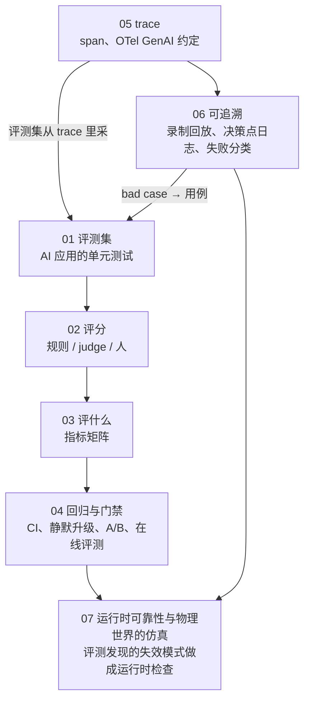
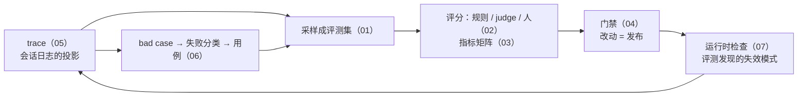

## 这个系列的三句话主张

> **没有评测集的改动是猜测**；**judge 是仪器，要先被测量**；**不可复现就录下来**。

<aside class="notes" markdown="1">
总纲：/evaluation-observability-and-traceability.html。89% 的团队有可观测、只有 52% 有评测——差距是事故来源。
</aside>

---

## 几篇怎么连起来

---

## 01 · 评测集：AI 应用的单元测试

**结论**：从**真实流量按类型采**（高频 / 边界 / 失败过的）+ 红队，不按流量比例；四字段、期望可检验、含状态；**几十条起、跑 k 次**；hold-out、六元组绑定、随 bad case 长。

| 量 | 数 |
|---|---|
| 有可观测 vs 有评测的团队 | 89% vs **52%** |
| 重复次数 k | 3–5 |
| hold-out | 20–30% |
| 合成集 | 只做冷启动——问法贴合原文，recall 高估 |

- 「等评测集完善再用」——几十条就能分方向；拖延是最常见的失败
- 「按流量比例采」——难例几乎没有，退化看不见

<aside class="notes" markdown="1">
原文 /eval-sets-the-unit-tests-of-ai-applications.html。
</aside>

---

## 02 · 评分：规则、LLM-as-judge 与人

**结论**：**能规则不 judge、能 judge 不人**；judge 四类偏差（风格最大）；**报 kappa 不报一致率**（未校正机遇，虚高 33–41 pp）；一致 ≠ 正确；八步校准。

| 量 | 数 |
|---|---|
| 一致率 → kappa | 虚高 33–41 pp；排名移 14 位 |
| 重测一致 vs 位置偏差 | > 0.95 与 > 0.10 并存——稳定但有偏 |
| 风格偏差 | 0.10–0.76 |
| 中档模型 + 去偏 vs 前沿模型 | 胜，且便宜 **15×** |
| 门槛 | κ ≥ 0.61 |

- 「judge 一致率 88% 可做门禁」——报 kappa；「用最大的模型当 judge」——去偏策略比大小重要

<aside class="notes" markdown="1">
原文 /scoring-rules-llm-as-a-judge-and-humans.html。
</aside>

---

## 03 · 评什么：指标矩阵

**结论**：**形态 × 维度**——单步 / RAG / agent / 多轮 / 代码 × 结果 / 过程 / 成本 / 安全；**过程与结果并列**；多轮以**会话**为单位、模拟器要校准；生产看 **pass^k** 不看 pass@k。

| 形态 | 结果 | 过程 | 成本 | 安全 |
|---|---|---|---|---|
| 单步 | 正确 / 格式 | — | token | 拒答 |
| RAG | 忠实 / 完整 | recall@k、引用 | 检索 + 生成 | 权限泄漏 |
| agent | 任务完成 | 步数、越权、重复 | token × 步 | 不可逆动作 |
| 多轮 | 会话目标 | 每轮 + 全局 | 会话 token | |

- 分层报告；质量 vs 成本图
- 「pass@5 = 生产可靠性」——生产看 pass^k（k 次全过）

<aside class="notes" markdown="1">
原文 /what-to-evaluate-metrics-for-single-step-rag-agent-and-multi-turn.html。
</aside>

---

## 04 · 回归与门禁：改动 = 发布

**结论**：分层 ≥ 基线 − 噪声、逐条 diff；**钉快照 + 探针集每日**（探针集是模型指纹，发现供应商静默升级）；影子 → 灰度 → 回滚；A/B 一因素；隐式反馈带 trace id；**季度校验离线—在线相关性**。

| 规则 | 为什么 |
|---|---|
| 改 rubric 后重量基线 | 尺子变了 |
| 灰度忽略缓存冷启动 | 第一轮全写是预期 |
| 短期信在线、长期修离线 | 在线有噪声，离线可复现 |

- 「没部署就不会变」——供应商静默升级；「离线涨了在线一定涨」——季度校验

<aside class="notes" markdown="1">
原文 /regression-gates-silent-model-updates-ab-and-online-evaluation.html。
</aside>

---

## 05 · trace：记什么、按什么约定

**结论**：三级树（会话 / 轮 / 调用）+ 事件 + 子会话链接；OTel `gen_ai.*` 全部 Development 状态、迁独立仓库、属性改名（`system` → `provider.name`）、**钉 opt-in**；业务属性用 `app.*`；元数据全量、内容采样、bad case 全量。

| 项 | 数 |
|---|---|
| OTel 语义约定 | v1.42.0（2026-06）移到独立仓库 |
| 工具选择 | 按评测闭环 / 自托管 |
| trace 是什么 | 会话日志的投影 |

- 「只记前 500 字省空间」——回放与复现都做不了；内容进对象存储
- 「自造 `gen_ai.prompt.version`」——命名空间冲突；用 `app.*`

<aside class="notes" markdown="1">
原文 /tracing-spans-opentelemetry-genai-conventions-and-tooling.html。
</aside>

---

## 06 · 可追溯：从坏结果追到那一步并变成用例

**结论**：**录制回放**（输入哈希守卫，非模型改动零成本回归）、**决策点日志**、**失败分类十一类**（「技术对产品错」单列）、版本 diff 同轴、反馈带 trace id 进队列、事后分析五段。

| 失败类 | 药在哪 |
|---|---|
| 检索没找到 / 找到没用 | 检索层 |
| prompt 约束丢失 | 上下文层 |
| 工具返回错 / 编造工具结果 | 工具与 mask |
| 模型能力不足 | 模型（十一类里的少数） |
| 技术对、产品错 | 产品层 |

- 「幻觉 = 模型问题」——多数的药在检索、prompt、产品层
- 「回放全过就上线」——输入变了要报警重跑

<aside class="notes" markdown="1">
原文 /traceability-record-replay-decision-logs-failure-taxonomy-and-feedback.html。
</aside>

---

## 07 · 运行时可靠性与物理世界的仿真

**结论**：guardrails **同步只放高风险**；高风险断言必须有依据（不要模型自报置信度）；fallback 四级；仿真六层、**闭环才测决策**、sim-to-real、放大长尾、影子、SIL / HIL；数字与物理世界同构。

| 数字世界 | 物理世界 |
|---|---|
| 评测集 | 场景库 |
| 回放 | 仿真回灌 |
| 影子模式 | 影子驾驶 |
| 灰度 | 分批 OTA |
| 覆盖率 = 新场景比例 | 同 |

- 「让模型输出置信度」——不可靠；要依据

<aside class="notes" markdown="1">
原文 /runtime-reliability-and-simulation-for-the-physical-world.html。
</aside>

---

## 一个闭环

---

## 常见误区（一）

- 「有 trace 就够了」——看得见不等于能判断
- 「按流量比例采评测集」——难例看不见
- 「等评测集完善再用」——几十条就能分方向
- 「judge 一致率 88% 可做门禁」——报 kappa
- 「用最大的模型当 judge」——去偏比大小重要
- 「每轮平均分代表会话质量」——以会话为单位
{: .fragments}

---

## 常见误区（二）

- 「pass@5 = 生产可靠性」——pass^k
- 「没部署就不会变」——静默升级，探针集
- 「只记前 500 字」——回放做不了
- 「幻觉 = 模型问题」——药多在别处
- 「让模型输出置信度」——要依据
{: .fragments}

---

## 下一步

- **同一路线**：《生产与运维》——门禁之后的发布、SLO 与 runbook；《产品与体验》——量「有用」不是「用了」；《工具、Agent 与 harness》第 9 篇——轨迹评测
- **算法侧**：《经典机器学习》第 10 篇——校准、judge 一致率、多重比较；《后训练》第 8 篇——benchmark 的三关
- 原文总纲：`/evaluation-observability-and-traceability.html`；通关自测在系列总结
