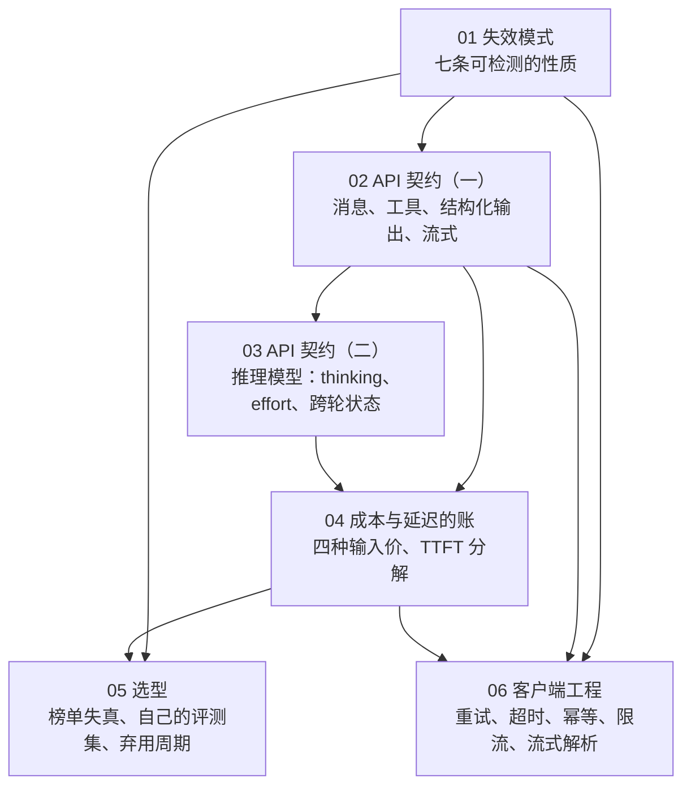
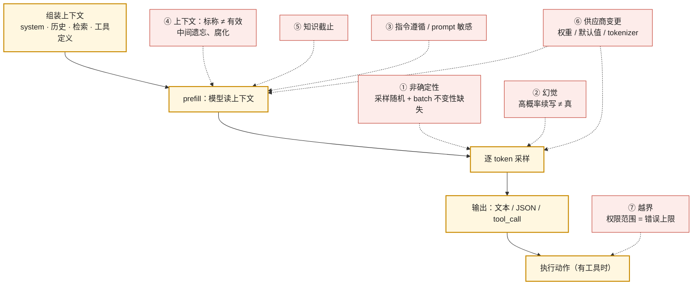
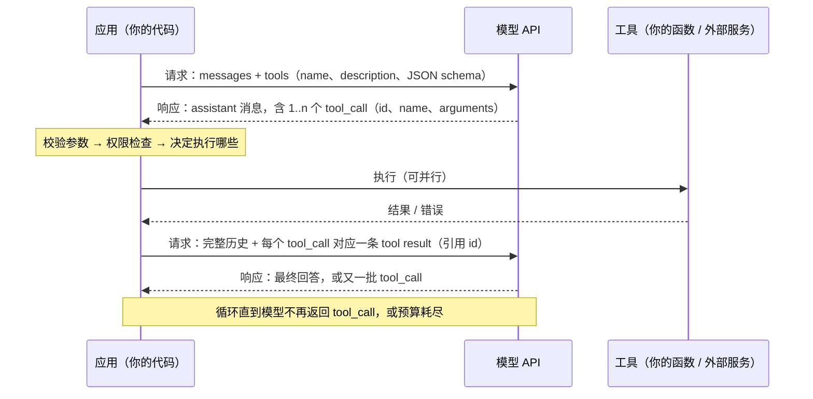
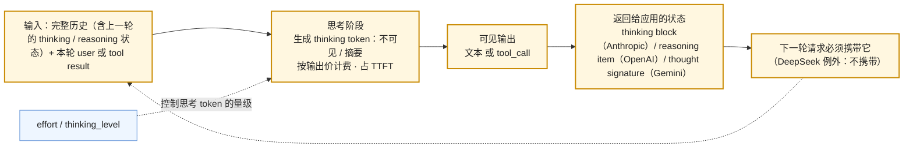
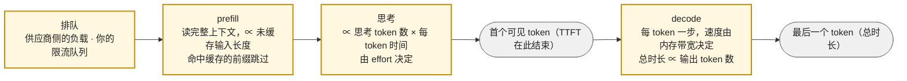
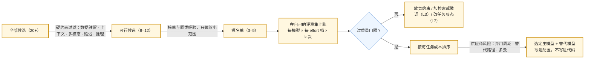
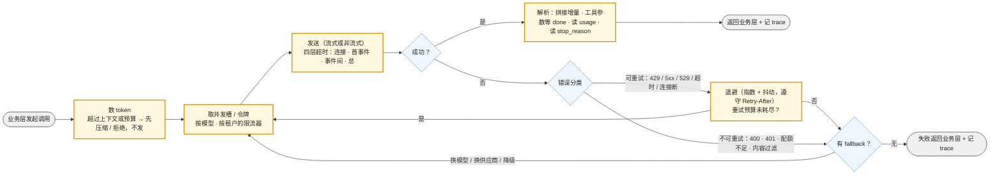

## 这个系列的一句话主张

> 模型 API **没有供应商替你写的规格书**，应用工程师要自己写——**失效模式、契约、账、选型判据、客户端纪律**，五部分缺一不可。

<aside class="notes" markdown="1">
总纲：/model-as-a-component.html。
</aside>

---

## 几篇怎么连起来

---

## 01 · 失效模式：把「模型会出错」拆成七条可检测的性质

**结论**：非确定性、幻觉、指令遵循与 prompt 敏感、**上下文标称 ≠ 有效**、知识截止、供应商侧变更、越界——每条对应后面某一层的应对。

<aside class="notes" markdown="1">
原文 /llm-failure-modes-nondeterminism-hallucination-and-context.html。
</aside>

<!-- v -->

### 要点

| 性质 | 一个数 |
|---|---|
| 非确定性 | batch 不变性缺失：1000 次贪心 18 种结果 → 修好后 1 种；公开 API 做不到 |
| 上下文有效长度 | NoLiMa 32K 处 11/13 模型掉到基线一半以下；GPT-4o 99.3% → 69.7% |
| 幻觉的后果 | Air Canada 812.02 加元——源材料正确、输出编造、公司仍负责 |
| 越界 | PocketOS 9 秒删库；约 700 个 agent 入侵 Hugging Face |

- 「system prompt 是权限更高的通道」——它只是上下文里一段被标记的文本，与工具返回里的注入竞争

---

## 02 · API 契约（一）：四家 API 的共同骨架

**结论**：**块列表进、块列表出**；**工具调用是协议不是功能**（校验、权限、执行、配对、截断在应用侧）；结构化输出**保证语法不保证语义**；服务端状态默认存储。

<aside class="notes" markdown="1">
原文 /llm-api-contract-messages-tools-structured-output-and-streaming.html。
</aside>

<!-- v -->

### 要点

| 项 | OpenAI | Anthropic |
|---|---|---|
| 工具参数 | `arguments` 是字符串 | `input` 是对象 |
| 服务端状态 | Responses 默认 `store: true` 30 天；Conversation 无 TTL | 无状态 |
| 缓存顺序 | tools → system → messages | 同 |
| 变更 | Assistants API 2026-08-26 关闭 | |

- 「用了 strict 模式就不会有错误输出」——只保证 schema 形状；值可以编造；拒答会被伪装成答案
- 「服务端状态省 token 钱」——每轮模型仍读完整上下文，输入照样计费

---

## 03 · API 契约（二）：推理模型加了什么维度

**结论**：思考**按输出价计费、占 TTFT、`max_tokens` 含它**；effort 是**倾向不是预算**，选档靠三条曲线（质量 / 延迟 / 成本 vs 档位）取饱和最低档；思考是**跨轮状态，只搬运不读写**。

<aside class="notes" markdown="1">
原文 /reasoning-models-as-components-thinking-effort-and-state.html。
</aside>

<!-- v -->

### 要点

| 量 | 数 |
|---|---|
| 同任务 `low` → `high` | 账单 \$0.0075 → \$0.0445（**6 倍**） |
| 历史校验 | 校验 thinking block 之前的历史——编辑历史受约束 |
| Chat Completions | 自 GPT-5.4 起不支持带 effort 的工具调用 |
| DeepSeek | `reasoning_content` 不能送回 |

- 「把模型名从 4.6 改成 5 就迁移完了」——thinking 默认开启、采样参数 400、tokenizer 多 30%、`max_tokens` 含思考
- 「effort 越高越好」——简单任务高档可能过度思考

---

## 04 · 成本与延迟的账

**结论**：五项成本公式；**缓存读一次回本**（写 1.25× + 读 0.1× = 1.35× < 2×）；多轮不缓存二次增长、缓存后约 15%；**TTFT = 排队 + prefill + 思考，总时长由输出 × TPOT 主导**。

<aside class="notes" markdown="1">
原文 /token-cost-and-latency-ledger-for-llm-applications.html。
</aside>

<!-- v -->

### 要点

| 价 | 相对输入价 |
|---|---|
| 输出 | 4–6× |
| 缓存读 | 0.1×（Fable 5.1 0.025×、DeepSeek 0.02×） |
| 缓存写 | 1.25×（1 小时 TTL 2×） |
| 长上下文 | OpenAI > 272K：**整个请求**输入 2×、输出 1.5× |
| 峰时 / Batch | DeepSeek 峰时 ×2；Batch API 50% |

- 价目跨三个量级：\$10 → \$0.15 → 读 \$0.003 每百万
- 「长上下文加价只对超出部分」——300K 输入全部 2×

---

## 05 · 选型：榜单只缩范围

**结论**：选型用**自己的评测集（30–50 条起）**；闭源 vs 自托管是运营问题；**级联分流不漏难题**（路由会漏）；**弃用周期是选型维度**。

<aside class="notes" markdown="1">
原文 /model-selection-beyond-leaderboards.html。
</aside>

<!-- v -->

### 要点

| 量 | 数 |
|---|---|
| Arena 失真 | Llama 4 前 27 个私测变体；两家各约 20% Arena 数据 vs 83 个开源模型共 29.7% |
| 大小模型价差 | 5–20 倍；70% 简单请求级联省 63% |
| 自托管 | 满载 \$0.8 / 百万；利用率 30% 时翻三倍 + Infra 团队 |
| 弃用通知 | OpenAI 3–6 个月、Anthropic ≥ 1 年、**DeepSeek 4 天** |

- 「路由比级联省钱所以用路由」——只省 2–3 个百分点却会漏难题

---

## 06 · 客户端工程：调用侧要处理哪些失败

**结论**：错误分四类**只重试「再试可能不同」的**；**四层超时**；幂等问题在工具上；限流按 RPM / TPM 与层级；发前数 token；熔断 + 分层 fallback。

<aside class="notes" markdown="1">
原文 /llm-client-engineering-retries-timeouts-streaming-and-rate-limits.html。
</aside>

<!-- v -->

### 要点

| 纪律 | 规则 |
|---|---|
| 重试 | full jitter $$t_n = \min(t_{max}, \text{random}(0, t_0 2^n))$$；重试预算 10% |
| `insufficient_quota` | 也是 429，**不可重试** |
| 超时 | 连接 / 首字节 / 字节间 / 总——一个总超时不够 |
| 流式 | 超过一分钟的生成一律流式 |
| 计数 | Sonnet 5 同文本多 30% token；中文每字 1–2 token |
| 取消 | 用户关页面要传播到上游，否则供应商继续生成并计费 |

---

## 五部分规格书

| 部分 | 一句话 | 篇 |
|---|---|---|
| 失效模式 | 七条性质，每条可检测 | 01 |
| 契约 | 块列表进出；工具调用是协议；思考是只搬运的状态 | 02、03 |
| 账 | 五项成本；读一次回本；TTFT 三段 | 04 |
| 选型判据 | 自己的评测集；级联；弃用周期 | 05 |
| 客户端纪律 | 四类错误、四层超时、预算、传播取消 | 06 |

---

## 常见误区（一）

- 「temperature = 0 加 seed 就能复现」——公开 API 的 batch 随负载变
- 「源材料没错机器人就不会说错」——幻觉是高概率续写不是转述
- 「标称 1M 就能放 1M」——32K 处就掉一半
- 「system prompt 权限更高」——只是一段文本
- 「strict 模式不会有错误输出」——只保证形状
- 「服务端状态省 token 钱」——只改变谁传历史
{: .fragments}

---

## 常见误区（二）

- 「effort 越高越好」——账单 6 倍、可能过度思考
- 「缓存写入加价所以不划算」——读一次回本
- 「Arena 第一就是最好」——只用来缩范围
- 「自托管 \$0.8 比 API 便宜」——满载数字
- 「429 了就重试」——`insufficient_quota` 不可重试
- 「用户关了页面请求就结束了」——不传播则继续计费
{: .fragments}

---

## 下一步

- **同一路线**：《Prompt 与上下文工程》——契约之上，模型这一步该看到什么；《生产与运维》——客户端纪律的服务端一半
- **往下**：《vLLM 源码》——API 另一端的引擎；《高效推理与压缩》——为什么输出价是输入的 4–6 倍
- 原文总纲：`/model-as-a-component.html`；通关自测在系列总结
