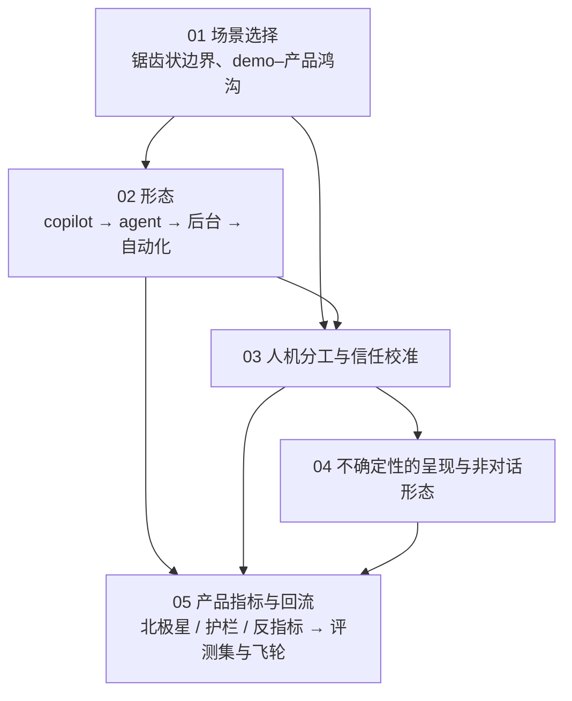

## 这个系列的一句话主张

> 把 AI 放在**边界内**、把人放在**边界上**、把信任**校准到与能力一致**、**诚实呈现**不确定、量「**有用**」而不是「用了」。

<aside class="notes" markdown="1">
总纲：/ai-product-and-experience.html。
</aside>

---

## 几篇怎么连起来

---

## 01 · 场景选择：锯齿状边界与 demo–产品鸿沟

**结论**：四维度（**价值、可验证、容错、频率**）；锯齿状边界**按任务划、用评测集量**；回撤的共同错误是**外推**；鸿沟五来源；决策拆任务 → 三分 → 审外推 → 可逆。

| 证据 | 数 |
|---|---|
| 哈佛 / BCG 758 名顾问 | 边界内 +25% 速度 / +40% 质量；**边界外错误 +19 pp**——比不用更差 |
| Klarna | 700 人的工作 → 裁 1,500 → 回到混合；来自简单查询，20–30% 例外漏回成本 |
| 经验 | 「80% 的 demo 是 20% 的产品」 |

- 「demo 96% 就能替代人」——分布、长尾、外推
- 「先裁员再看」——不可逆决定建在可变判断上

<aside class="notes" markdown="1">
原文 /choosing-ai-scenarios-the-jagged-frontier-and-the-demo-to-product-gap.html。
</aside>

---

## 02 · 形态：copilot、agent 与自动化，后台 agent 为什么成了主流

**结论**：copilot → 同步 agent → 后台 agent → 自动化对应人机六级；演进四步各靠一个 harness 机制；后台成主流的四原因；决策按**验证 / 撤销 / 落点 / 可等**；多形态并存与切换点。

| 形态 | 人在哪看结果 | 前提 |
|---|---|---|
| copilot | 逐条 | 无 |
| 同步 agent | 等它做完 | 步数可控 |
| 后台 agent | **落点**（PR 是天然审阅落点） | 独立完成、进度通知、部分结果 |
| 自动化 | 不看 | 可验证 + 可逆 |

- 不可逆止于**提案**；渐进放开
- 「后台 agent 只是把同步的放后台」——需要落点、独立完成、进度、部分结果

<aside class="notes" markdown="1">
原文 /product-forms-copilot-agent-automation-and-the-rise-of-background-agents.html。
</aside>

---

## 03 · 人机分工与信任校准

**结论**：**过度**（自动化偏见）与**不足**两种失败，目标是**校准**；接受率三成 + 再编辑是常态；八种手段；让不信任的开始用；动态重校。

| 危险信号 | 含义 |
|---|---|
| 接受率趋 100% 而有错 | 过度信任 |
| 核对率趋零 | 自动化偏见 |
| 接受率三成、大量再编辑 | **正常**——人在编辑 |

- 按任务看接受 × 错误 × 核对的象限
- 「接受率 97% 太棒了」——有错时是过度信任；「三成接受率说明 AI 不行」——人在编辑是常态；「用户会自己核对」——高风险要结构性核对

<aside class="notes" markdown="1">
原文 /human-ai-division-of-labor-and-trust-calibration.html。
</aside>

---

## 04 · 不确定性的呈现与非对话形态

**结论**：三原则——**诚实、可核对、可行动**；引用到段落、**置信度用行为不用数字**、拒答三部分（不能做什么 / 为什么 / 能做什么）；步骤分层、审批三要素、diff 部分接受；对话框五局限、七种非对话形态。

| 不要 | 要 |
|---|---|
| 「置信度 87%」 | 用行为：加引用、标注「未核实」、请求确认 |
| 「无法回答」 | 三部分拒答 |
| 展开全部步骤 | 分层：结论 → 关键步 → 全部 |
| 允许 / 拒绝两个按钮 | 三要素：做什么、影响什么、怎么撤 |
| 默认对话框 | 先问「为什么是对话框」 |

- 无依据不呈现为事实

<aside class="notes" markdown="1">
原文 /presenting-uncertainty-and-beyond-the-chat-box.html。
</aside>

---

## 05 · 产品指标与回流：量「有用」不是「用了」

**结论**：矩阵十类；**北极星一场景一个 + 护栏**；**反指标**（消息数涨可能是重试）；**自报高于实测一倍以上、两个都报**；定性看绕过；回流三条；A/B 五特殊。

| 场景 | 不是北极星 | 是 |
|---|---|---|
| 客服 | 处理时间 | 一次解决率 + 护栏（升级率） |
| 编码 | 接受率、消息数 | 合入且未回退的改动 |
| 写作 | 生成字数 | 保留到发布的比例 |

- 「用户说省 5 小时」——自报高于实测一倍以上；「首周 A/B 涨了全量」——学习效应、留存、护栏

<aside class="notes" markdown="1">
原文 /ai-product-metrics-and-feeding-back-into-the-system.html。
</aside>

---

## 五个动词在五篇里

| 动词 | 篇 | 落点 |
|---|---|---|
| 放在边界内 | 01 | 按任务划边界、评测集量、审外推 |
| 放在边界上 | 02 | 落点、提案、六级分工 |
| 校准 | 03 | 接受 × 错误 × 核对象限 |
| 诚实呈现 | 04 | 三原则、行为不数字、拒答三部分 |
| 量有用 | 05 | 北极星 + 护栏 + 反指标；回流到评测集 |

---

## 常见误区（一）

- 「demo 96% 就能替代人」——分布、长尾、外推
- 「边界外顺手也让 AI 试试」——比不用差 19 pp
- 「先裁员再看」——不可逆建在可变判断上
- 「做成对话框最快」——五局限
- 「直接发给客户 = 自动化成功」——不可逆 + 不可验证不到六级
- 「接受率 97% 太棒了」——过度信任
{: .fragments}

---

## 常见误区（二）

- 「三成接受率说明 AI 不行」——编辑是常态
- 「显示置信度 87%」——用行为
- 「展开全部步骤最透明」——分层
- 「消息数涨 40%」——反指标
- 「用户说省 5 小时」——自报高一倍
- 「首周 A/B 涨了全量」——学习效应
{: .fragments}

---

## 下一步

- **同一路线**：《评测与可观测》——北极星背后的评测集；《工具、Agent 与 harness》第 8 篇——六级分工的 harness 侧；《生产与运维》第 7 篇——回流进飞轮
- **起点**：《模型作为组件》第 1 篇——七条失效性质是「边界」的技术定义
- 原文总纲：`/ai-product-and-experience.html`；通关自测在系列总结
