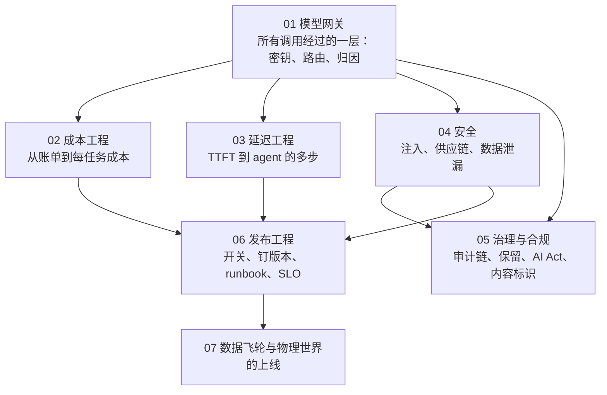

## 这个系列的三句话主张

> **四个指标并列**（质量、成本、延迟、安全）；**防御在架构不在措辞**；**改动 = 发布，依赖也会变**。

<aside class="notes" markdown="1">
总纲：/production-and-operations-for-ai-applications.html。每篇从一类事故出发。
</aside>

---

## 几篇怎么连起来

---

## 01 · 模型网关：所有调用经过的一层

**预防的事故**：key 散落、锁死供应商、无归因。**结论**：七项职责——密钥、路由 / fallback、限流 / 配额、缓存、归因、日志 / 脱敏、抽象；**不做业务逻辑、不改请求体、不默认语义缓存**、要高可用。

| 形态 | 例 |
|---|---|
| 自托管 | LiteLLM |
| 托管市场 | OpenRouter |
| 边缘 | Cloudflare AI Gateway |
| 抽象的边界 | 推理状态与缓存不能抽象掉 |

- 「网关做语义缓存省钱」——相似不等于同答案；默认关
- 「网关注入 request_id 到 system」——毁缓存前缀

<aside class="notes" markdown="1">
原文 /model-gateway-the-layer-every-call-goes-through.html。
</aside>

---

## 02 · 成本工程：从账单到每任务成本

**预防的事故**：账单吓一跳。**结论**：归因三视图（用户 / 功能 / 模型）；预算 80 / 95 / 100% + **六级降级梯子**；九种手段各有量级；**按任务算 p50 / p95**；单位经济学三决策；FinOps 节奏。

| 手段 | 量级 |
|---|---|
| 级联 | 50–80% |
| 缓存输入 | 50–90% |
| Batch API | 50% |
| 长尾 | 5% 的任务花 60% |

- 价值 / 成本 < 3 重做；定价覆盖 p95（重度用户 5–10×）
- 「月底看账单」——长尾与跳变；每小时异常归因；「评测太贵先砍」——一次事故更贵

<aside class="notes" markdown="1">
原文 /cost-engineering-from-the-bill-to-cost-per-task.html。
</aside>

---

## 03 · 延迟工程：从 TTFT 到 agent 的多步

**预防的事故**：用户等。**结论**：**七段分解各有药**；感知 ≠ 绝对、流式三层；p95 预算分段 + 四层超时；agent 上 **减步数 > 并行 > 级联 > 每步更快 > 后台**。

| 段 | 药 |
|---|---|
| 排队 | 限流、优先级 |
| prefill | **缓存命中是最大杠杆** |
| 思考 | effort 选档 |
| decode | 输出长度约束、流式 |
| 工具 | 并行、超时 |
| 多步 | 减步数 |
| 网络 | 就近、连接复用 |

- TTFT ≈ 1 s 的预算例；三个数字一起报（TTFT / TPOT / 总）
- 「慢就换快模型」——七段各有药；「硬砍 max_tokens」——截断；配 prompt 约束与结构化

<aside class="notes" markdown="1">
原文 /latency-engineering-from-ttft-to-multi-step-agents.html。
</aside>

---

## 04 · 安全：注入、供应链与数据泄漏

**预防的事故**：EchoLeak、MCP 投毒、沙箱逃逸。**结论**：OWASP 十条里七条已有机制；四个事件的链路**逐环有层拦**；**五层防御**；**MCP server 是权限主体**；密钥七条；红队进门禁。

| 事件 | 链路 | 拦在哪 |
|---|---|---|
| EchoLeak | 七环：邮件 → 检索 → 注入 → 读 → 拼 URL → 渲染 → 外传 | 任一环：权限、输出检查、CSP |
| Cursor 三 CVE | 同模式「读 → 写不该写的文件」 | 配置 / MCP 清单 / 沙箱策略 deny 写 |
| MCP 描述投毒 | 架构性 | 钉哈希、再批准、独立凭据 |

- 「加注入分类器就安全了」——EchoLeak 绕过了；「工作区可写没问题」——配置文件要 deny

<aside class="notes" markdown="1">
原文 /security-prompt-injection-supply-chain-and-data-exfiltration.html。
</aside>

---

## 05 · 治理与合规：审计链、保留、AI Act 与内容标识

**预防的事故**：审计拿不出、数据被训、罚款、未标识。**结论**：**审计链 = 会话日志 + trace + 决策点 + 保留 / 不可篡改 / 导出**；数据流图核合同；AI Act 推迟的只是高风险；标识一套两格式；责任矩阵。

| 法规 | 日期 | 罚则 |
|---|---|---|
| AI Act GPAI 义务 | 2026-08-02 | 1,500 万 € / 3% |
| Article 50 标识 | 2026-08 | |
| Annex III 高风险 | 2027-12-02（推迟） | |
| Annex I | 2028-08-02 | |
| 中国生成内容标识 | 2025-09-01 | |

- 「有 trace 就有审计链」——要完整内容、保留期、不可篡改、导出；「供应商网页说不训练」——核合同

<aside class="notes" markdown="1">
原文 /governance-and-compliance-audit-retention-ai-act-and-labeling.html。
</aside>

---

## 06 · 发布工程：改动 = 发布

**预防的事故**：改坏回不去、依赖变了没发现。**结论**：**十类算发布**（prompt、模型、工具、schema、检索索引……）；开关三态 + **kill switch 上线前存在并演练**；钉一切；依赖变更进同一流程；五本 runbook；四类 SLO + 错误预算；值班。

| 规则 | |
|---|---|
| 控制台改动 | 禁止 |
| 浮动别名 | 禁止——静默升级 |
| 回滚 | 前确认（缓存、状态） |
| 弃用 | 是有截止日的发布 |

- 「小改动直接上」——改动 = 发布；「出事再做 kill switch」——上线前存在并演练

<aside class="notes" markdown="1">
原文 /release-engineering-for-ai-features-switches-pinning-runbooks-and-slos.html。
</aside>

---

## 07 · 数据飞轮与物理世界的上线

**预防的事故**：系统不变好；车队更新出事。**结论**：飞轮六环三判据；**微调在末端做行为优化**（bad case 不直接微调，筛过的好例子）；四道门；物理世界**分阶段准入 + 安全案例 + 分批 OTA**；高风险 agent 的发布应更像 OTA。

| 节奏 | |
|---|---|
| 周 | 新用例进评测集 |
| 月 | 发布 |
| 季 | 分布变化审视 |

- 「bad case 直接微调」——学进错误；「OTA 一次全量」——分批、准入、停止条件

<aside class="notes" markdown="1">
原文 /data-flywheel-and-deploying-to-the-physical-world.html。
</aside>

---

## 三句话在七篇里

| 主张 | 落点 |
|---|---|
| **四个指标并列** | 网关归因（01）、每任务成本（02）、七段延迟（03）、安全进门禁（04）——任何一个单独优化都会伤另一个 |
| **防御在架构不在措辞** | 网关不改请求体（01）、五层防御（04）、MCP 是权限主体（04）、审计链不可篡改（05） |
| **改动 = 发布，依赖也会变** | 十类算发布（06）、钉一切与探针（06）、弃用是发布（06）、分批 OTA（07） |

---

## 常见误区（一）

- 「每个服务自己拿 key 调模型」——散落、无归因、无 fallback
- 「网关做语义缓存省钱」——默认关
- 「月底看账单」——每小时归因
- 「按平均用户定价」——覆盖 p95
- 「慢就换快模型」——七段各有药
- 「加注入分类器就安全了」——五层
{: .fragments}

---

## 常见误区（二）

- 「MCP server 装了就完」——权限主体
- 「有 trace 就有审计链」——保留、不可篡改、导出
- 「AI Act 延期了停项目」——推迟的只是高风险
- 「小改动直接上」——改动 = 发布
- 「浮动别名方便」——静默升级
- 「bad case 直接微调」——学进错误
{: .fragments}

---

## 下一步

- **同一路线**：《评测与可观测》——门禁的另一半；《模型作为组件》第 6 篇——客户端纪律；《工具、Agent 与 harness》第 5 篇——沙箱与权限的 agent 侧
- **Infra 侧**：《AI 平台工程》第 7 篇——网关之下的配额与路由
- 原文总纲：`/production-and-operations-for-ai-applications.html`；通关自测在系列总结
