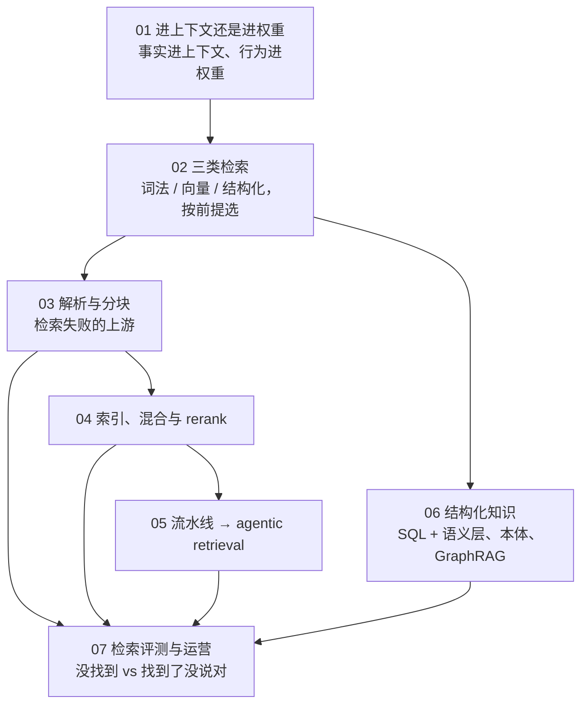
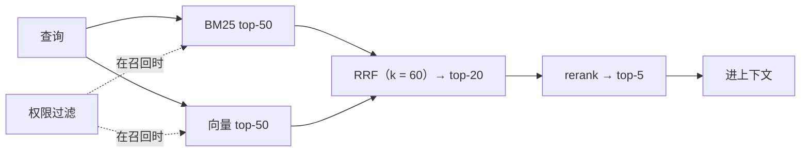

## 这个系列的一句话主张

> **事实进上下文、行为进权重**；检索有**三类按前提选**、失败大多在**检索之前**；**检索与生成分开评**。

<aside class="notes" markdown="1">
总纲：/retrieval-and-knowledge-access.html。
</aside>

---

## 几篇怎么连起来

---

## 01 · 进上下文还是进权重

**结论**：**微调不是灌知识的工具**（不可靠、遗忘、不可引用、不可更新与过滤）；默认顺序 **prompt → few-shot → 检索 / 工具 → 微调 → 继续预训练**，每步在评测集上证明前一步不够。

| 四问 | 任一为「是」→ 不进权重 |
|---|---|
| 会变？ | 价格、政策、库存 |
| 有 schema？ | 表、字段、关系 |
| 要引用？ | 合规、客服 |
| 按用户不同？ | 权限、个性化 |

- *Fine-Tuning or Retrieval?*：检索显著优于微调；RAFT 微调的是「怎么用检索」不是知识本身
- 「把手册 SFT 进模型就学会了」——SFT 学分布不学事实

<aside class="notes" markdown="1">
原文 /knowledge-in-context-or-in-weights.html。知识类型表六行。
</aside>

---

## 02 · 三类检索：coding agent 为什么只用 grep

**结论**：按前提选——**词法三前提**（精确标识符、可枚举、能迭代）、**向量**解决词汇不匹配、**结构化**独占关系；coding agent 的分歧是**过期税由写路径还是读路径付**。

| 产品 | 选择 |
|---|---|
| Claude Code | 放弃向量库，agentic grep；Anthropic「从 agentic 搜索开始」 |
| Cursor | Merkle 树 + 块哈希缓存 + turbopuffer——写路径付过期税 |
| Cody 5.3 | 移除 embedding |

- **embedding 是点不是边**：「谁调用了这个函数」用 LSP / 图，不用向量库
- 「Claude Code 不用向量库所以向量检索过时了」——代码满足词法三前提，企业文档不满足
- 「向量索引比 grep 省 token」——检索结果作为上下文进每轮，噪声多时更费

<aside class="notes" markdown="1">
原文 /three-kinds-of-retrieval-lexical-vector-structured.html。
</aside>

---

## 03 · 文档解析与分块：检索失败的上游

**结论**：解析三个梯级（**规则 → 布局模型 → VLM**）先低后高；三个**静默失败**（阅读顺序、表格、页眉页脚）；**按结构切**、父子块；contextual retrieval；**权限进元数据**。

| 量 | 数 |
|---|---|
| OmniDocBench | PaddleOCR-VL-1.6（0.9B）96.34 > Gemini 3 Pro 92.91 > GPT-5.2 86.59 |
| Mistral OCR 4 | 每千页 \$4 |
| contextual retrieval（Anthropic） | 失败率 −49%，加 rerank −67% |
| 块大小 | 200–800 token |

- 「直接调 OCR API」——开放文档 VLM 更准更便宜；先规则抽取按需升级
- 「固定长度切一切」——切断函数、条款、表格

<aside class="notes" markdown="1">
原文 /document-parsing-and-chunking-for-retrieval.html。
</aside>

---

## 04 · 索引、混合检索与 rerank

**结论**：MTEB 缩范围、**自己的查询集决定**，换模型 = 全量重建；百万级 HNSW + 现有数据库就够；**BM25 + 向量用 RRF 是默认**；**rerank 性价比最高**；权限在召回时过滤。

- Qwen3-Embedding-8B MTEB 70.58；「rerank 太慢不要」——只精排 top-20，几十到几百毫秒，且降 k 省钱

<aside class="notes" markdown="1">
原文 /indexing-hybrid-search-and-reranking.html。
</aside>

---

## 05 · 从流水线到 agentic retrieval

**结论**：流水线**可预测、召回压力高、无多跳**；agentic **召回压力低、多跳、成本不定**；中间有改写 / HyDE / 多查询 / 路由 / 自检；**最常见是级联**——流水线默认、agentic 兜底。

| 规则 | 为什么 |
|---|---|
| 工具返回摘要 + 引用，不返全文 | 上下文爆炸；全文另取 |
| 步数上限必配 | 成本不定 |
| 内置 file search 是服务端工具 | 失去权限与分块控制 |

- 「全部改成 agentic」——成本延迟不定

<aside class="notes" markdown="1">
原文 /from-rag-pipelines-to-agentic-retrieval.html。
</aside>

---

## 06 · 结构化知识：SQL、本体与 GraphRAG

**结论**：text-to-SQL 对裸 schema 企业级**只有两成**（Spider 2.0），用**语义层**；**本体 = 对象 + 关系 + 动作 + 权限，是 harness 不是检索**；GraphRAG 答全局与多跳，**索引贵几十到几百倍**，LazyGraphRAG 推到查询时。

| 判据 | 数 |
|---|---|
| SQL 四道门 | 语法、只读、成本、超时 |
| 建图门限 | 全局 / 多跳问题比例低于一成不建图 |

- 「上 GraphRAG 提升 RAG 效果」——只对全局 / 多跳有用

<aside class="notes" markdown="1">
原文 /structured-knowledge-sql-ontology-and-graphrag.html。
</aside>

---

## 07 · 检索评测与运营：没找到 vs 找到了没说对

**结论**：分开评——**recall@50 / @5 分层**、固定检索评生成；评测集从**真实查询**采（50–100 条起）；在线信号带 trace；新鲜度与重建预算；**权限泄漏是评测项**。

| 项 | 数 / 案例 |
|---|---|
| judge 一致率 | ≥ 85% 才能用 |
| 权限泄漏 | Slack AI 跨权限注入；Copilot 暴露 SharePoint 权限债 |
| 「不该看到」查询集 | 进 CI |

- 「合成评测集就够了」——措辞贴合原文高估 recall
- 「只看端到端准确率」——分不清检索还是生成；三个数字

<aside class="notes" markdown="1">
原文 /retrieval-evaluation-and-operations.html。
</aside>

---

## 常见误区（一）

- 「把手册 SFT 进模型就学会了」——SFT 学分布不学事实
- 「RAG 就是向量库」——三类之一
- 「向量库找『谁调用了这个函数』」——embedding 是点不是边
- 「固定长度切一切」——按结构切
- 「生成后过滤权限」——模型已看到
- 「MTEB 榜首直接用」——查询集决定；换模型全量重建
{: .fragments}

---

## 常见误区（二）

- 「只上向量就够」——BM25 + RRF 是默认
- 「全部改成 agentic」——级联
- 「对裸 schema 做 text-to-SQL」——两成；语义层
- 「本体是一种检索」——是 harness
- 「上 GraphRAG 提升效果」——只对全局 / 多跳
- 「权限泄漏是安全团队的事」——检索放大权限错误
{: .fragments}

---

## 下一步

- **同一路线**：《Prompt 与上下文工程》第 6 篇——上下文 vs 检索；《工具、Agent 与 harness》——agentic retrieval 的那个循环；《评测与可观测》——judge 一致率从哪来
- **算法侧**：《经典机器学习》第 4、9 篇——KNN 就是检索、MinHash 去重
- 原文总纲：`/retrieval-and-knowledge-access.html`；通关自测在系列总结
