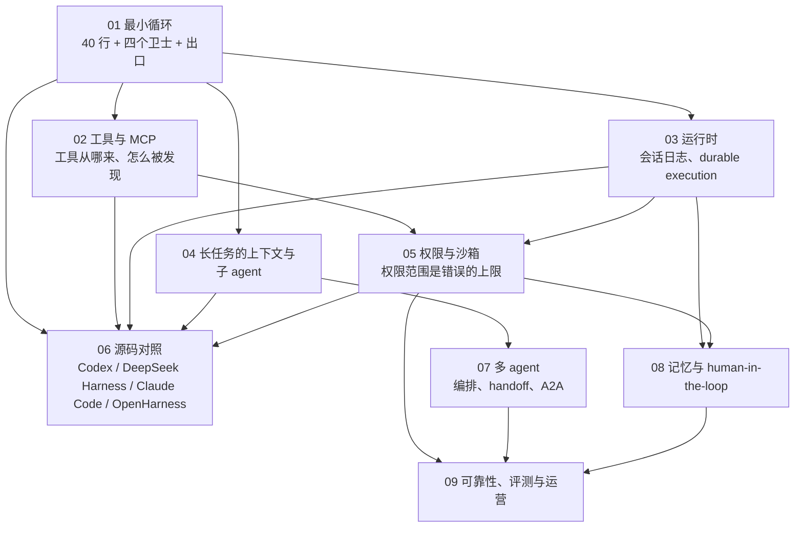
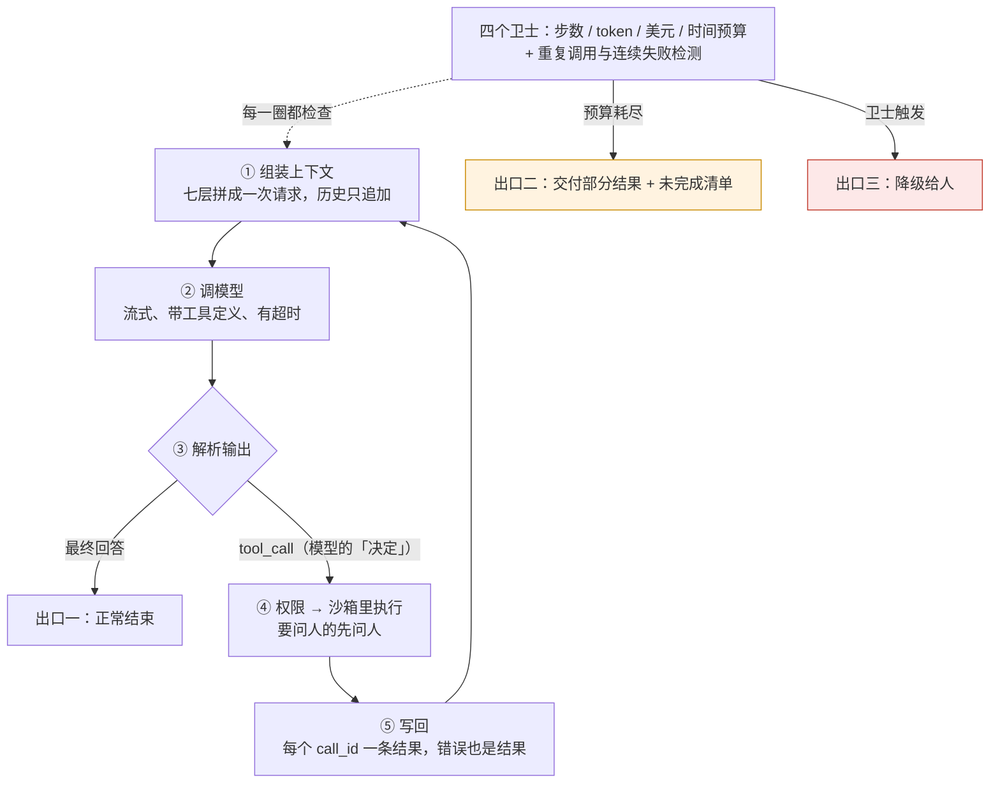
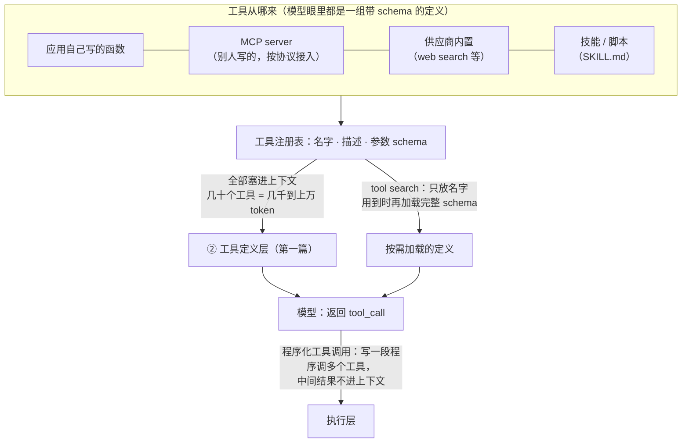
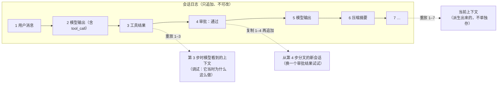
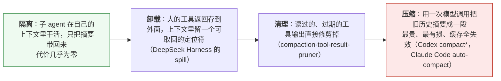
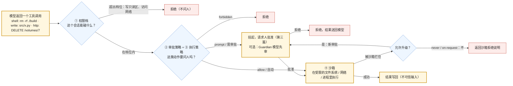
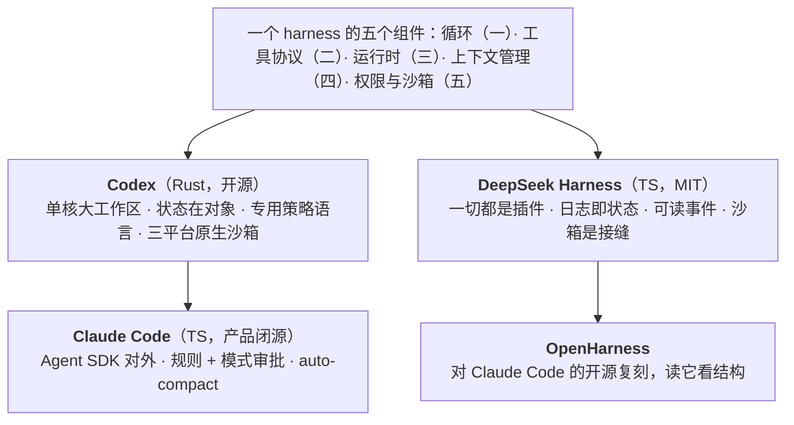
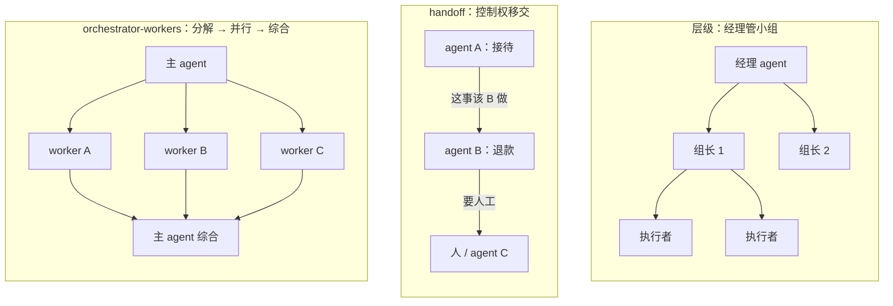
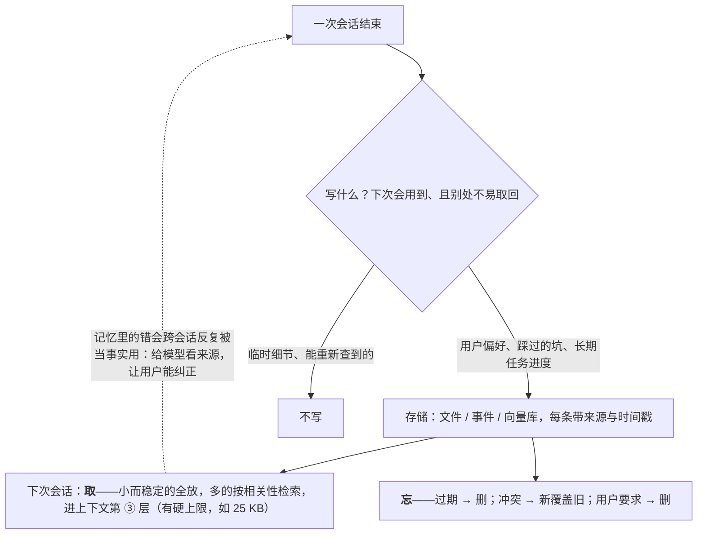
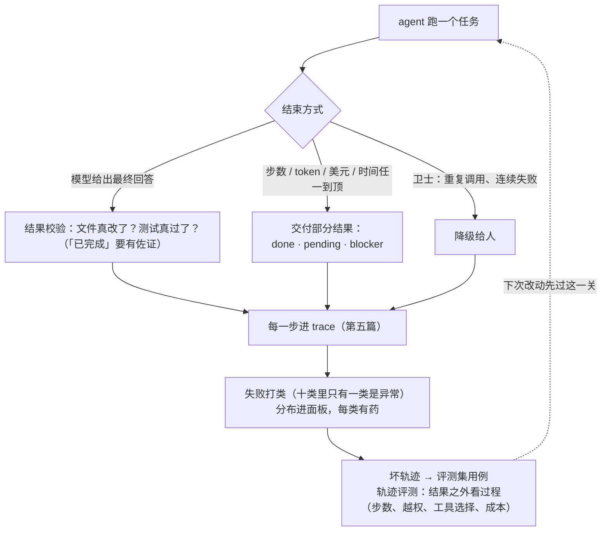

## 这个系列的三句话主张

> **循环之外的一切都是 harness**；**权限范围是错误的上限**；**能自动验证到什么程度，就能自主到什么程度**。

<aside class="notes" markdown="1">
总纲：/tools-agents-and-harness.html。
</aside>

---

## 几篇怎么连起来



---

## 01 · 最小 agent 循环：从 40 行到生产级

**结论**：40 行 + **四个卫士**（步数、预算、超时、重复检测）+ **两个出口**（完成、放弃）才能上生产；Codex 三层（`submission_loop` → turn → 编排器），DeepSeek Harness 日志驱动；**能用工作流就不用 agent**。



<aside class="notes" markdown="1">
原文 /anatomy-of-the-agent-loop.html。
</aside>

<!-- v -->

### 要点

```python
while True:                                   # 四个卫士在这里：步数 / 预算 / 超时 / 重复
    resp = model(messages, tools)
    if not resp.tool_calls: return resp.text  # 出口一：模型停
    for call in resp.tool_calls:              # 编排器：审批 → 沙箱首试 → 不升级
        result = execute(call)                # 一切「模型可见」的都要「已记录」
        messages.append(tool_result(call, result))
```

- 编排器原则：审批 → 沙箱首试 → `never` / `on-request` 不升级；「模型可见 ⟺ 已记录」
- 「循环只要模型停就停」——找不到答案时无限换词、工具挂死、费用无限

---

## 02 · 工具调用与 MCP：工具从哪来、怎么被发现

**结论**：MCP 2026-07-28 **无状态核心、扩展框架、授权加固**；描述从模型视角写；**tool search 换预算付缓存**（按需定义不在前缀里）；**PTC（程序化工具调用）让中间结果不进上下文**。



<aside class="notes" markdown="1">
原文 /tool-calling-mcp-tool-search-and-programmatic-tool-calling.html。
</aside>

<!-- v -->

### 要点

| 项 | 数 |
|---|---|
| 治理 | AAIF；SDK 十亿下载 |
| 授权 | DCR → CIMD；`resource` 绑定受众 |
| 何时用 tool search | 二十个以上工具 |
| PTC | 四家都有 |

- 「MCP 只是一个有会话的 RPC」——已改为无状态核心
- 「tool search 一定提高缓存命中率」——命中率可能降，看绝对量

---

## 03 · agent 运行时：第三种服务形态

**结论**：**事件溯源的会话日志是核心**——resume / fork / replay 是同一条流；**durable execution**：任务不随连接消失；**挂起要释放 worker**；托管 / 库 / 自托管三种交付。



<aside class="notes" markdown="1">
原文 /agent-runtime-sessions-persistence-and-durable-execution.html。
</aside>

<!-- v -->

### 要点

| 项 | 数 |
|---|---|
| Agents API | 2026-09-10；九家沙箱；无额外费；失败响应 −86% |
| 100 个并发会话在等审批 | 不能占 100 个 worker——挂起释放 |
| 托管的代价 | 绑供应商模型、日志在供应商侧 |

- 「用 Web 框架直接跑 agent」——任务随连接消失、重启从头

---

## 04 · 长任务的上下文管理与子 agent

**结论**：`spill` / 截断规则 → 修剪 → `compact*` / `compaction` 五包；plan / todo / goal 对抗漂移；子 agent 三形态；**多 agent 约 15 倍 token**；DeepSeek Harness 能拉起 Claude Code 与 Codex。



<aside class="notes" markdown="1">
原文 /long-horizon-context-management-and-subagents.html。
</aside>

<!-- v -->

### 要点

| 规则 | |
|---|---|
| 「无 > 10K token 的项」 | 任何单项超过就 spill 到文件 |
| subagent vs agent teams | 前者回摘要、后者共享目标 |
| 串行任务 | **不拆**子 agent——没有并行收益，多派发与摘要开销 |

- 「子 agent 只回摘要所以便宜」——token 不进主窗口但都在账单上

---

## 05 · 权限、沙箱与安全边界：压低错误的上限

**结论**：**四层缺一不可**——权限档、审批策略、执行策略（`execpolicy` Starlark + Guardian）、沙箱（三平台）；Claude Code 六步 **deny 高于一切**；PocketOS 五环里三环在基础设施。



<aside class="notes" markdown="1">
原文 /permissions-sandboxes-and-security-boundaries-for-agents.html。
</aside>

<!-- v -->

### 要点

| 层 | 例 |
|---|---|
| 权限档 | `:read_only` / `:workspace` / `:danger_full_access` |
| 审批策略 | allow / prompt / forbidden 带 `match` / `not_match`；策略化授权对抗审批疲劳 |
| 执行策略 | 命令文本看不出脚本的真实效果——所以还要沙箱 |
| 沙箱 | macOS Seatbelt / Linux Landlock + seccomp / Windows |

- 「审批够了不需要沙箱」——命令文本看不出真实效果
- 「hook 返回 allow 就放行」——deny 高于 hooks 与 `bypassPermissions`

---

## 06 · 源码级对照：四个 harness 各怎么选

**结论**：十二维表；取舍主轴——**状态在对象 / 日志、压缩加密 / 可读、权限策略语言 / 规则 / 插件、沙箱原生 / 接缝、模型耦合深 / 浅**；每个选择换一样付一样，没有最好的 harness。



<aside class="notes" markdown="1">
原文 /coding-agent-harness-comparison-codex-deepseek-harness-claude-code.html。
</aside>

<!-- v -->

### 要点

| | Codex | DeepSeek Harness | Claude Code | OpenHarness |
|---|---|---|---|---|
| 实现 | Rust 单核 | Python 轻量 | 闭源 + SDK | TS 一切皆插件 |
| 状态 | 对象 | 日志驱动 | 对象 + 加密压缩 | 插件 |
| 权限 | `execpolicy` Starlark | 规则 | 六步 deny 优先 | 插件 |
| 沙箱 | 原生三平台 | 接缝 | 原生 | 接缝 |
| 模型耦合 | 深 | 浅（能拉起别家） | 深 | 浅；Minimal 模式 |

---

## 07 · 多 agent：编排、handoff 与 A2A

**结论**：只为三个理由——**隔离、并行、专业化**；orchestrator-workers / handoff / 层级三种模式；**15 倍 token、缓存不共享（只有分叉前的相同前缀能命中）、trace 是树**；MCP 管工具、A2A 管 agent——协议未收敛，组织内用 harness 子 agent。



<aside class="notes" markdown="1">
原文 /multi-agent-orchestration-handoff-and-a2a.html。三层评测。
</aside>

<!-- v -->

### 要点

- 「多 agent 更聪明」——组合失败、15 倍成本
- 「并行 agent 共享缓存」——只有分叉前的前缀
- 「现在就要接 A2A」——组织内先用子 agent

---

## 08 · memory 与 human-in-the-loop

**结论**：**记忆是检索**（写 / 取 / 忘、带来源、设上限 25 KB）；**六级人机分工每级换验证**；不可逆且不能自动验证的动作不该无人在环；**本体把验证前移到结构**，业务 agent 可到 4–5 级。



<aside class="notes" markdown="1">
原文 /agent-memory-and-human-in-the-loop.html。
</aside>

<!-- v -->

### 要点

| 级 | 人做什么 | 验证靠什么 |
|---|---|---|
| 1 | 逐步确认 | 人 |
| 2–3 | 批准计划 / 抽检 | 人 + 规则 |
| 4–5 | 例外处理 | 结构（本体、类型、权限）+ 测试 |
| 6 | 不在环 | 全自动验证 + 可逆 |

- 提案先于落库；风险五级
- 「直接发送给客户 = 无人在环成功」——不可逆且不能验证

---

## 09 · 可靠性、评测与运营

**结论**：**十类失败只有一类是异常**；幂等 / 预算 / 部分结果 / 校验；**轨迹评测六维**（不只完成率）；基准只缩范围；三级 trace + 面板十项 + 门禁。



<aside class="notes" markdown="1">
原文 /agent-reliability-evaluation-and-operations.html。
</aside>

<!-- v -->

### 要点

| 量 | 数 |
|---|---|
| Terminal-Bench | 90.6 / 30.0 / 31.2——同一基准三种协议三个数 |
| demo 到生产 | 十二行清单 |
| 改工具 | 录制回放，不重跑模型回归 |

- 「完成率 85% 就可靠」——过程失败看不出；要成本、越权、鲁棒性
- 「拒绝率降到零是好事」——审批疲劳或规则太松

---

## 三句话在九篇里

| 主张 | 落点 |
|---|---|
| **循环之外的一切都是 harness** | 卫士与出口（01）、工具发现（02）、会话日志（03）、压缩与子 agent（04）、权限（05）、四家对照（06） |
| **权限范围是错误的上限** | 四层缺一不可（05）、deny 高于一切、沙箱看真实效果、基础设施三环（05）、越权是评测项（09） |
| **能验证到什么程度就能自主到什么程度** | 六级分工每级换验证（08）、本体前移验证、不可逆不无人（08）、轨迹六维（09） |

---

## 常见误区（一）

- 「循环只要模型停就停」——四个卫士
- 「所有多步任务都做成 agent」——能工作流就工作流
- 「tool search 一定提高缓存命中率」——看绝对量
- 「用 Web 框架直接跑 agent」——durable execution
- 「审批等待占着 worker 没问题」——挂起释放
- 「子 agent 只回摘要所以便宜」——15 倍
{: .fragments}

---

## 常见误区（二）

- 「审批够了不需要沙箱」——命令文本看不出效果
- 「hook 返回 allow 就放行」——deny 优先
- 「有最好的 harness」——每个选择换一样付一样
- 「多 agent 更聪明」——只为隔离、并行、专业化
- 「记忆越多越好」——上限、来源、遗忘
- 「完成率 85% 就可靠」——六维
{: .fragments}

---

## 下一步

- **同一路线**：《Prompt 与上下文工程》——第 4 篇压缩的应用侧；《检索与知识》——agentic retrieval 与本体；《评测与可观测》——轨迹评测与 trace；《生产与运维》——运营 agent
- **Infra 侧**：《RL 后训练 Infra》第 6 篇——训练 agent 的 rollout 是同一个循环
- 原文总纲：`/tools-agents-and-harness.html`；通关自测在系列总结
