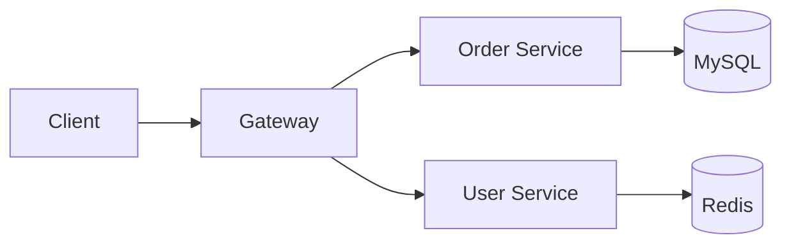

## 这是什么

一份**纯 Markdown** 写成的在线幻灯片。

- 源文件放在 `slides/`，和写博客一模一样
- kramdown 正常渲染，`_layouts/slides.html` 再按 `---` 切成一页页
- 复用博客已有的能力：rouge 代码高亮、Mermaid、KaTeX
- 没有构建步骤，`git push` 就上线

<aside class="notes" markdown="1">
按 `S` 打开演讲者视图，就能看到这段备注。
</aside>

---

## 怎么写一页

新建 `slides/my-talk.md`：

```markdown
---
layout: slides
title: "我的分享"
subtitle: "副标题"
permalink: /slides/my-talk.html
date: 2026-08-19
theme: white          # white / simple / league / night / solarized ...
transition: slide     # slide / fade / convex / concave / zoom / none
---

## 第一页

- 要点一
- 要点二

---

## 第二页

正文……
```

访问 `/slides/my-talk.html` 即可。

---

## 唯一的规矩

**`---` 前面必须留一个空行。**

```markdown
上一页最后一行
                  <- 这个空行不能省
---

## 下一页
```

否则 Markdown 会把 `上一页最后一行` + `---` 当成 setext 二级标题，
那一页就不会被切开。

---

## 逐条出现

给列表加 `.fragments`，按空格键逐条显示：

- 先说问题
- 再说思路
- 最后给数字
{: .fragments}

写法是在列表下面单独写一行 `{: .fragments}`。
整块一起出现用单数的 `{: .fragment}`，它对任何元素都有效。

---

## 代码

和文章里一样，围栏代码块 + 语言名，rouge 高亮：

```go
func (s *Server) Handle(ctx context.Context, req *Request) (*Response, error) {
    span, ctx := opentracing.StartSpanFromContext(ctx, "Handle")
    defer span.Finish()

    if err := req.Validate(); err != nil {
        return nil, fmt.Errorf("invalid request: %w", err)
    }
    return s.dispatch(ctx, req)
}
```

行内代码 `kubectl get pods -w` 也正常。

---

## Mermaid 图



图表按需加载，没有图的 deck 不会拉 mermaid.js。

---

## 公式

行内的 $$O(n \log n)$$ 和独立成行的都可以：

$$
\mathrm{QPS} = \frac{\text{并发数}}{\text{平均响应时间}}
$$

$$
\text{Attention}(Q, K, V) = \mathrm{softmax}\!\left(\frac{QK^{\top}}{\sqrt{d_k}}\right)V
$$

---

## 表格与引用

| 方案 | 吞吐 | P99 延迟 | 复杂度 |
|------|-----:|--------:|:------:|
| 单机同步 | 1.2k | 180ms | 低 |
| 批量异步 | 18k | 45ms | 中 |
| 分片 + 批量 | 74k | 22ms | 高 |

> 先让它跑对，再让它跑快，最后才让它跑得省。

---

## 纵向幻灯片

在同一页里用 `<!-- v -->` 分隔，就能做出**向下展开**的子页面：
按 <kbd>↓</kbd> 继续，按 <kbd>→</kbd> 跳过整组。

<!-- v -->

### 子页 1

适合放「细节展开」——主线听众按右键跳过，想深挖的按下键。

<!-- v -->

### 子页 2

一组纵向页里可以放任意多张。

---

<!-- .slide: data-background="#1c1f26" -->

## 单页定制

在某一页里写一行注释，属性就会挂到这页上（本页就是深色背景）：

```html
<!-- .slide: data-background="#1c1f26" -->
<!-- .slide: data-transition="zoom" -->
<!-- .slide: data-background-image="/img/home-bg.jpg" -->
```

---

## 快捷键

| 键 | 作用 |
|----|------|
| <kbd>Space</kbd> / <kbd>→</kbd> | 下一页 / 下一个 fragment |
| <kbd>Esc</kbd> 或 <kbd>O</kbd> | 全局缩略图总览 |
| <kbd>S</kbd> | 演讲者视图（备注 + 计时） |
| <kbd>F</kbd> | 全屏 |
| <kbd>B</kbd> | 黑屏（把注意力拉回自己） |
| <kbd>Alt</kbd> + 点击 | 放大局部 |
| <kbd>Ctrl</kbd>+<kbd>Shift</kbd>+<kbd>F</kbd> | 全文搜索 |

---

## 导出 PDF

在地址后面加上 `?print-pdf`，然后用浏览器打印：

```text
/slides/reveal-demo.html?print-pdf
```

在打印对话框里选 **横向**、边距 **无**、勾上 **背景图形**，
存为 PDF 即可。

---

## 就这些

- 写文章 → `_posts/`
- 写 PPT → `slides/`

**Markdown 一把梭。**

<aside class="notes" markdown="1">
收尾，留时间提问。
</aside>
